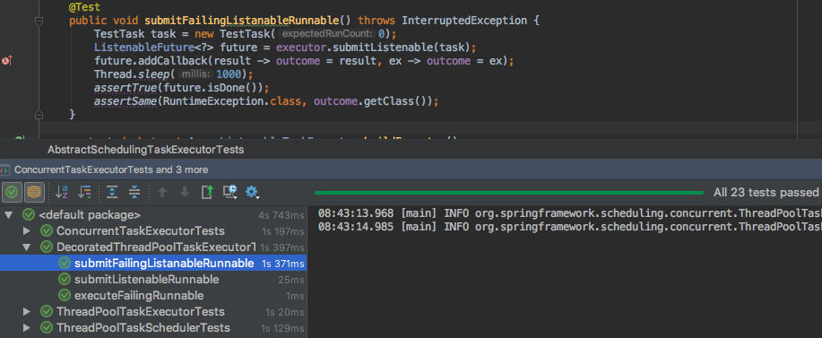
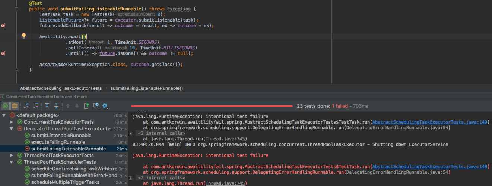

= Asynchronous tests, the Awaitility and exceptions
:source-highlighter: prettify
:icons: font
:toc: left
:experimental:
:numbered:
:homepage: http://antkorwin.com
Korovin Anatoliy <antkorwin@gmail.com>;  Home <http://antkorwin.com>
// START OF CONTENT

## Intro

A couple of weeks ago I'm tried to run all tests in the spring-framework project
and found that sometimes some of them do not pass.
These were tests of asynchronous events and a thread pool.

Sometimes tests fall because an iteration takes a different time on different machines.
But tests were written with the expectation for a specific value of delay - not more than 100 milliseconds.

Also I found some tests where the duration time of delay is hardcoded by using the `Thread.sleep(1000)`.

This is not a good practice because each of these tests is waiting at least one second
even if the test case completes after 10 ms.
If we've a lot of such tests than we will wait a long time before they finishes

One example of such test:

[source, java]
----
@Test
public void asyncMethodListener() throws Exception {
	// Arrange
	originalThreadName = Thread.currentThread().getName();
	listenerCalled = 0;
	GenericApplicationContext context = new GenericApplicationContext();
	context.registerBeanDefinition("asyncTest",
								new RootBeanDefinition(AsyncMethodListener.class));
	context.registerBeanDefinition("autoProxyCreator",
								new RootBeanDefinition(DefaultAdvisorAutoProxyCreator.class));
	context.registerBeanDefinition("asyncAdvisor",
								new RootBeanDefinition(AsyncAnnotationAdvisor.class));
	// Act
	context.refresh();
	Thread.sleep(1000);
	assertEquals(1, listenerCalled);
}
----

There is a more efficient way to test asynchronous behavior - for example using the Awaitility library.

I found all the tests that could be refactored and started rewriting them.

When I replaced all the use of the `Thread.sleep` on the `Awaitility.await` and ran them, I was unpleasantly surprised,
tests that were successful before began to fall, but not always.

Thus, the behavior became even more fragile.

## Research

Most often the problem was reproduced in children tests of the `AbstractSchedulingTaskExecutorTests`

Test before using of the Awaitility:

[source, java]
----
@Test
public void submitFailingListenableRunnable() throws Exception {
	TestTask task = new TestTask(0);
	ListenableFuture<?> future = executor.submitListenable(task);
	future.addCallback(result -> outcome = result, ex -> outcome = ex);
	Thread.sleep(1000);
	assertTrue(future.isDone());
	assertSame(RuntimeException.class, outcome.getClass());
}
----
you can see full version here: link:https://github.com/spring-projects/spring-framework/blob/912c270f2bebf3f24dd16dcaea576a58d500852e/spring-context/src/test/java/org/springframework/scheduling/concurrent/AbstractSchedulingTaskExecutorTests.java[AbstractSchedulingTaskExecutorTests.java]

And the source code of this test with the Awaitility:

[source, java]
----
@Test
public void submitFailingListenableRunnable() throws Exception {
    TestTask task = new TestTask(0);
    ListenableFuture<?> future = executor.submitListenable(task);
    future.addCallback(result -> outcome = result, ex -> outcome = ex);

    Awaitility.await()
              .atMost(1, TimeUnit.SECONDS)
              .pollInterval(10, TimeUnit.MILLISECONDS)
              .until(() -> future.isDone() && outcome != null);

    assertSame(RuntimeException.class, outcome.getClass());
}
----

In this code `executor` is a `ThreadPoolTaskExecutor` instance with settings depends on the child test.
Let's look at the next implementation (DecoratedThreadPoolTaskExecutorTests)

[source, java]
----
@Override
protected AsyncListenableTaskExecutor buildExecutor() {
	ThreadPoolTaskExecutor executor = new ThreadPoolTaskExecutor();
	executor.setTaskDecorator(runnable ->  <1>
			new DelegatingErrorHandlingRunnable(runnable, TaskUtils.LOG_AND_PROPAGATE_ERROR_HANDLER));
	executor.setThreadNamePrefix(THREAD_NAME_PREFIX);
	executor.setMaxPoolSize(1);
	executor.afterPropertiesSet();
	return executor;
}
----
<1> execution of tasks will be decorated by handler
and also if this task throws exception,
then will propagate this exception to the next level.

## Let's compare results of this tests

The result of test with Thread.Sleep:

The result of test with the Awaitility:

This is unexpected behavior, the use of awaitility for tests breaks their result.
However, when I run only failed test without inherited test suite.

It's also interesting that sometimes tests pass.
I thought it depends on something what happened before this test,
but really the reason of fail hide in a parallel thread for our test.

Let's look on the test case in more detail:

[source, java]
----
@Test
public void submitFailingListenableRunnable() throws Exception {
	TestTask task = new TestTask(0); <1>
	ListenableFuture<?> future = executor.submitListenable(task); <2>
	future.addCallback(result -> outcome = result, ex -> outcome = ex);  <3>

	Thread.sleep(1000); <4>

	assertTrue(future.isDone());
	assertSame(RuntimeException.class, outcome.getClass());
}
----
<1> creation of the new TestTask, with the failed setting
(submit of this task will create a thread which will throw an error after a small delay)
<2> submit of this task in the ThreadPoolTaskExecutor
<3> add a handler for the result of execution of the task
<4> the main thread of our test will sleep for a second

## Isolate test problem

I don't like working with unstable tests then I decided to isolate a problem and write a stable failed test.

[source, java]
----
public ThreadPoolTaskExecutor setUpExecutor(ErrorHandler errorHandler) {
    ThreadPoolTaskExecutor executor = new ThreadPoolTaskExecutor();
    executor.setThreadNamePrefix(THREAD_NAME_PREFIX);
    executor.setMaxPoolSize(1);
    executor.afterPropertiesSet();
    return executor;
}

@Test
public void catchUncaught() throws InterruptedException {

    ThreadPoolTaskExecutor taskExecutor = setUpExecutor(TaskUtils.LOG_AND_PROPAGATE_ERROR_HANDLER);
    taskExecutor.execute(new ErrorTestTask());
    ListenableFuture<?> future = taskExecutor.submitListenable(new ErrorTestTask());
    Awaitility.await()
              .atMost(1, TimeUnit.SECONDS)
              .pollInterval(10, TimeUnit.MILLISECONDS)
              .until(future::isDone);
}

private static class ErrorTestTask implements Runnable {
    @Override
    public void run() {
        try {
            Thread.sleep(100);
        } catch (InterruptedException e) {
            e.printStackTrace();
        }
        throw new RuntimeException(Thread.currentThread().getName() + " -> Error");
    }
}
----

## The source code

This project available on github by this link:

image:../icons/git.png[github,64,64] link:https://github.com/antkorwin/statemachine[github.com/antkorwin/statemachine]

// END OF CONTENT
include::../metrica.adoc[]

++++

<noscript>Please enable JavaScript to view the <a href="https://disqus.com/?ref_noscript">comments powered by Disqus.</a></noscript>
++++
