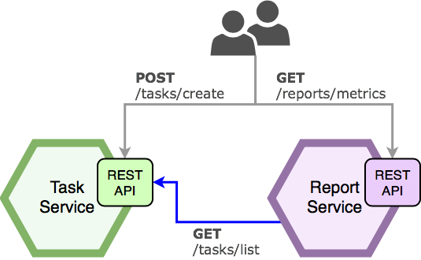
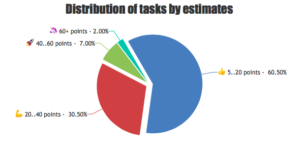
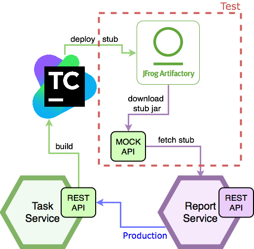
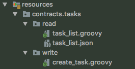
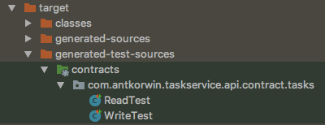
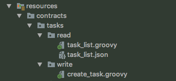
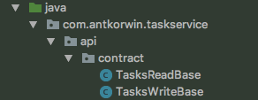
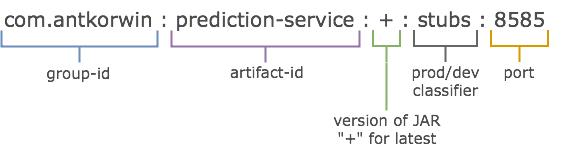
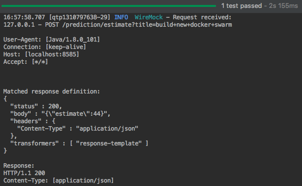
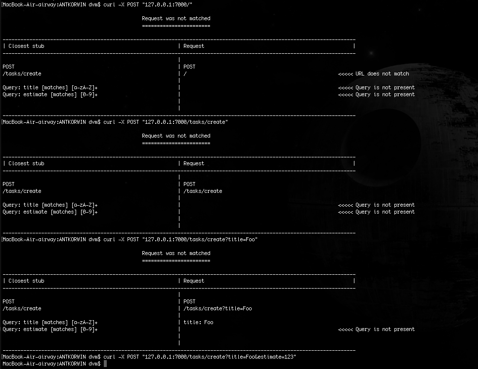

= How to use JUnit5 and Spring Cloud Contract
:source-highlighter: prettify
:icons: font
:toc: left
:experimental:
:numbered:
:homepage: http://antkorwin.com
Korovin Anatoliy <antkorwin@gmail.com>;  Home <http://antkorwin.com>
// START OF CONTENT

## Intro

In this article, we will consider an example of microservice application.

This application consists of `task-service` and `report-service`.

In the `task-service` we can create and get tasks.
The `report-service` provides to us the statistics of tasks distribution.
For creating these statistics, the `report-service` is using the API has provided by the `task-service`.

So, we've a two services that communicate together.
The **"contract"** is the API which is using between a pair of microservices.
In this article, we will consider a tool to maintain the consistency of the contract between microservices.

In terms of the Consumer Driven Contracts,
the `task-service` is a provider of the API, and `report-service` is a consumer.

Working flow:

. we write groovy contract files in the `task-service`

. build `task-service`, generate and run contract tests (for JUnit5)

. install JAR file with the stub of contracts (json and request/response schemes of the `task-service`)

. deploy this stub to the binary repository(Artifactory)

. write contract tests on the consumer side(`report-service`)

. use the stub from the artifactory on the consumer tests

## Provider configuration

Support for JUnit5 is currently unavailable in stable release of Spring Cloud Contract.
But this feature already completed and we can use it from the snapshots.

We need to add the next repository of snapshots:

### Dependencies

[source, xml]
----
<repositories>
    <repository>
        <id>spring-snapshots</id>
        <name>Spring Snapshots</name>
        <url>https://repo.spring.io/libs-snapshot</url>
        <snapshots>
            <enabled>true</enabled>
        </snapshots>
    </repository>
</repositories>
----

Also we need to use a snapshot for plugins,
because Spring Cloud Contract generates source code with the help of maven plugin:

[source, xml]
----
<pluginRepositories>
    <pluginRepository>
        <id>spring-snapshots</id>
        <name>Spring Snapshots</name>
        <url>https://repo.spring.io/libs-snapshot</url>
        <snapshots>
            <enabled>true</enabled>
        </snapshots>
    </pluginRepository>
</pluginRepositories>
----

and now, we can add the next dependency:

[source, xml]
----
<dependency>
    <groupId>org.springframework.cloud</groupId>
    <artifactId>spring-cloud-starter-contract-verifier</artifactId>
    <scope>test</scope>
</dependency>
----

also we need to add a dependency management for spring cloud 2.1.0 snapshot:

[source, xml]
----
<dependencyManagement>
    <dependencies>
        <!-- If you're adding this dependency explicitly you have to
               add it *BEFORE* the Release Train BOM-->
        <dependency>
            <groupId>org.springframework.cloud</groupId>
            <artifactId>spring-cloud-contract-dependencies</artifactId>
            <version>2.1.0.BUILD-SNAPSHOT</version>
            <type>pom</type>
            <scope>import</scope>
        </dependency>

        <dependency>
            <groupId>org.springframework.cloud</groupId>
            <artifactId>spring-cloud-dependencies</artifactId>
            <version>${spring-cloud.version}</version>
            <type>pom</type>
            <scope>import</scope>
        </dependency>
    </dependencies>
</dependencyManagement>
----

In the plugin section, we need to configure the `spring-cloud-contract-maven-plugin`,
This plugin is responsible for generating a source code of contract tests:

[source, xml]
----
<build>
    <plugins>
        <plugin>
            <groupId>org.springframework.cloud</groupId>
            <artifactId>spring-cloud-contract-maven-plugin</artifactId>
            <version>2.1.0.BUILD-SNAPSHOT</version>

            <extensions>true</extensions>
            <configuration>
                <baseClassForTests>com.antkorwin...MvcTest</baseClassForTests> <1>
                <testFramework>JUNIT5</testFramework> <2>
            </configuration>
        </plugin>

        ..

    </plugins>
<build>
----
<1> The reference to the base class for your auto-generated tests,
each of the contract tests will be inherited from this class.
<2> the setting for Junit5 tests generation.

### BaseClass for contract tests

This class will be used for generating contract verification tests, as a parent class.

[source, java]
----
@ExtendWith(SpringExtension.class)  <1>
@SpringBootTest
public class MvcTest {

    @Autowired
    private WebApplicationContext context;

    @BeforeEach
    void setup() {
        RestAssuredMockMvc.webAppContextSetup(context); <2>
    }

}
----
<1> of course, we use JUnit5, and ExtendWith instead of RunWith
<2> RestAssured initialization with the application context.

### Describe your contracts

All what we need to make manually is a contract declaration of our API.
This is a groovy-based DSL, where you can describe request to your API and expected response for it:

[source, groovy]
----
package contracts.tasks.write

import org.springframework.cloud.contract.spec.Contract
import org.springframework.http.HttpStatus

UUID_REGEX = "([a-fA-F0-9]{8}-[a-fA-F0-9]{4}-[a-fA-F0-9]{4}-[a-fA-F0-9]{4}-[a-fA-F0-9]{12})";

Contract.make {
    description "Create new task"
    request {
        method POST()
        url("/tasks/create") {
            queryParameters {
                parameter("title", value(consumer(regex("[a-z A-Z]+"))))
                parameter("estimate", value(consumer(regex("[0-9]+"))))
            }
        }
    }
    response {
        body(
                id: value(producer(regex("$UUID_REGEX"))),
                title: fromRequest().query("title"),
                estimate: fromRequest().query("estimate")
        )
        headers {
            contentType(applicationJson())
        }
        status HttpStatus.CREATED.value()
    }
}
----

You can collect groovy files with contracts in packages and put it in the resources, as you can see here:

A little later we will consider generated tests from this contracts.

In my opinion, the using of groovy is a more intuitive and maintained way of describing a contract
than using something like YAML. By the way, Spring Cloud Contract supports both of these variants (groovy and yaml).

### Generate the contract tests

So, if you added all the needed dependencies and wrote a contract, then we can build the project:

[source]
----
$ mvn clean install

...

[INFO] --- maven-install-plugin:2.5.2:install (default-install) @ task-service ---
[INFO] Installing task-service-0.0.1-SNAPSHOT.jar to ~\.m2\...
[INFO] Installing pom.xml to ~\.m2\...
[INFO] Installing task-service-0.0.1-SNAPSHOT-stubs.jar to ~\.m2\...
[INFO] ------------------------------------------------------------------------
[INFO] BUILD SUCCESS
[INFO] ------------------------------------------------------------------------
[INFO] Total time: 01:47 min
[INFO] Finished at: 2018-09-18T11:07:33+10:00
[INFO] Final Memory: 82M/280M
[INFO] ------------------------------------------------------------------------
----

After a successful build of your project,
you get a generated test for the groovy contract in the `/target/generated-test-sources/contracts` folder,
as you can see on the next image:

Let's look at these tests:

[source, java]
----
public class WriteTest extends MvcTest {  <1>

	@Test
	public void validate_create_task() throws Exception {  <2>
		// given:
			MockMvcRequestSpecification request = given();

		// when:
			ResponseOptions response = given().spec(request)  <3>
					.queryParam("title","G ")
					.queryParam("estimate","42")
					.post("/tasks/create");

		// then:
			assertThat(response.statusCode()).isEqualTo(201);
			assertThat(response.header("Content-Type")).matches("application/json.*");
		// and:
			DocumentContext parsedJson = JsonPath.parse(response.getBody().asString());  <4>
			assertThatJson(parsedJson).field("['title']").isEqualTo("G ");
			assertThatJson(parsedJson).field("['estimate']").isEqualTo("42");
			assertThatJson(parsedJson).field("['id']").matches("([a-fA-F0-9]{8}-[a-fA-F0-9]{4}-[a-fA-F0-9]{4}-[a-fA-F0-9]{4}-[a-fA-F0-9]{12})");
	}

}
----
<1> the generated test extends from our base test class (`MvcTest`)
<2> the name of the test case generated from the name of the file with a contract
<3> this request generated from the contract
<4> the response will be verified by the contract.

When you put some breaking changes in the contract, these tests help to find the place which you need to change.

Sometimes the code of these tests looks like boilerplate,
but it's not important, because these tests are needed only to ensure the correctness of the contract.

And if you run it, you can check your contract.

When you run `mvn clean install` these test will run automatically, after generation stage.
Besides that, after generates and runs all tests maven will install binary artifacts in the local folder `.m2`.
Among these artifacts there is one new - an artifact with the stub of contracts (`prediction-service-0.0.1-SNAPSHOT-stubs.jar`).

If you need only generate test sources without run all tests and install artifacts, you can run `mvn generate-test-sources`.

Sometimes for debugging you need to install contracts without running tests, in this case you can do it by `mvn clean install -DskipTests`.

### Different base classes for different test cases

Sometimes you have test cases with a different initialization logic.
For example, when you test a creating of something, you don't need to put in the database the already created records.
But if you test a reading from a database, then you need to be sure that read data sets exist in the database.

You can set a package with the base classes for tests generate, instead of setting a one base class for all tests.

[source, xml]
----
<plugin>
    <groupId>org.springframework.cloud</groupId>
    <artifactId>spring-cloud-contract-maven-plugin</artifactId>
    <version>2.1.0.BUILD-SNAPSHOT</version>
    <extensions>true</extensions>
    <configuration>
        <packageWithBaseClasses>com.antkorwin.taskservice.api.contract</packageWithBaseClasses> <1>
        <testFramework>JUNIT5</testFramework>
    </configuration>
</plugin>
----
<1> package with the base classes

And now, you need to keep your contracts directory in the next kind:

The names of your base classes depend on the structure of the contracts package,
you need to reflect the names of directories in the name of the base class.

And you will get the next generated tests structure:

Also when you write several contracts in one package, then you get a test class with multiple test cases.
All of these items were named like packages and files in the resource directory:

So, we got a next tests after run `generate-test-sources`:

[source, java]
----
public class ReadTest extends TasksReadBase {  <1>

	@Test
	public void validate_task_list() throws Exception {
    ...
	}

}

public class WriteTest extends TasksWriteBase {  <2>

	@Test
	public void validate_create_task() throws Exception {
		...
	}

    @Test
	public void validate_create_subtask() throws Exception {
      ...
    }

}
----
<1> extends from the first base class (for tests reading)
<2> extends from the second base class (for tests writing)

## Consumer configuration

### Dependency

The configuration of dependencies looks simpler on the consumer side.
All what we need is the stub runner dependency:

[source, xml]
----
<dependency>
    <groupId>org.springframework.cloud</groupId>
    <artifactId>spring-cloud-starter-contract-stub-runner</artifactId>
    <scope>test</scope>
</dependency>
----

### Test with a stub of contracts

In order to use a stub in tests, we need to use the `@AutoConfigureStubRunner` annotation:

[source, java]
----
@ExtendWith(SpringExtension.class)
@SpringBootTest(webEnvironment = SpringBootTest.WebEnvironment.NONE)
@AutoConfigureStubRunner(ids = {"com.antkorwin:task-service:+:stubs:8585"},  <1>
                         stubsMode = StubRunnerProperties.StubsMode.LOCAL)   <2>
class TaskServiceFeignIT {

    @Autowired
    private TaskServiceFeign taskServiceFeign;

    @Test
    void getAllTasks() {
        // Arrange
        // Act
        List<Task> tasks = taskServiceFeign.getAllTask();
        // Assert
        assertThat(tasks).isNotNull()
                         .extracting(Task::getEstimate)
                         .contains(20, 5, 100);
    }
}
----
<1> binary artifact with the stub of contracts
<2> `LOCAL/REMOTE` mode

As you can see the ids: `com.antkorwin:prediction-service:+:stubs:8585` is contain of :

If you select a `LOCAL` mode, the stub runner will find binary artifact with contracts in your local maven repository (`~/.m2/`).
Else if you select a `REMOTE` mode, you will need to setup the `repositoryRoot` where stub runner will find a jar with contracts.

Let's run it:

## How to use the Stub Runner (manual)

You can download stub runner server here:
link:https://search.maven.org/remotecontent?filepath=org/springframework/cloud/spring-cloud-contract-stub-runner-boot/2.0.1.RELEASE/spring-cloud-contract-stub-runner-boot-2.0.1.RELEASE.jar[spring-cloud-contract-stub-runner-boot-2.0.1.RELEASE.jar]

let's run the next command under directory with jars of contract stubs:

[source]
----
 java -jar ../spring-cloud-contract-stub-runner-boot-2.0.1.RELEASE.jar --stubrunner.stubs-mode="local" --stubrunner.ids=com.a ntkorwin:prediction-service:+:stubs:8088
----

then you can send a request to stub server:

[source]
----
$ curl -X POST '127.0.0.1:8088/tasks/create?title=Foo&estimate=123'
----

If you send a wrong request or make some typos,
stub runner will find more closest variant of API which existed in the stub and shows it for you:

// END OF CONTENT
include::../metrica.adoc[]

++++

<noscript>Please enable JavaScript to view the <a href="https://disqus.com/?ref_noscript">comments powered by Disqus.</a></noscript>
++++
