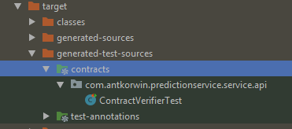
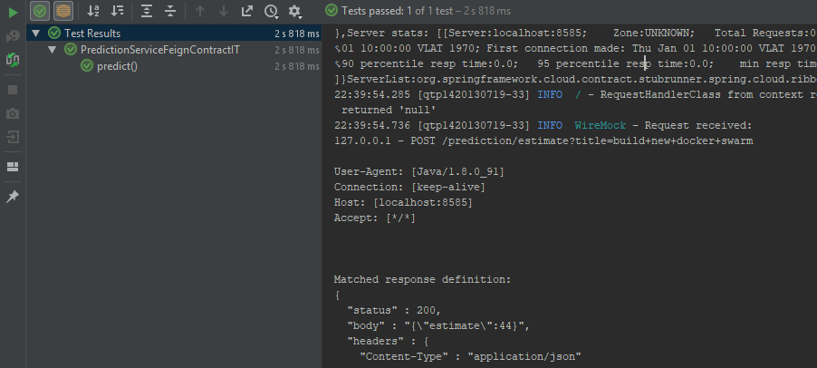

= Cloud Contract + JUnit5
:source-highlighter: prettify
:icons: font
:toc: left
:experimental:
:numbered:
:homepage: http://antkorwin.com
Korovin Anatoliy <antkorwin@gmail.com>;  Home <http://antkorwin.com>
// START OF CONTENT

## Provider configuration

Now time, support for Junit5 isn't available from current release of Spring Cloud Contract.
We need to add snapshots repository to use it.

### Dependencies

[source, xml]
----
<repositories>
    <repository>
        <id>spring-snapshots</id>
        <name>Spring Snapshots</name>
        <url>https://repo.spring.io/libs-snapshot</url>
        <snapshots>
            <enabled>true</enabled>
        </snapshots>
    </repository>
</repositories>
----

also we need to use a snapshot for plugins, because Cloud Contract generate source code throght maven plugin.

[source, xml]
----
<pluginRepositories>
    <pluginRepository>
        <id>spring-snapshots</id>
        <name>Spring Snapshots</name>
        <url>https://repo.spring.io/libs-snapshot</url>
        <snapshots>
            <enabled>true</enabled>
        </snapshots>
    </pluginRepository>
</pluginRepositories>
----

and now we can add next dependency

[source, xml]
----
<dependency>
    <groupId>org.springframework.cloud</groupId>
    <artifactId>spring-cloud-starter-contract-verifier</artifactId>
    <scope>test</scope>
</dependency>
----

also we need to add a dependency management for spring cloud 2.1.0 snapshot:

[source, xml]
----
<dependencyManagement>
    <dependencies>
        <!-- If you're adding this dependency explicitly you have to
               add it *BEFORE* the Release Train BOM-->
        <dependency>
            <groupId>org.springframework.cloud</groupId>
            <artifactId>spring-cloud-contract-dependencies</artifactId>
            <version>2.1.0.BUILD-SNAPSHOT</version>
            <type>pom</type>
            <scope>import</scope>
        </dependency>

        <dependency>
            <groupId>org.springframework.cloud</groupId>
            <artifactId>spring-cloud-dependencies</artifactId>
            <version>${spring-cloud.version}</version>
            <type>pom</type>
            <scope>import</scope>
        </dependency>
    </dependencies>
</dependencyManagement>
----

In the plugin section, we need

[source, xml]
----
<build>
    <plugins>
        <plugin>
            <groupId>org.springframework.cloud</groupId>
            <artifactId>spring-cloud-contract-maven-plugin</artifactId>
            <version>2.1.0.BUILD-SNAPSHOT</version>

            <extensions>true</extensions>
            <configuration>
                <baseClassForTests>com.antkorwin.predictionservice.service.api.Junit5MvcTest</baseClassForTests> <1>
                <testFramework>JUNIT5</testFramework>
            </configuration>
        </plugin>

        ..

    </plugins>
<build>
----
<1> Provide the reference to base class for your auto-generated tests

### BaseClass for contract tests

This class will be used for generating contract verification tests.

[source, java]
----
@ExtendWith(SpringExtension.class)
@SpringBootTest
public class Junit5MvcTest {

    @Autowired
    private WebApplicationContext context;

    @BeforeEach
    void setup() {
        RestAssuredMockMvc.webAppContextSetup(context);
    }

}
----

### Add contract

[source, groovy]
----
import org.springframework.cloud.contract.spec.Contract
Contract.make {
    description "should return even when number input is even"
    request{
        method POST()
        url("/prediction/estimate") {
            queryParameters {
                parameter("title", "build new docker swarm")
            }
        }
    }
    response {
        //  body(file("response.json"))
        body(
                estimate: 44
        )
        headers {
            contentType(applicationJson())
        }
        status 200
    }
}
----

Now we can build the project:

[source]
----
$ mvn clean install

...

[INFO] --- maven-install-plugin:2.5.2:install (default-install) @ prediction-service ---
[INFO] Installing C:\DEV\GIT\DRAFTS\CONF2018\prediction-service\target\prediction-service-0.0.1-SNAPSHOT.jar to C:\Users\User\.m2\repository\com\antkorwin\prediction-service\0.0.1-SNAPSHOT\prediction-service-0.0.1-SNAPSHOT.jar
[INFO] Installing C:\DEV\GIT\DRAFTS\CONF2018\prediction-service\pom.xml to C:\Users\User\.m2\repository\com\antkorwin\prediction-service\0.0.1-SNAPSHOT\prediction-service-0.0.1-SNAPSHOT.pom
[INFO] Installing C:\DEV\GIT\DRAFTS\CONF2018\prediction-service\target\prediction-service-0.0.1-SNAPSHOT-stubs.jar to C:\Users\User\.m2\repository\com\antkorwin\prediction-service\0.0.1-SNAPSHOT\prediction-service-0.0.1-SNAPSHO
T-stubs.jar
[INFO] ------------------------------------------------------------------------
[INFO] BUILD SUCCESS
[INFO] ------------------------------------------------------------------------
[INFO] Total time: 01:47 min
[INFO] Finished at: 2018-09-18T11:07:33+10:00
[INFO] Final Memory: 82M/280M
[INFO] ------------------------------------------------------------------------
----

after successful build of your project you will get a generated test for groovy contract in the `/target/generated-test-sources/contracts` folder,
as you can see on the next image:

## Consumer configuration

At the first, we need to add a dependency for work with StubRunner:

[source, xml]
----
<!-- StubRunner - Consumer -->
<dependency>
    <groupId>org.springframework.cloud</groupId>
    <artifactId>spring-cloud-starter-contract-stub-runner</artifactId>
    <scope>test</scope>
</dependency>
<!-- StubRunner - Consumer -->
----

And now we can write a contract test on the consumer side:

[source, java]
----
@ExtendWith(SpringExtension.class)
@SpringBootTest(webEnvironment = SpringBootTest.WebEnvironment.NONE)
@AutoConfigureStubRunner(ids = {"com.antkorwin:prediction-service:+:stubs:8585"},
                         stubsMode = StubRunnerProperties.StubsMode.LOCAL)
class PredictionServiceFeignContractIT {

    @Autowired
    private PredictionServiceCdcFeign feign;

    @Test
    void predict() {
        // Arrange
        // Act
        int estimate = feign.predictEstimate("build new docker swarm").getEstimate();
        // Assert
        assertThat(estimate).isNotNull()
                            .isGreaterThan(10);
    }
}
----

Let's run it:

[source]
----
127.0.0.1 - POST /prediction/estimate?title=build+new+docker+swarm

User-Agent: [Java/1.8.0_91]
Connection: [keep-alive]
Host: [localhost:8585]
Accept: [*/*]

Matched response definition:
{
  "status" : 200,
  "body" : "{\"estimate\":44}",
  "headers" : {
    "Content-Type" : "application/json"
  },
  "transformers" : [ "response-template" ]
}

Response:
HTTP/1.1 200
Content-Type: [application/json]
----

## How to manual use a Stub Runner

You can download stub runner server here:
link:https://search.maven.org/remotecontent?filepath=org/springframework/cloud/spring-cloud-contract-stub-runner-boot/2.0.1.RELEASE/spring-cloud-contract-stub-runner-boot-2.0.1.RELEASE.jar[spring-cloud-contract-stub-runner-boot-2.0.1.RELEASE.jar]

let's run the next command under directory with jars of contract stubs:

[source]
----
 java -jar ../spring-cloud-contract-stub-runner-boot-2.0.1.RELEASE.jar --stubrunner.stubs-mode="local" --stubrunner.ids=com.a ntkorwin:prediction-service:+:stubs:8088
----

then you can send a request to stub server:

[source]
----
$ curl '127.0.0.1:8088/prediction/estimate'

                                        Request was not matched
                                        =======================

-----------------------------------------------------------------------------------------------------------------------
| Closest stub                                             | Request                                                  |
-----------------------------------------------------------------------------------------------------------------------
                                                    |
GET                                                        | GET
/prediction/estimate                                       | /prediction/estimate
                                                    |
Query: title = build new docker swarm                      |                                                     <<<<< Query is not present
                                                    |
                                                    |
-----------------------------------------------------------------------------------------------------------------------
----

// END OF CONTENT
include::../metrica.adoc[]

++++

<noscript>Please enable JavaScript to view the <a href="https://disqus.com/?ref_noscript">comments powered by Disqus.</a></noscript>
++++
