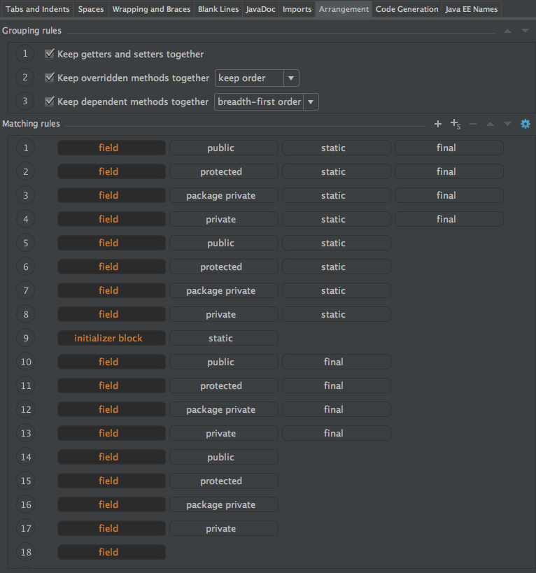
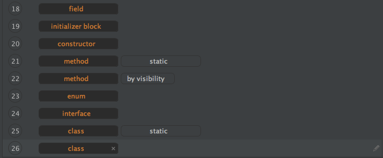

= Code style guide
:source-highlighter: prettify
:icons: font
:toc: left
:experimental:
:numbered:
Korovin Anatoliy <antkorwin@gmail.com>

## Why coding style conventions is important?

* Maintenance of software is very important.
Exactly the maintenance brings much more profit
than a one-time development.

* Code conventions improve the readability of the software,
allowing engineers to understand new code more quickly and thoroughly

* In my opinion a uniform code style is very important for teamwork,
in the team all the code should look depersonalized,
as if any member of the team could write it.

* Any team member can continue working on your code
and he should not waste time adapting the code for the team's style guide.

## Naming

Naming conventions make programs more understandable by making them easier to read.

### Package names

Package names are all lowercase, with consecutive words simply concatenated
together (no underscores). For example, `com.example.deepspace`,
not [.line-through]#com.example.deepSpace# or [.line-through]#com.example.deep_space.#

### Class names

Class names are written in `UpperCamelCase`.

Class names are typically nouns or noun phrases. For example, `Character` or `ImmutableList`.
Interface names may also be nouns or noun phrases (for example, `List`),
but may sometimes be adjectives or adjective phrases instead (for example, `Readable`).

Use whole words — avoid acronyms and abbreviations (unless the abbreviation
is much more widely used than the long form, such as URL or HTML)

There are no specific rules or even well-established conventions for naming annotation types.

Test classes are named starting with the name of the class they are testing,
and ending with `Test` or `IT`. For example, `UserServiceTest` or `UserRepositoryIT`.

Abstract class with some basic functionality usually named as BaseSomething,
for example: `BaseEntity`, or `BaseArgument`.

There are no rules for naming interface implementations, if one interface have multiple implementation
better to reflect main specific of implementation in the class name,
for example: `FtpFileScanner` or `SmbFileScanner`.
But if you have a single implementation of interface you can use names like SomethingImpl,
for example `UserServiceImpl` or `EntityMapperImpl`.

### Method names

Method names are written in lowerCamelCase.

Method names are typically verbs or verb phrases. For example, `sendMessage` or `stop`.

### Variables names

Variable names are written in lowerCamelCase.
Variable names should be short yet meaningful.

One-character variable names should be avoided except
for temporary “throwaway” variables. Common
names for temporary variables are `i`, `j`, `k`, `m`, and `n` for integers.
Do not use such variable names as `l` or `o`, because they can be confused with one or zero.

### Constants

The names of variables declared as constants should be all
uppercase with words separated by underscores (`_`).

Constants are `static final` fields whose contents are deeply immutable and whose methods have no detectable side effects.
This includes primitives, Strings, immutable types, and immutable collections of immutable types.

[source,java]
----
// Constants
static final int NUMBER = 5;
static final ImmutableList<String> NAMES = ImmutableList.of("Ed", "Ann");
static final ImmutableMap<String, Integer> AGES = ImmutableMap.of("Ed", 35, "Ann", 32);
static final Joiner COMMA_JOINER = Joiner.on(','); // because Joiner is immutable
static final SomeMutableType[] EMPTY_ARRAY = {};
enum SomeEnum { ENUM_CONSTANT }

// Not constants
static String nonFinal = "non-final";
final String nonStatic = "non-static";
static final Set<String> mutableCollection = new HashSet<String>();
static final ImmutableSet<SomeMutableType> mutableElements = ImmutableSet.of(mutable);
static final ImmutableMap<String, SomeMutableType> mutableValues =
    ImmutableMap.of("Ed", mutableInstance, "Ann", mutableInstance2);
static final Logger logger = Logger.getLogger(MyClass.getName());
static final String[] nonEmptyArray = {"these", "can", "change"};
----

### Type variable names

A name in the form used for classes followed by the capital letter T, examples: `RequestT`, `FooBarT`.

## Class declaration

* Exactly one top-level class declaration (Each top-level class resides in a source file of its own)

## Wrapping & braces

### Wrapping argument of method

ugly:
[source,java]
----
User user = userService.update(userId
                , username
                , passwordEncoder.encode(data.getPassword())
                , data.getAccountType()
                , data.getRoles()));
----

bad:
[source,java]
----
User user = userService.update(userId, username,
                               passwordEncoder.encode(data.getPassword()),
                               data.getAccountType(), data.getRoles());
----

good:
[source,java]
----
User user = userService.update(userId,
                               username,
                               passwordEncoder.encode(data.getPassword()),
                               data.getAccountType(),
                               data.getRoles());
----

### Chained method calls

ugly:
[source,java]
----
mockMvc.perform(post(tokenEndpoint)
                            .param("client_id", clientId)
                            .param("client_secret", clientSecret)
                            .param("grant_type", "password").
                                    param("username",username)
                                    .param("password",password)
                            .param("scope", scope).
                                    header("Authorization", "Basic " +authHeader))
     .andExpect(status().isOk())
                  .andReturn();
----

good:
[source,java]
----
mockMvc.perform(post(tokenEndpoint).param("client_id", clientId)
                                   .param("client_secret", clientSecret)
                                   .param("grant_type", "password")
                                   .param("username",username)
                                   .param("password",password)
                                   .param("scope", scope)
                                   .header("Authorization", "Basic " +authHeader))
       .andExpect(status().isOk())
       .andReturn();
----

### Long signature of a method

When the method has too many parameters (more than five)

* You can group similar parameters into objects
* You can group all parameters into a single method argument
* If the constructor takes a lot of arguments, then you need to make a builder

ugly:
[source,java]
----
public User create(String login, String password, boolean enabled, boolean accountNonExpired, boolean credentialsNonExpired, boolean accountNonLocked, Collection<? extends GrantedAuthority> authorities, String firstName, String lastName, Date birthday) {
        ...
}
----

bad:
[source,java]
----
public User create(String login,
                   String password,
                   boolean enabled,
                   boolean accountNonExpired,
                   boolean credentialsNonExpired,
                   boolean accountNonLocked,
                   Collection<? extends GrantedAuthority> authorities,
                   String firstName,
                   String lastName,
                   Date birthday) {
  ...
}
----

good:
[source,java]
----
public User create(UserCreateArgument argument) {
  ...
}
----

good:
[source,java]
----
public User create(String login,
                   String password,
                   SecurityDescription securityFlags,
                   Personality personality) {
  ...
}
----

## Documentation (javadoc)

### When you need to write documentation

At the minimum, Javadoc is present for every `public class`, and every `public`
or `protected` member of such a class, with a few exceptions noted below.

### Exception: obvious names

[quote, Mark Twain]
When you have nothing useful to say, say nothing!

Javadoc is optional for simple method names like `getTime`,
in cases where there really and truly is nothing else worthwhile to say but "Returns the time".

[NOTE]
it is not appropriate to cite this exception to justify omitting relevant information
that a typical reader might need to know.
For example, for a method named `getCanonicalName`, don't omit its documentation
(with the rationale that it would say only `/** Returns the canonical name. */`)
if a typical reader may have no idea what the term "canonical name" means!

### Exception: overrides

Documentation is not always present on a method that overrides a supertype method, make your documentation on the super class.

### Example

[source,java]
----
/**
 * Created by Korovin A. on 06.02.2018.
 *
 * Helper for transformation data from Object[] to target class instance.
 *
 * @author Korovin Anatoliy
 * @version 1.0
 */
public class ObjectToInstance {

    /**
     * Create new instance of target class(targetClass),
     * from fields described in arrays of Objects(sourceObjects).
     * 

     * WARNING: target class must be contain all argument constructor,
     * with the same types as sourceObject elements
     *
     * @param sourceObjects  array with values of the target object fields
     * @param targetClass    target class type
     * @param <TargetClassT> generic type parameter for the target class type
     * @return instance of targetClass type with all fields value from sourceObject
     */
    public static <TargetClassT> TargetClassT mappedFromObject(Object[] sourceObjects,
                                                               Class<TargetClassT> targetClass) {

        ...
    }

}
----

## Ordering of class contents

IntellijIDEA supports automation tool for arranging code sequence, based on the type of content.
in my case, you can run the reordering of the code by pressing the kbd:[Ctrl+Alt+L] hotkey.

My preferable settings shown on the picture below.

.ordering of class content setting in IntellijIDEA

.ordering of class content setting in IntellijIDEA

Example:

[source,java]
----
/**
 * Created by Korovin Anatolii on 25.02.18.
 *
 * @author Korovin Anatolii
 * @version 1.0
 */
public class Style {

    // static fields : <1>
    public static final String NAME = "ususaly name";
    private static final int MAX_VALUE = Integer.MAX_VALUE;
    private static int internalCounter;

    // static initializer  //<2>
    static {
        internalCounter = 0;
    }

    // fields :  <3>
    public final int minValue = 10;
    private final int middleValue = 100;
    public int randomValue = 1234;
    protected String url;
    long score;
    private String stringValueOfScore;
    private int counter;

    // initializer : <4>
    {
        score = 1100;
    }

    // constructors : <5>
    public Style() {
        counter = 0;
    }

    private Style(int counter) {
        this.counter = counter;
    }

    // static methods : <6>
    public static Style instanceOf(int code) {
        return new Style(123);
    }

    // getter & setters :  <7>
    public int getCounter() {
        return counter;
    }

    public void setCounter(int counter) {
        this.counter = counter;
    }

    // methods :  <8>
    @Override
    public int firstPublicMethod(int a) {
        functionCallByFirstMethod();
        return a + counter;
    }

    private void functionCallByFirstMethod() {
        nextLevelOfNesting();
    }

    protected void nextLevelOfNesting() {
        //
    }

    @Override
    public int secondPublicMethod() {
        return 2;
    }

    void anyPackagePrivateMethod() {
        //
    }

    protected void anyProtectedMathod() {
        //
    }

    private int anyPrivateMethod() {
        return 1234;
    }

    // enumerations : <9>
    public enum NestedEnumeration {
        T1,
        T2,
        T3
    }

    // static nested classes : <10>
    static class NestedStaticClass {
        public int var;
    }

    // nested classes :  <11>
    private class NestedClass {
        private int a;
        private int b;
    }
}
----
<1> static fields (by visibility)
<2> static initializer block
<3> fields
<4> initializer block
<5> constructors, from a smaller to a larger number of arguments (if they do not have any dependencies)
<6> static methods
<7> getters & setters
<8> class methods by visibility with keep sequence of dependent methods together
<9> nested enum
<10> nested static classes
<11> nested classes

Visibility sequence describe on the next diagrams

[plantuml]
....
final -> not final
....

[plantuml]
....
public -> protected
-> package private
-> private
....

++++

<noscript>Please enable JavaScript to view the <a href="https://disqus.com/?ref_noscript">comments powered by Disqus.</a></noscript>
++++
