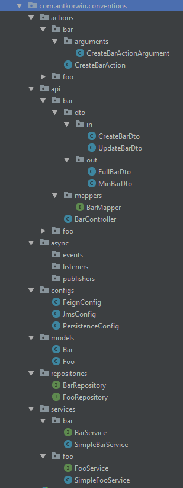

= Code Conventions
:source-highlighter: prettify
:icons: font
:toc: left
:experimental:
:numbered:
:homepage: http://antkorwin.com
Korovin Anatoliy <antkorwin@gmail.com>;  Home <http://antkorwin.com>
// START OF CONTENT

## Именование и организация пакетов

## Константы в сущности

Смотрим бизнес требования, если эти ограничения еще где-то используются то выносим в класс констант внутри класса сущности.

[source, java]
----
@Entity
public class Foo {
  @Id
  @GeneratedValue
  private UUID id;

  @Column(length = NAME_MAX_LENGTH)
  private String name;

  public class Constraints {
    public static int NAME_MAX_LENGTH = 500;
  }
}
----

## Комменты

Пишем только если есть что сказать - названия методов не дублируем в доки,
если поведение неочевидно (не CRUD) пишем что к чему,
если на ревью появляется вопрос непонимания то пишем доки.

Документация на методы пишется в интерфейсе, если она нужна.

Язык документации - Русский =(

Для класса пишем:

- дату создания файла

- автора

- ссылку на оригинал если копировали откуда-то

[source, java]
----
/**
 * Created on 01.08.2018.
 *
 * Класс для обертки над АПИ внешнего сервиса платежей (cash-bill)
 * (clone from: http://bitbucket.com/ws-blahblah.git)
 *
 * @author Korovin Anatoliy
 */
 class CashBillAdapter {

 }
----

// END OF CONTENT
include::../metrica.adoc[]

++++

<noscript>Please enable JavaScript to view the <a href="https://disqus.com/?ref_noscript">comments powered by Disqus.</a></noscript>
++++
