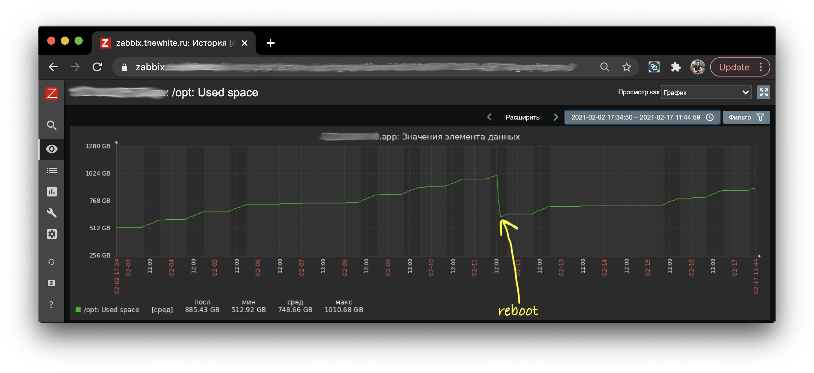
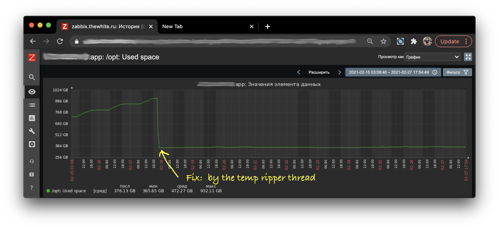

= PhantomReference and how to delete temporary files in java 
:source-highlighter: prettify
:icons: font
:toc: left
:experimental:
:numbered:
:homepage: http://antkorwin.com
Korovin Anatoliy <antkorwin@gmail.com>; Home <http://antkorwin.com>
// START OF CONTENT

== Зачем может понадобиться PhantomReference

Если вы когда-нибудь читали о том, какие типы ссылок бывают в java, и недоумевали зачем оно нужно в обычной жизни, то в этой статье я расскажу о реальном сценарии, когда может пригодиться знание того, как работают PhantomReference. 

Если вы еще не сталкивались с различными типами ссылок в java, то можете прочитать эту статью: http://antkorwin.com/concurrency/weakreference.html[Soft, Weak and Phantom references in Java]

image::./intro.png[]

Думаю, что многие были в ситуации, когда в процессе работы приложения нужно создать временный файл, например для обработки какого-нибудь изображения. Держать результат в файле удобно при работе с изображениями достаточно большого размера, когда нельзя постоянно хранить результат выполнения операции в памяти. 

Недавно на работе я заметил в одном из микросервисов, занимающемся конвертацией файлов в разные форматы, что создание временных файлов стало приводить к сильному росту занятого пространства на диске. По правде говоря, не заметить это было сложно, потому что один раз место на диске полностью кончилось и дальнейшая работа сервиса была невозможна. Конечно после этого пришлось поменять настройку уведомлений об инцидентах и теперь мы узнаем об этом заранее, но сегодняшняя история не об этом.

== Стандартный механизм удаления файлов

В java есть стандартный механизм для удаления временных файлов:

[source, java]
----
File temp = File.createTempFile("abc", ".tmp"); 
temp.deleteOnExit();
----

Но с ним есть один подвох: мало кто читает спецификацию, это же скучно, а там написано что файл будет удален только после остановки виртуальной машины, при этом остановка должна быть корректной.     Другими словами, все файлы будут сохраняться на диске в ожидании перезапуска сервиса. Это поведение легко заметить на графике роста занятого места на диске:

За неделю работы сервис создает порядка 500Gb временных файлов, и как только его перезапустили, большая часть их была удалена. 

В нашем случае этот сервис должен работать 24х7 и останавливать его только чтобы подчистить темп, по меньшей мере - странно. Конечно можно начать следить за использованием временных файлов и добавить логику удаления файла, когда мы точно завершили с ним работу, но наше приложение не маленькое, было написано довольно давно и добавить такую логику (еще и протестировать ее полностью) - довольно трудозатратно, да и попросту лень. 

## Используем PhantomReference

Что можно сделать в такой ситуации? Нам нужен механизм, позволяющий удалить файл после того как с ним закончили работу. Формально это может значить, что как только у нас не осталось ссылок на файл, и объект указывающий на него собран GC, то файл можно удалять с диска. И тут нам приходит на помощь PhantomReference, этот тип ссылок  позволяет отследить момент сборки объекта коллектором. Как только ссылка на объект будет извлечена из очереди, мы можем удалять файл на диске. 

Для этого нам потребуется расширить класс PhantomReference, добавим туда путь до файла и метод для его удаления:

[source, java]
----
class TempFileReference extends PhantomReference<Object> {

	private final String path;

	TempFileReference(File file,  <1>
	                  ReferenceQueue<? super Object> queue) { <2>
		super(file, queue);
		this.path = file.getPath();
	}

	boolean delete() {
		File file = new File(path);
		if (file == null || !file.exists()) {
			return true;
		}
		return file.delete();
	}
}
----
<1> вот эту ссылку мы будем отслеживать, как только объект пометит GC, мы можем удалять файл на диске, потому что не останется ссылок, по которым можно было бы с ним работать.
<2> указание очереди нам понадобится для того, чтобы потом отслеживать добавления туда наших ссылок, при работе GC

При создании временного файла будем создавать фантомную ссылку на этот файл:

[source, java]
----
private ReferenceQueue<Object> referenceQueue = new ReferenceQueue<>();

public File createTempFile() {
    File tempFile = File.createTempFile("tmp-", "." + extension);
	new TempFileReference(tempFile, referenceQueue); <1>
	return tempFile;
}
----
<1> ссылка на очередь, в которой появится событие, когда
объект соберет GC

При этом в отдельном потоке нужно ждать в очереди наш указатель, как только мы его получим, файл можно удалять:

[source, java]
----
class TempFileReaperThread extends Thread {

	public TempFileReaperThread() {
		super("TempFileReaper");
		setDaemon(true);
	}

	@Override
	public void run() {
		while (true) {
			TempFileReference unusedReference = 
			      (TempFileReference) referenceQueue.remove();  <1>
			unusedReference.delete();  <2>
			unusedReference.clear(); <3>
		}
	}
}
----
<1> ждем пока GC не соберет нашу ссылку на файл
<2> удаляем файл сс диска
<3> зануляем reference объект

Теперь, за неделю работы приложения, размер папки temp - практически не изменился. Это хороший результат, как минимум это значит что теперь никто не будет разбужен ночью сообщением о том что место на диске кончилось. 

Конечно, у этого механизма есть оверхед в плане производительности. Создавать новый поток для сборки неиспользуемых файлов - не дешевая операция, но при необходимости этот поток можно создать однажды при старте приложения и оставить фоновым демоном. Я использую вариант, когда поток создается при запросе первого временного файла и останавливается, когда все файлы удалены. Однако в нашем кейсе создание файлов происходит настолько интенсивно, что этот поток почти никогда не останавливается. 

WARNING: Примеры кода в статье осознано упрощены, если вы хотите использовать полноценное решение для создания временных файлов, с автоматическим удалением после завершения работы с ними, то воспользуйтесь готовой библиотекой: https://github.com/antkorwin/ioutils[github.com/antkorwin/ioutils] ну и конечно я буду рад, если вы поставите звездочку на гитхабе =)

// END OF CONTENT
include::../metrica.adoc[]

