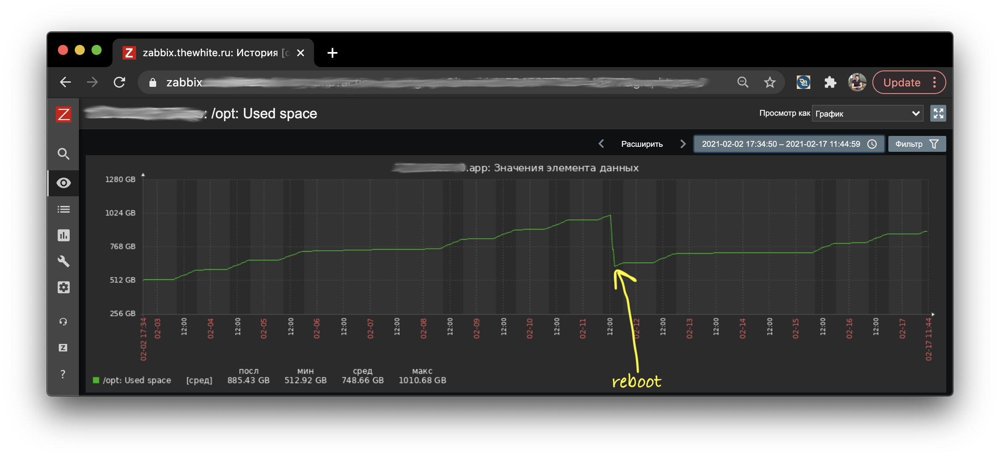
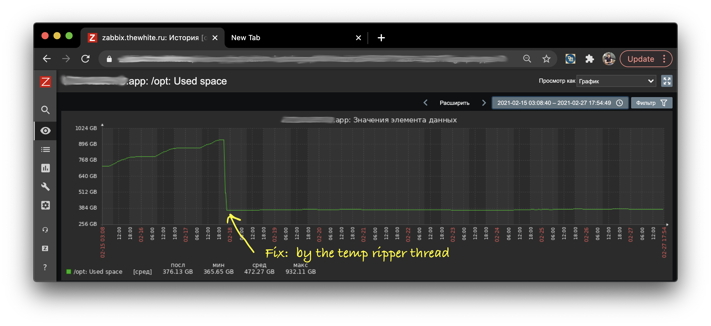

= Automaticaly deleted temporary files in Java (based on PhantomReferences) 
:source-highlighter: prettify
:icons: font
:toc: left
:experimental:
:numbered:
:homepage: http://antkorwin.com
Korovin Anatoliy <antkorwin@gmail.com>; Home <http://antkorwin.com>
// START OF CONTENT

== A real example of using PhantomReferences

If you ever wondered how we should use different types of references in Java and the answer to this question isn't obvious for you, then in this article you can read about a real example of using the PhantomReference. 

However, if you are not already familiar with the difference between references in Java then you can read this article: http://antkorwin.com/concurrency/weakreference.html[Soft, Weak and Phantom references in Java]

Let's talk about our case, I think the use of temporary files is a pretty common use case. For example, when we making a multiple-stage image processing, we can save an intermediate result in a temporary file, especially if this file large enough to store in memory.

Recently, at work, I noticed that one of the microservices (which converting files in different formats) has allocated all free space on a disk and stopped. The reason for this behavior is the active creating of the temporary files.  

Of course, after this incident, we have changed the notification policy and start to watch the temp folder capacity. But today we will be talking about the more pragmatic solution.

== Standard java API to delete temporary files.

There is a standard approach to delete a temporary file in java:

[source, java]
----
File temp = File.createTempFile("abc", ".tmp"); 
temp.deleteOnExit();
----

This API has one unusual behavior: the file will be deleted only after JVM exit. Of course, this described in the JavaDoc, but who reads the docs!? it's boring. So, the temporary file will be deleted after the normal termination of the virtual machine. In other words, all files will be persisted on a disk until we restart our application. 

It can be seen on the graph of the free space of the disk:

In one week this microservice created around 500 Gb temporary files, and after reboot, most of these files were deleted.

In our case, this application should work 24x7, and reboot this service just to clean a temp folder sounds like a strange solution. Of course, we can delete temp files manually after finish processing, but it will require a lot of refactoring and complicate unit tests. 
 

How we can simplify the solution for this problem? We need something to track all references to the file because we can delete a file from the disk exactly after all references will be collected by GC. Using PhantomReference can help us, when the reference is dequeued from the queue we can delete a file.

Let's extend the PhantomReference class to add a path to the temporary file and method to delete the file from the disk:

[source, java]
----
class TempFileReference extends PhantomReference<Object> {

	private final String path;

	TempFileReference(File file,  <1>
	                  ReferenceQueue<? super Object> queue) { <2>
		super(file, queue);
		this.path = file.getPath();
	}

	boolean delete() {
		File file = new File(path);
		if (file == null || !file.exists()) {
			return true;
		}
		return file.delete();
	}
}
----
<1> this reference we will track and when GC marked the object, we will delete a file (because nobody uses the file at this moment).

<2> the reference to a file will be added in this queue after collected by GC.

We will wrap the reference to the file in our TempFileReference:

[source, java]
----
private ReferenceQueue<Object> referenceQueue = new ReferenceQueue<>();

public File createTempFile() {
    File tempFile = File.createTempFile("tmp-", "." + extension);
	new TempFileReference(tempFile, referenceQueue); <1>
	return tempFile;
}
----
<1> in this queue will be published reference when GC collect our file object.

In the separate thread, we waiting a reference from the queue:

[source, java]
----
class TempFileReaperThread extends Thread {

	public TempFileReaperThread() {
		super("TempFileReaper");
		setDaemon(true);
	}

	@Override
	public void run() {
		while (true) {
			TempFileReference unusedReference = 
			      (TempFileReference) referenceQueue.remove();  <1>
			unusedReference.delete();  <2>
			unusedReference.clear(); <3>
		}
	}
}
----
<1> waiting until GC collect references to the file 
<2> delete the file from disk
<3> clear the reference object (set `null` in reference)

During the next week, after we applied this update, the size of the temp folder doesn't change. It's a good result, at least this means that nobody will wake up with an alarm notification in the night.

However, this approach has a performance overhead. Create a new thread to remove unused files isn't a trivial operation, but we can create this thread once at the start of the application and set it as a demon thread. 

In my project, I prefer to create the cleaning thread simultaneously with the first temp file and keep this thread until all temporary files will be deleted.  In our project, temporary files using so frequently that the cleaning thread doesn't have time to stop.

WARNING: All examples and source codes in this article have been simplified. If you want to use a complete tool to create temporary files you can use this library:  https://github.com/antkorwin/ioutils[github.com/antkorwin/ioutils] Of course, I'll be glad if you set a star in this library on GitHub. =)

// END OF CONTENT
include::../metrica.adoc[]

