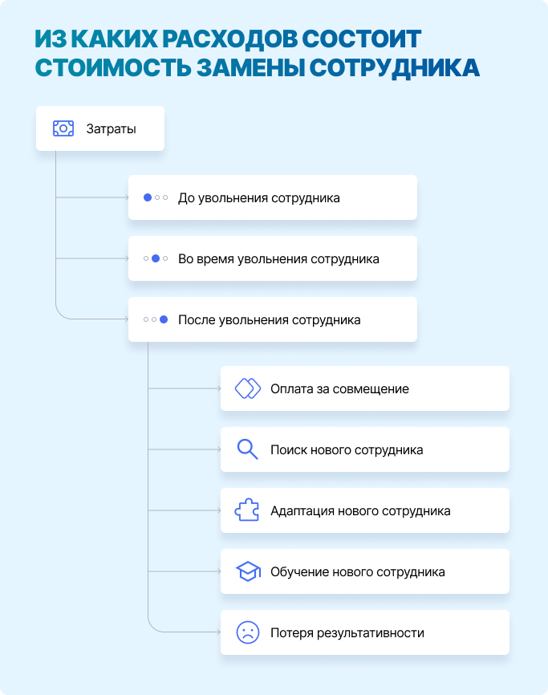

= Как посчитать стоимость замены уволившегося сотрудника
:source-highlighter: prettify
:icons: font
:toc: left
:experimental:
:numbered:
:homepage: http://antkorwin.com
Korovin Anatoliy <antkorwin@gmail.com>;  Home <http://antkorwin.com>

Давайте разберемся сколько компания тратит на замену уволившихся сотрудников, из каких статей расходов складывается эта сумма и как можно ее сократить. Цену, которую мы платим при увольнении сотрудника, можно разделить на три периода: до увольнения, во время, и после.

 

Важно осознавать эти расходы, особенно если вы не Google или Netflix и текучесть кадров сложно снизить самой большой зарплатой на свете. 

== Действительно ли нужны две недели отработки

Большинство руководителей стремятся сохранить уходящих сотрудников на протяжении двух недель, чтобы успеть найти замену. Однако эффективность работы таких сотрудников будет другой. Даже если они очень ответственно подходят к передаче дел и не проводят все время на кухне с коллегами, обсуждая причины ухода и свои дальнейшие планы. Очень сложно ожидать той же отдачи что и раньше, это нормально, мы не роботы. Снижение производительности может быть вызвано различными факторами, такими как отсутствие мотивации, сосредоточение на поиске новой работы, переходе и адаптации, а также эмоциональными причинами, связанными с прощанием с коллегами и компанией.

В итоге, производительность таких сотрудников снижается на 30 - 50%, компания фактически тратит половину их зарплаты впустую.

При заработной плате в 100 000 руб на руки, сотрудник обходится компании в намного бОльшую сумму, это важно учесть, вам придется выплачивать: отчисления, страховые и социальные взносы, налоги, оплачивать инфраструктурные расходы на офис, vpn, онлайн сервисы Jira, Confluence и т.д. Тут могут быть специфичные для отрасли и должности инструменты. Поэтому стоимость часа в выше указана больше, чем просто ЗП разделенная на 160 рабочих часов в месяц.

== Сколько стоит оформить увольнение

Тут все просто, нужно учесть работу отдела кадров на оформление бумаг, расчет компенсаций и т.п. При этом сюда же нужно отнести время, которое потратят руководители (или HR) на обсуждение причин увольнения с сотрудником. В это однозначно стоит инвестировать, чтобы проблема не повторилась. 

== Сколько стоит вернуться к прежней эффективности 

Вот тут начинается самое интересное. Кто-то должен подхватить работу уволившегося, пока мы ищем замену. Найти замену тоже не просто, минималистичный вариант: объявление на headhunter и поиск своими силами, хорошо если у вас есть рекрутер в штате. Оплачивать работу внешнего рекрутера будет дороже, и не факт что он сможет быстро понять специфику ваших процессов, чтобы подобрать подходящих кандидатов.

После того как мы нашли замену, нам предстоит процесс онбординга. Новенькому нужно выделить наставника или ментора, как ни назови, кому-то придется тратить свое время на адаптацию сотрудника. Точно не стоит ждать, что с первого же рабочего дня он будет также эффективен как ушедший. Длительность адаптации сильно зависит от ваших процессов и должности сотрудника. В среднем можно рассчитывать на полноценный рабочий темп через месяц-полтора. Важно учесть, что в этот период, эффективность работы команды просядет, и вам предстоит это как-то компенсировать. Потеря эффективности сильно зависит от квалификации сотрудника который уволился, в среднем можно считать что это 10-20%.

Итого получаем следующий расчет:

== Сколько компания платит за это в течение года

Теперь обсудим такой вопрос, как процент текучести в вашей компании.
Если вы знаете, сколько сотрудников уволилось за год и среднюю численность персонала, то можете посчитать какая текучесть кадров у вас. 

Зная этот процент и стоимость замены одного сотрудника, рассчитанную выше, можно посчитать сколько вам стоит замена уволившихся в течение года:

А теперь представим, что наша платформа мотивации персонала wicando сможет снизить текучесть. Даже снижение всего на 3 процента, даст заметный экономический эффект, полноценное использование платформы может дать эффект более 5%.

Самые внимательные заметили, что какие-то показатели я обвел желтым - это то над чем стоит работать в первую очередь. Оптимизации этих значений, дадут вам самый большой эффект в сокращении стоимости текучести кадров.

== Полезности

Скопировать таблицу себе и пересчитать сколько в вашем случае будет стоить замена сотрудника можно тут:

image:../../icons/excel.png[github,64,64]  link:https://docs.google.com/spreadsheets/d/1SGxZitQF7HTZXolJsZ6AWmxtKd-XuR02mDuKbHs7MxM/edit?usp=sharing[ Калькулятор расходов на замену сотрудника]

Если понравилась статья, то можно подписаться на обновления в телеграм канале:

image:../../icons/tg.png[github,64,64]  link:https://t.me/antkorwin_blog[ t.me/antkorwin_blog]

include::../../metrica.adoc[]