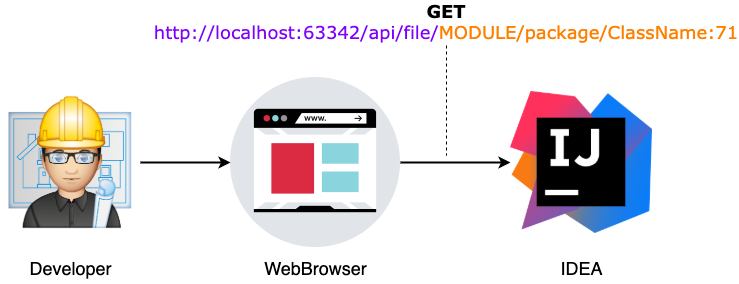

= How to open files in IDEA from a browser
:source-highlighter: prettify
:icons: font
:toc:
:experimental:
:numbered:
:homepage: http://antkorwin.com
Korovin Anatoliy <antkorwin@gmail.com>;  Home <http://antkorwin.com>
// START OF CONTENT

## Do you know that IDEA runs a web server in background?

After starting IDEA runs the web server to implement an open file service.

You can use this service to open necessary file in IDE, all what you need is the file reference
and name of the project module.

When we open a link in the browser, the IDEA webserver (on the default 63342 port)
handles this request, asks about permissions for your browser and
opens the requested class file in the code editor. Of course,
if you have opened a window with this project.

Format of the url:

[source]
----
curl http://localhost:63342/api/file/relative/to/module/root/path/to/file.kt:100:34
                       |                |                             |       |  |
                  default port          |                        class name   |  column number
                                        |                                     |
                              path to the class file                      line number
----

We can find the source code of this web-server here: link:https://github.com/JetBrains/intellij-community/blob/a77365debaadcf00b888a977d89512f3f0f3cf9e/platform/built-in-server/src/org/jetbrains/ide/OpenFileHttpService.kt#L52[github.com/JetBrains/intellij-community...]

## How to use the OpenFile server in IDEA?

I think currently this feature requires improvement but even now we can use it to simplify communication between a Web-UI
and source code for developers.

We already use this in one locally internal admin interface, this UI shows synchronization progress between two microservices:
one with a relational database and the second with Elasticsearch.
This UI shows errors happened in the process of synchronization and these errors can contain exceptions with stack traces.

The short video to show how it works:
image:./idea-tricks.gif[IDEA hidden tricks]

When something happens, developers use these logs to find a reason of the problem,
and this is a very useful feature to fast navigate from Web-UI to the source code of the problem.

## Limitations

- You should have already opened IDEA with the target project before you click on the link in a web browser.
- You need to allow access for the web browser to handle these requests in IDEA. It's not a problem, just one popup message.
- You should maintain a map with all project modules and package names in the Web-UI application to parse a package name in a stack trace and match this path to the correct module.
- Currently, this API doesnʼt support inner class references in requests and constructions like this: `FirstLeveClassName$InnerClassName:31`
- This feature doesn't work in Safari (maybe just for me)

## References
- link:https://stackoverflow.com/questions/56061831/create-a-web-browser-link-that-opens-a-file-in-intellij-possible/56066943#56066943[StackOverflow discussion about this feature]
- link:https://github.com/JetBrains/intellij-community/blob/a77365debaadcf00b888a977d89512f3f0f3cf9e/platform/built-in-server/src/org/jetbrains/ide/OpenFileHttpService.kt#L52[Source code from JetBrains github]

// END OF CONTENT
include::../metrica.adoc[]

++++

<noscript>Please enable JavaScript to view the <a href="https://disqus.com/?ref_noscript">comments powered by Disqus.</a></noscript>
++++
