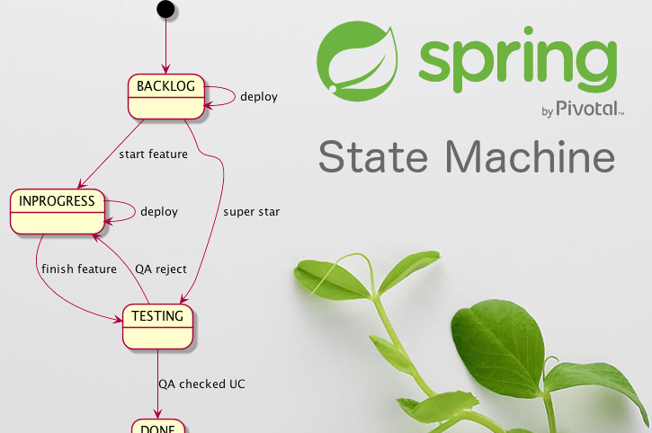
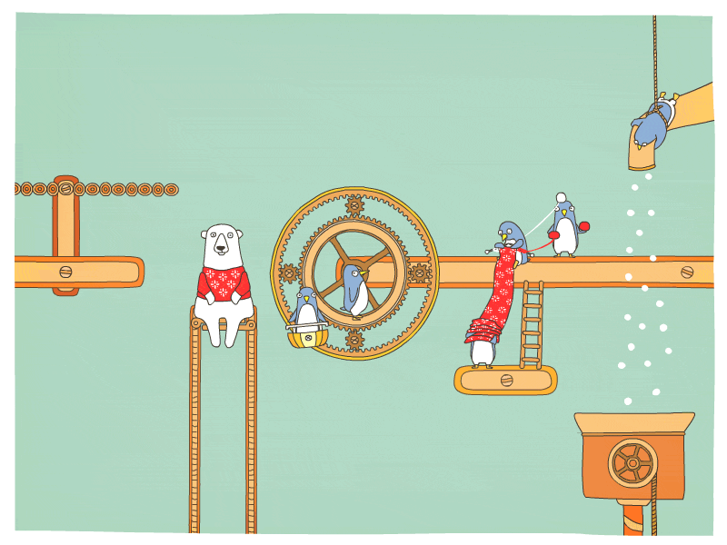

= Java Software Design
:source-highlighter: prettify
:icons: font
:experimental:
Korovin Anatoliy <antkorwin@gmail.com>

My thoughts about java application development, spring framework, TDD and other...

## Spring State Machine

This article explains how to create a spring state machine.
We will look the configuration of various business cases.
Also we will write several custom implementations for persisting the state machine.

link:./statemachine/statemachine.html[English version] image:./statemachine/eng.png[english,25]

link:./statemachine/statemachine_rus.html[Russian version] image:./statemachine/rus.png[russian,25]

## Spring cloud infrastructure

Here, we discussed the building of an infrastructure for a microservice application,
based on spring cloud stack. link:./cloud/micros.html[Read more]

## Traps, Pitfalls, Strangenesses...

image::truble.jpg[double truble, 520,200]

different problems and difficulties that often occur in the development process
link:sherlock.html[Read more]

## Code style conventions

image::conventions.png[arrange_1]

In our development team, we use the following http://antkorwin.com/codestyle.html[code style conventions]

include::metrica.adoc[]
