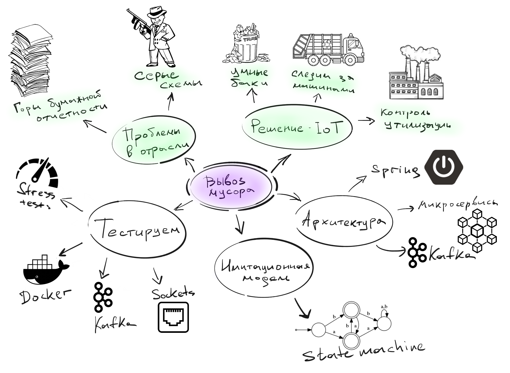
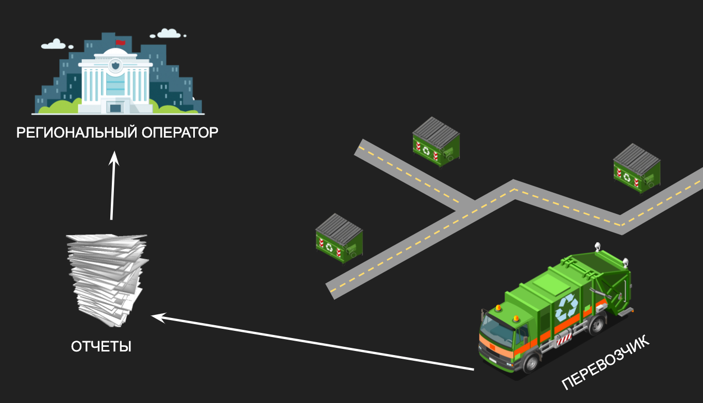
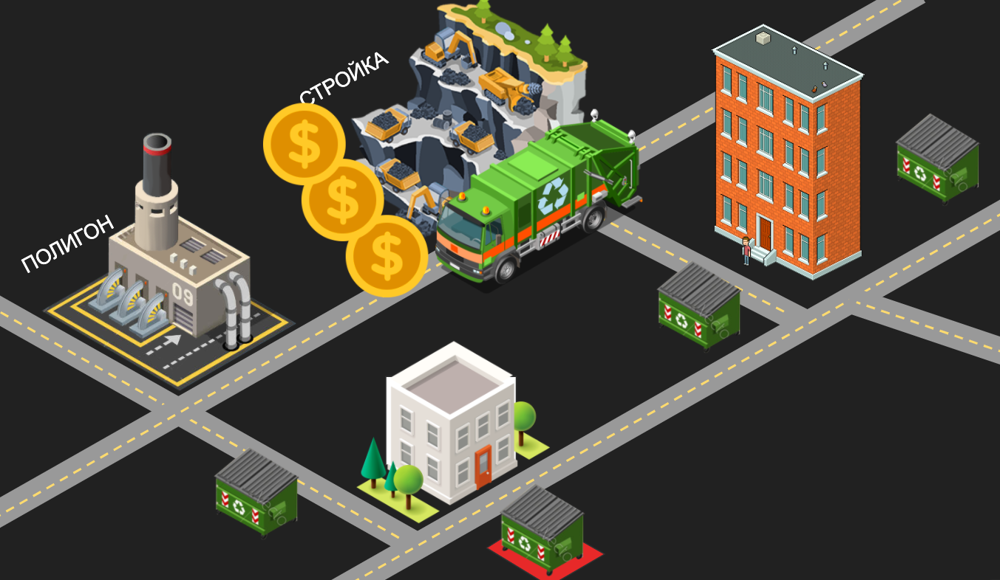
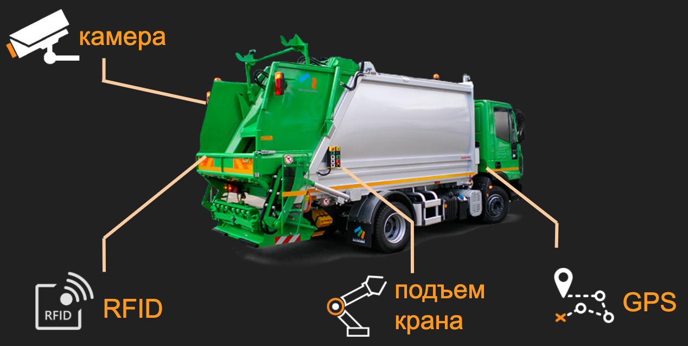
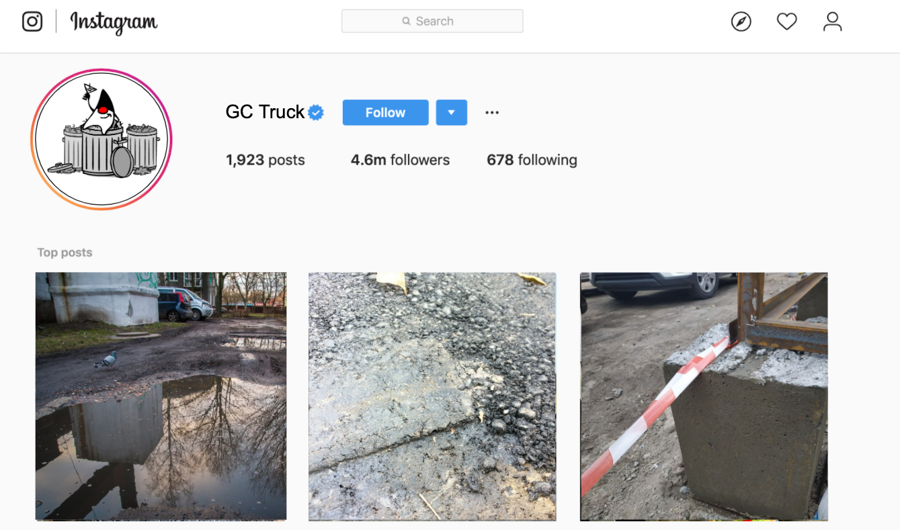
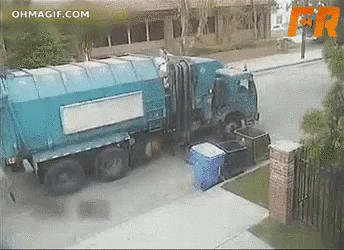
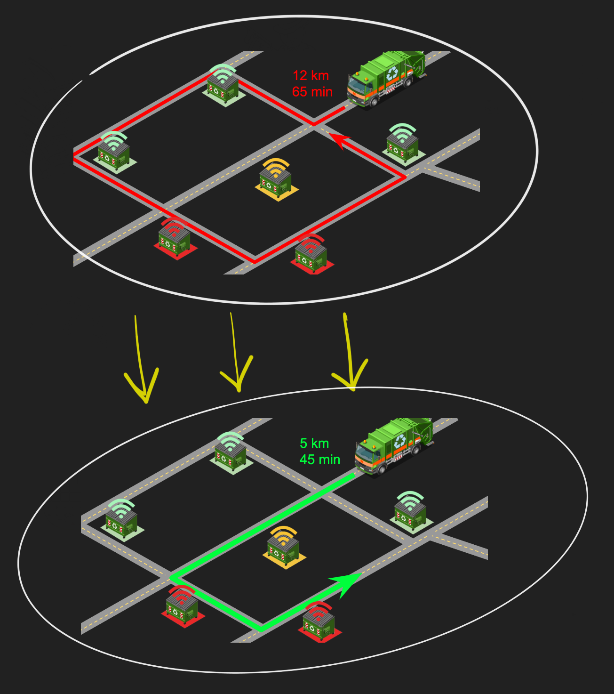
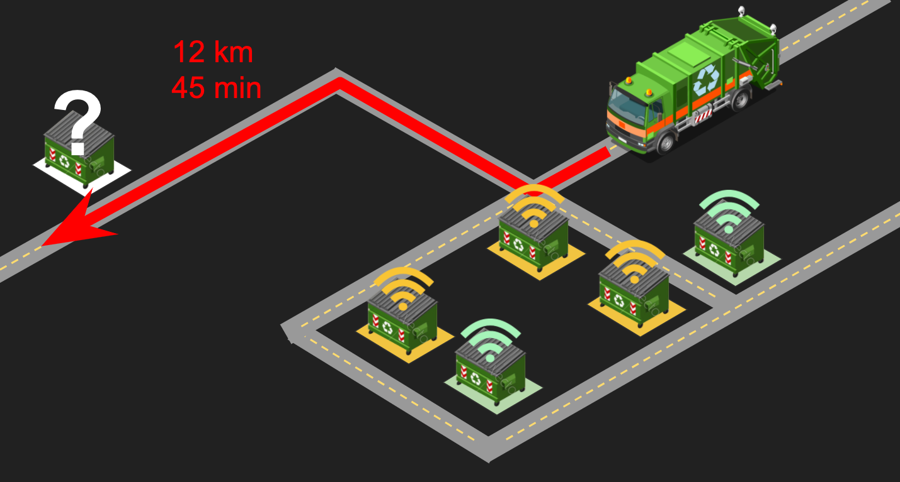

= Вывоз мусора через IoT 
Korovin Anatoliy
:doctype: book
:encoding: utf-8
:lang: en
:toc: left
:numbered:

## Интро

Это расшифровка доклада Коровина Анатолия с конференции Heisenbug 2019 Moscow

## О чем поговорим в этой статье

Общая структура доклада показана на картинке ниже, в этой статье мы рассмотрим только то что закрашено зеленым на схеме. 

Я искрене считаю что в 2020 никто не читает long read-ы, так что будет гуманно разделить эту статью на парочку частей. Если вам понравится первая, то в продолжении мы поговорим о том как все это было устроено под капотом и какие были особенности в тестировании и разработке такого IoT проекта.

Итак, сегодня обсуждать будем только то что закрашено зеленым на схеме.

## Проблемы в отрасли

Основные действующие лица:

* мусорные контейнеры (ну тут все понятно, мы каждый день видим мусорные баки)
* жильцы многоквартирных домов
* региональный оператор (организация отвечающая за работу с ТКО в регионе)
* компании перевозчики мусора (транспортные компании, спецтехника для вывоза ТКО)
* мусорные полигоны (это и мусорные котлованы, и мусоросжигатели, и заводы по переработке мусора)

Когда мы платим за вывоз мусора, то оценить качество услуги проще всего на основании факта вывозв мусора со двора. Но если погружаться глубже в этот вопрос и попытаться выяснить, куда перевозчик везет мусор (до полигона или в ближайшую канаву), то возникают сложности. Поэтому одной из задач нашей системы стал контроль добросовестности исполнителей. 

### Бумажная отчетность

В большинстве регионов с которыми мы работали, региональные операторы собирали отчеты от перевозчиков в бумажном виде. В отчете фиксируется номер автомобиля перевозчика, его маршрут, время загрузки баков и объем мусора. И сдают эти отчеты один раз(или два раза) в год, так что вы можете представить какой это объем данных. 

### Сложно проверить

Учитывая что нет никакого механизма для проверки достоверности этих данных, то во многом отчет принимается "на веру". Для решения проблемы операторы в некоторых регионах установили GPS-трекеры на машины перевозчика и стали отслеживать маршрут транспорта. 

Хоть операторы и задали вектор решения верно, целиком задача не была решена — отчеты все также представляли собой кипу бумаг на полках в офисе операторов. Сложно представить, что кто-то станет проверять все руками. Из этой кучи бумаги нужно достать какую-нибудь случайно, открыть программу трекера, сверить время в отчете и на трекере, местоположение машины. И на проверяющего падает слишком большой объем данных.

Помимо этого, есть недобросовестные перевозчики, использующие уязвимости в этой системе. Они постепенно осознали, какие показатели у них проверяют, и начали выстраивать «серые» схемы.

  
//картинка с машиной и монетками

Например, перевозчик подъезжает к мусорному контейнеру во дворе, водитель выходит из машины, курит пару минут и уезжает, так и не забрав мусор. Затем он приезжает на ближайшую стройку и загружает себя коммерческим мусором, утилизация которого должна оплачиваться отдельно, потому что это отходы производств и других промышленных предприятий. После этого перевозчик добирается до полигона, где уверенно говорит, что весь этот мусор забрал у подъездов жилых домов.

В таком сценарии, маршрут полученный с GPS трекера будет показывать те же самые точки, что фигурируют в отчете перевозчика, но мусор никто не вывез.

И это только один из множества сценариев.

## Решаем проблемы при помощи IoT

Чтобы покрыть наибольшее число сценариев, была построена IoT система включающая автоматизацию мусорных баков, транспорта перевозчика и мусорные полигоны.

### Умные мусорные баки

Для начала мы оборудовали мусорные контейнеры несколькими типами датчиков:

* Обычный ультразвуковой датчик - определяет уровень заполненности контейнера. Использовать дорогие навороченные системы не имело смысла, поскольку такой девайс по цене iPhone не поставишь в мусорку где-то в удаленном районе, и наверняка его кто-то захочет унести домой.

* Датчик температуры - Телеметрия с него дает понять, не горит ли мусор;
акселерометр. Он определяет угол наклона контейнера, и так мы фиксируем в истории, когда приезжал перевозчик и выгружал мусор. А в качестве приятного бонуса мы можем узнать, не перевернули ли вандалы мусорку.

* RFID-метка. С ее помощью можно однозначно сопоставить, какая машина перевозчика выгружает контейнер.

Все данные передавались через GSM/GPRS, так что никаких проводов, просто прицепили на стенку контейнера, и девайс измеряет уровень мусора перед собой.

### Следим за транспортом перевозчика

Для контроля транспорта мы использовали:

* GPS-трекеры
* датчик подъема крана, чтобы отслеживать передвижение арматуры
* RFID-считыватель для определения, какой контейнер прицеплен к машине
* камера на случай каких-либо разбирательств

Как вы думаете, какой датчик оказался самым бесполезным?

Да, снимки с камеры не принесли никакой пользы. Из них не то что гламурный аккаунт в Instagram не соберешь, там даже непонятно на что смотрим-то:

Камеру довольно сложно установить на спец-транспорте перевозчика, так чтобы фотографии были наглядными. В итоге на фото были дорога, шлагбаум, лужи и т.д., и изредка контейнерные площадки с не самых удачных ракурсов. Ожидали увидеть различные нарушения перевозки мусора, а на деле мусор — сами фото. 

### Контролируем утилизацию мусора

Контейнеры и транспорт подключили, осталось получить телеметрию от конечной точки — мусорного полигона. Для этого на въезде устанавливается огромный весовой стенд. Когда автомобиль заезжает, мы распознаем номер машины и фиксируем данные в базе. На выезде транспорт проходит аналогичную процедуру, и на разнице этих двух значений мы и работаем.

## Что дало внедрение системы

Перевозчики от этой системы получают довольно большой профит, поскольку теперь каждое утро они знают оптимальный маршрут следования. Машины теперь могут отправиться сначала к точкам, где контейнеры полностью заполнены, и затем двигаться по точкам по убыванию уровня заполненности. 

Такие треки разительно отличаются от обычных маршрутов перевозчиков, поскольку без телеметрии предугадать оптимальный вариант довольно сложно.

Также бывает и такой сценарий: большинство площадок для вывоза мусора скомпоновано в достаточно малой области, но есть одна точка, которая располагается на значительном расстоянии от других. Без телеметрии трудно узнать, нужно ли забирать мусор с этой площадки, и водитель приедет к ней, увидит, что контейнеры пустые, и уедет, потратив время и топливо.

## To be continued

В продолжении будет о том как устроен backend этого проекта и какую специфику превнес IoT в подходы к тестированию. 

Понравился доклад? Другие не менее интересные доклады вас ждут на конференции Heisenbug 2020 Piter...