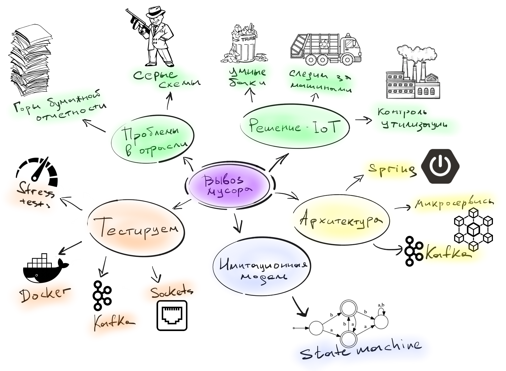
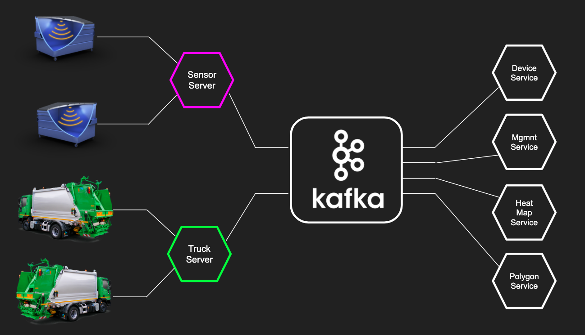
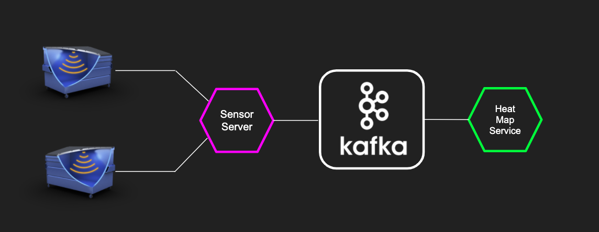
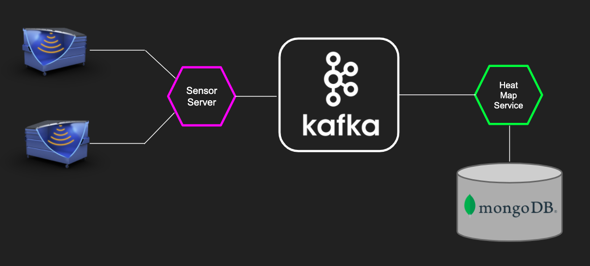
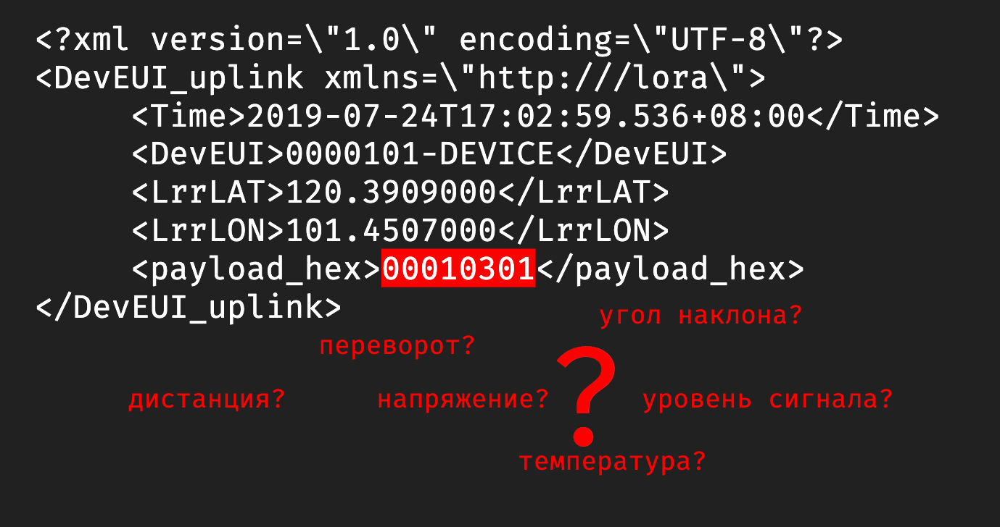
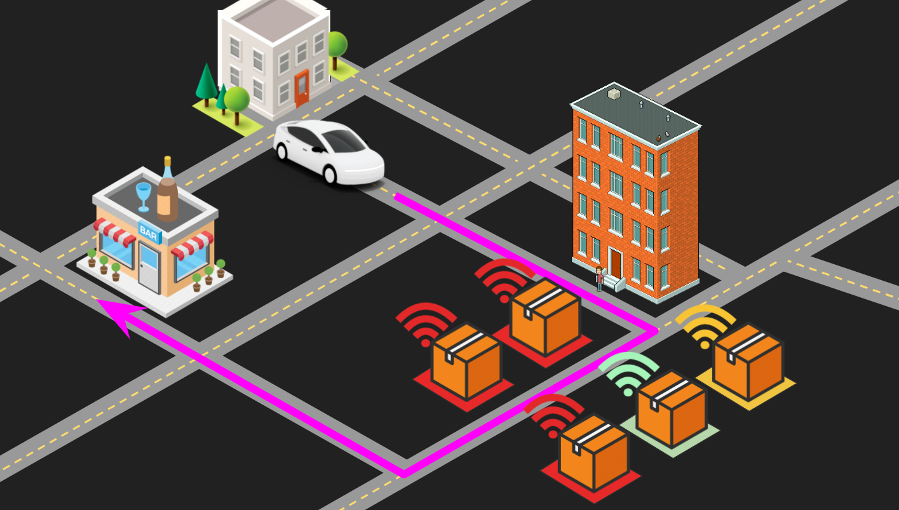
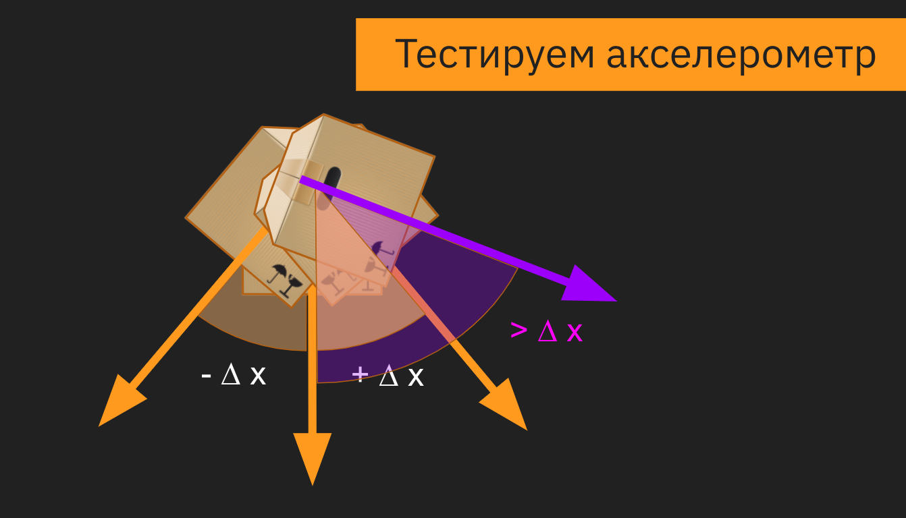

= Вывоз мусора через IoT - part 2
Korovin Anatoliy
:doctype: book
:encoding: utf-8
:lang: en
:toc: left
:numbered:

## Интро

Продолжение первой части, тем кто забыл о чем была прошлая часть, вот наш план:

Сегодня будем разбираться в архитектуре проекта и его тестировании.

## Архитектура проекта

У нас получился типичный микросервисный проект. Слой микросервисов "нижнего уровня" принимает данные с устройств и датчиков, складирует их в Kafka, после чего уже бизнес-ориентированные микросервисы могут работать с данными полученными из Kafka, чтобы показать текущее состояние устройств, построить аналитику и подстроить свои модели.

Kafka в IoT-проекте зашла очень круто. По сравнению с другими системами вроде RabbitMQ, Kafka имеет несколько преимуществ:

 - **Работа со стримами**: Сырые данные с датчиков можно обработать в получить стрим. А со стримами вы можете гибко настроить, что вы хотите отфильтровать в них, и легко сделать рестриминг(сформировать новые потоки данных)
 
- **Логирование**: Kafka больше похожа на журнал, и благодаря структуре данных типа лога мы можем хранить данные, например, за полгода. Из-за того, что сервисы из бизнес-части разрабатывались разными командами, то новые микросервисы добавлялись в проект постепенно. При внедрении сервиса в инфраструктуру мы могли прогнать на нем все данные, которые были получены в Kafka с начала времен, и построить его модель. Это очень удобно когда ты первый раз запускаешь приложение, а у тебя уже есть база событий, полученных с реальных устройств за предыдущий месяц.

## Тестирование

Давайте поговорим о том как тестировать такой проект.

### Бизнесовые сервисы(типичный Backend)

Для начала посмотрим на привычный нам backend, весь бизнес-слой приложения построен на одном стеке Java и Spring. Для тестирования микросервисных приложений в реальном окружении мы используем библиотеку test-containers. Она позволяет легко развернуть внешнюю обвязку (Kafka, PostgreSQL, MongoDB и т.д.) в Docker.

Сначала мы поднимаем нужный контейнер в Docker, запускаем приложение и на реальном инстансе уже гоняем тестовые данные. 

О том, как именно мы это делаем, я подробно рассказывал на Heisenbug 2019 Piter в докладе «Микросервисные войны: JUnit эпизод 5 — TestContainers наносит ответный удар»:

video::UeQfaulJJDo[youtube, width=640, height=380]

Давайте посмотрим на небольшом примере как это выглядело. Сервис нижнего уровня берет данные c девайсов и кидает их в Kafka. А сервис “Heat Map” из бизнес-части забирает данные из kafka и строит тепловую карту.

Давайте протестируем получение данных сервисом "Heat Map" (через Kafka)

[source, java]
----
@KafkaTestContainer
@SpringBootTest
class KafkaIntegrationTest {

    @Autowired
    private KafkaTemplate kafkaTemplate;

    @Test
    void sendTest() {
        kafkaTemplate.send(TOPIC_NAME, MEASSAGE_BODY)
        
        // тут нужно дождаться получения данных
        // и можно проверять что логика их обработки 
        // реализована правильно
    }
}
----

Мы пишем обычный интеграционный SpringBoot-тест, однако он отличается annotation-based стилем конфигурации тестового окружения. Аннотация @KafkaTestContainer нужна для поднятия Kafka. Для ее использования нужно подключить библиотеку: 

https://github.com/jupiter-tools/spring-test-kafka[github.com/jupiter-tools/spring-test-kafka]

При старте приложения, запускается Spring и стартует Kafka контейнер в Docker. Затем в самом тесте мы используем kafkaTemplate, инжектим его в тестовый кейс и отправляем данные в Kafka, чтобы протестировать логику обработки новых данных из топика.

Все это происходит на нормальном инстансе Kafka, никаких embedded-вариантов, а только та версия, что крутится в продакшене.

Сервис Heat Map использует в качестве хранилища MongoDB, и тест для MongoDB выглядит похожим образом:

[source, java]
----
@MongoDbDataTest
class SensorDataRecordServiceTest {

    @Autowired
    private SensorDataRecordRepository repository;
    
    @Test
    @MongoDataSet(value ="sensor_data.json")
    void findSingle() {
        var log = repository.findAllByDeviceId("001");
        assertThat(log).hasSize(1);
        ...
    }
}  
----

Аннотация `@MongoDbDataTest` запускает MongoDB в Docker аналогично Kafka. После того, как приложение было запущено, мы можем пользоваться репозиторием для работы с MongoDB. 

Для использования в ваших тестах этого функционала, все что нужно это подключить библиотеку: 

https://github.com/jupiter-tools/spring-test-mongo[github.com/jupiter-tools/spring-test-mongo]

К слову говоря, там есть много других полезностей, например можно перед выполнением теста загружать в базу данные, через анотацию `@MongoDataSet` как в примере выше, или при помощи аннотации `@ExpectedMongoDataSet` проверить что после выполнения тестового кейса в базе появился именно тот набор данных, который мы ожидаем.

[WARNING]
====
Подробнее о работе с тестовыми данными Анатолий расскажет на Heisenbug 2020.
====

### Тестируем IoT специфичные вещи

Если бизнес-часть — это типичный бэкенд, то работа с данными с девайсов содержала много граблей и специфики, связанной с железом.

У вас есть девайс, и вам надо с ним сопрягаться. Для этого вам понадобится документация. Хорошо, когда у вас на руках и железка, и доки к ней. Однако у нас все начиналось по-другому: была только документация, а девайс был еще в пути. Мы запилили небольшое приложение, которое в теории должно было работать, но как только приехали реальные девайсы, наши ожидания столкнулись с реальностью.

Мы думали, что на входе будет бинарный формат, а устройство стало кидать в нас каким-то XML-файлом. И в такой жесткой форме родилось первое правило для IoT-проекта:
[WARNING]
====
НИКОГДА НЕ ВЕРЬ ДОКУМЕНТАЦИИ
====

В принципе, полученные с устройства данные были более-менее понятные:
`Time` — это временная метка, `DevEUI` — идентификатор девайса, `LrrLAT` и `LrrLON` — координаты.

А вот что такое `payload_hex`? Мы видим 8 разрядов, что в них может быть? Это дистанция до мусора, напряжение датчика, уровень сигнала, угол наклона, температура или вообще все вместе взятое? В какой-то момент мы думали, что китайские производители этих девайсов познали какой-то фен-шуй архивирования и смогли в 8 разрядов запаковать все, что только можно. Но если посмотреть выше, то видно что время записано обычной строкой и содержит в 3 раза больше разрядов, то есть байты явно никто не экономил. В итоге выяснилось, что конкретно в этой прошивке половина датчиков в девайсе просто выключена, и нужно ждать новую прошивку. 

Пока ждали, мы сделали в офисе тестовый стенд, который, по сути, был обычной картонной коробкой. На ее крышку мы прикрепили устройство и закидывали в коробку всякий офисный хлам. Еще нам нужен был тестовый экземпляр машины перевозчика, и ее роль исполняла машина одного из разработчиков в проекте.

Теперь мы видели на карте, где стоят картонные коробки, и знали, куда ездил разработчик (спойлер: работа-дом, и по вечерам пятницы никто бар не отменял). 

Однако система с тестовыми стендами просуществовала не долго, потому что есть большие отличия от реальных контейнеров. Например, если говорить про акселерометр, то мы крутили коробку из стороны в сторону и получали показания с датчика, и вроде все работало. Но в реальности есть некие ограничения. 

В первых версиях девайса угол измерялся не в абсолютных значениях, а в относительных. И когда коробку наклоняли больше, чем на фиксированную в прошивке дельту, то датчик начинал работать некорректно или даже мог не зафиксировать поворот.

Конечно, все эти ошибки в процессе исправили, но на старте различия между коробкой и контейнером принесли много проблем. И мы просверлили бак со всех сторон, пока решали, как расположить датчик в контейнере, чтобы при подъеме бака машиной перевозчика мы точно фиксировали, что мусор выгружают.

Помимо проблемы с углом наклона, мы поначалу не учли, каким будет реальный мусор в контейнере. И если мы кидали в ту коробку пенопласт да подушки, то в реальности люди складывают в контейнер все подряд, даже цемент с песком. И в результате однажды датчик показывал, что контейнер пуст, хотя на самом деле тот был заполнен. Как выяснилось, кто-то во время ремонта выкинул крутой звукопоглощающий материал, который гасил сигналы от датчика.

В этот момент мы решили договориться с арендодателем бизнес-центра, где находится офис, чтобы установить датчики на его мусорные контейнеры. Мы оборудовали площадку перед офисом, и с этого момента жизнь и будни разработчиков проекта кардинально изменились. Обычно в начале рабочего дня ты хочешь выпить кофе, почитать новости, а тут у тебя вся лента забита мусором, буквально:

При тестировании температурного датчика, как и в случае с акселерометром, реальность преподнесла новые сценарии. Пороговое значение для температуры довольно сложно подобрать так, чтобы мы вовремя узнали, что датчик горит и не распрощались с ним. Например, летом контейнеры сильно нагреваются под солнцем, и установка слишком малой пороговой температуры чревата постоянными уведомлениями от датчика. А если девайс реально горит, и кто-то начинает его тушить, то нужно готовиться к тому, что бак зальют доверху водой, потом кто-нибудь его уронит, и тушить будут уже на полу. При таком сценарии датчик, очевидно, не выживет.

image::./fire0.gif[]

В какой-то момент к нам пришла новая прошивка (вы же помните, что мы ее ждали?).  Мы накатили ее на датчики, и протокол связи с датчиком вновь сломался. Прощай, XML, и да здравствует опять бинарный формат. Хочется надеяться в этот момент, что сейчас он соответствует документации, но… нет же! 

[WARNING]
====
Поэтому второе правило: читай первое правило, то есть никогда не верь документации.
====

Что можно сделать? Например, заняться реверс-инжинирингом: сидим с консолью, собираем данные, крутим-вертим датчик, ставим что-то перед ним, пытаемся выявить закономерности. Так можно вычленить дистанцию, статус контейнера и контрольную сумму. Однако некоторые данные было сложно интерпретировать, потому что китайцы, видимо, любят велосипеды. И чтобы запаковать в бинарный формат число с плавающей точкой для интерпретации угла наклона, они решили взять два байта и разделить на 35.

И во всей этой истории нам сильно помогло то что нижний слой сервисов, работающий с девайсами был изолирован от верхнего, и все данные переливались через кафку, контракты на которую были согласованы и закреплены. 

Это сильно помогало в плане разработки, поскольку если поломался нижний уровень, то мы спокойно пилим бизнес-сервисы, потому что контракт в них жестко зафиксирован. Поэтому настоящее второе правило разработки IoT-проектов — это изолировать сервисы и использовать контракты.

## Иммитационная модель
