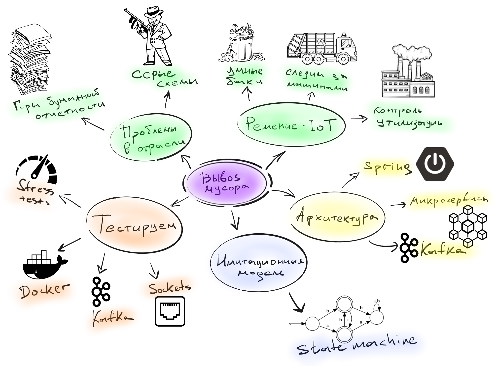

= Вывоз мусора через IoT - part 3
Korovin Anatoliy
:doctype: book
:encoding: utf-8
:lang: en
:toc: left
:numbered:

## Интро

Продолжение первой части, тем кто забыл о чем была прошлая часть, вот наш план:

Сегодня немного поговорим о как построить модель системы и затронем такие темы как нагрузочное тестирование и проверку проекта на более-менее похожих на реальность данных.

## Иммитационная модель

Как я уже рассказывал в прошлой части, протоколы взаимодействия с девайсами вещь довольно нестабильная и шансы потерять связь с тестовыми устройствами, после обновления прошивки, были довольно большие. Разработкой занималось несколько команд и было жесткое требование не терять возможность тестировать бизнес-слой приложения, даже если перепрошивка устройств переломает весь флоу работы с датчиками.

Для того чтобы бизнес-аналитики могли тестировать свои гипотезы на более менее похожих на реальность данных, мы построили имитационную модель устройсва. Таким образом если устройство ломалось из-за новой прошивки, а данные необходимо было срочно получить, мы запускали в сеть имитационную модель заместо реального девайса, которая по старому формату гоняла данные и выдавала результат.

Также плюсом модели было то, что бизнес никогда не купит большую партию устройств только для проверки гипотезы. Например, команда бизнес-анализа решила, что тепловая карта должна строиться по другим законам или предсказание времени заполнения контейнера должно работать по-другому. И для проверки их гипотезы никто не побежит покупать 10 000 датчиков.

Сама имитационная модель выглядела следующим образом:

Состояние и поведение мусорного бака описывается обычной state-машиной. Сначала мы инициализируем state-машину состоянием `EMPTY (level = 0)` и можем выполнять над ней некоторые действия, то есть закинуть мусор в контейнер. Теперь нужно определиться, остается ли контейнер пустым `(level ? MAX_LEVEL)` либо же он переполнен `(level >= MAX_LEVEL)`. Если второе, то состояние меняется на `FULL`. 

Из полного контейнера кто-то может выгрузить мусор, либо же дворник пришен наводить свои порядки, и нам надо решить, в какое состояние переходить. За выбор действия отвечает стэйт `CHOICE` — в терминологии state-машины, что-то похожее на блок if.

Еще контейнер может гореть,и тогда состояние state-машины меняется на `FIRE`. Также, контейнер может падать, и его состояние становится `FALL` (в докладе я кстати рассказывал о том какими неожиданными причинами могут быть вызваны падения контейнеров). Но есть еще одно состояние `LOST`, которое допустимо из любого другого стейта - оно устанавливается при потере связи.

Такой конечный автомат описывает почти все поведение контейнера и датчика на нем. Но этого недостаточно, чтобы сделать имитационную модель, потому что мы знаем о возможных состояниях и переходах из них, однако не знаем, какова вероятность этих событий и когда они произойдут. 

По факту получилось, что вероятность событий зависела от времени суток, потому что:

- перевозчики не работают ночью;

- люди выбрасывают больше мусора в определенные часы (утром перед работой и вечером).

Поэтому мы сделали для команды бизнес-анализа возможность настраивать поведение имитации. Можно было задать вероятность того или иного события в определенное время суток.

## Простой и наглядный stress test

Сама имитация имеет много преимуществ, и одно из них — дешевое нагрузочное тестирование. Дешевое, потому что имитация — это, по сути, отдельный поток, который запускает state-машину, применяет к ней события, и сами события отправляются на реальный сервер. 

Поэтому имитация для бэкенда вообще ничем не отличается от реального датчика. И если нам нужно запустить 1000 датчиков, запускаем 1000 потоков и работаем. Кроме того, имитация прекрасно масштабируется.

С одной стороны, так тестировать нагрузку довольно грубо, но с другой имитация дала возможность прогнать много приближенных к реальности данных по всему проекту. И не стоит забывать про одаренных китайских разработчиков, которые проигнорировали стандартные протоколы вроде MQTT и запилили свой протокол поверх сокетов. Поэтому нам пришлось делать свою реализацию сервера, принимающего данные на сокетах под этот проприетарный протокол.

Такой сервер должен был быть многопоточным, поскольку много входных датчиков. и эту часть тоже нужно протестировать отдельно, используя performance-тесты. Можно было взять JMeter (написать типичный тестовый сценарий), JMH / JCStress (протестировать изолированные части и сделать более тонкий бенчмарк), либо что-то свое. Когда вы принимаете решение в подобной ситуации, то советую послушать профессионалов, например, Алексея Шипилева. На JPoint 2017 он очень круто рассказывал о том, как бенчмаркать разные вещи и о чем нужно думать когда знимаетесь тестированием производительности.

video::p2b4JHESEOc[youtube, width=640, height=380]

Мы выбрали вариант сделать что-то свое, поскольку в проекте был нетипичный подход к QA — унас нет отдельной команды тестировщиков, и команда бэкенда сама тестировала функциональность. То есть человек, написавший socket-сервер, должен был сам покрыть код обычными юнитами, интеграционными и performance-тестами. 

У нас был небольшой инструмент, который позволял быстренько описать сценарий нагрузки и запустить его в нужном количестве параллельных потоков:

[source, java]
----
StressTestRunner.test()
                .mode(ExecutionMode.EXECUTOR_MODE)
                .threads(THREADS_COUNT)
                .iterations(MESSAGES_COUNT)
                .timeout(5, TimeUnit.SECONDS)
                .run(() -> sensor.send(MESSAGE));

Awaitility.await()
          .atMost(5, TimeUnit.SECONDS)
          .untilAsserted(() ->
            verifyReceived(MESSAGES_COUNT)
          );  
----

Мы говорим, сколько нужно прогнать потоков, сколько сообщений отправить, за какое время все это должно пройти, и отправляем в каждом потоке данные в сокет. Остается только ждать, что наш сервер сможет корректно обработать все эти данные. Вышло всего лишь несколько строчек кода, которые под силу написать любому бэкенд-разработчику.

## Эмуляция сетевых проблем

С помощью имитации мы смогли симулировать как некачественную, так и специфичную работу с сокетами. GSM-симки в датчиках не имеют «белых» IP-адресов, и мы могли получить в течение дня по 50 раз данные с разных IP. И часто бывало так, что соединение открывалось, мы начинали передавать данные, потом меняется IP-адрес, и сервер открывает новое соединение, не закрывая старое. Если бы мы не брали это в расчет, то за пару дней у нас кончились бы свободные порты на сервере.

Также возникла проблема разной скорости работы датчиков. Медленное устройство может открыть соединение и зависнуть на некоторое время, в то время как быстрый будет что-то присылать. И все это нужно корректно обработать. В имитации симулировать подобную ситуацию легко, используя паузы.

Это только часть сценариев, которые можно заложить в модель. 

## Выводы

Мне кажется что именно возможность имитационного моделирования сильно отличает IoT от других проектов: моделировать поведение девайсов проще, чем поведение людей. На входе мы получаем детерминированные значения, хорошо коррелирующие с нашей моделью, а не случайные человеческие поступки. Потому что поведение устройств описать логически проще, чем поведение людей, и тестировать систему становится легче.

полезности:

следующая конфа: 
