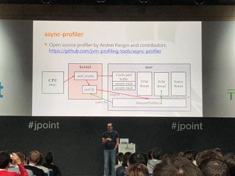
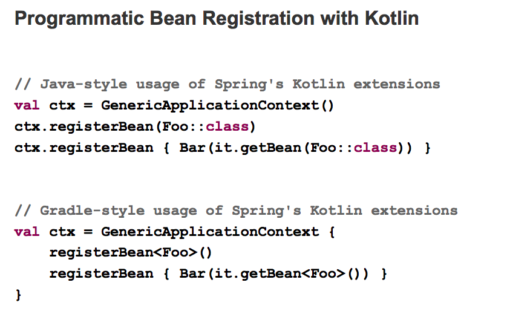

= JPoint 2018
:source-highlighter: prettify
:icons: font
:toc: left
:experimental:
:numbered:
:homepage: http://antkorwin.com
Korovin Anatoliy <antkorwin@gmail.com>;  Home <http://antkorwin.com>
// START OF CONTENT

## Доклады

### Spring 5 (Jurgen Holler)

- spring 5 & spring boot 2
- reactive web
- java 9 (jigsaw)
- junit 5
- kotlin

### Kafka + Bintray (Барух и Гамов)

- API стримит в HTTP ивенты
- продюсим ивенты в кафку
- данные из топика заворачиваем в стрим и все это вертится в KSQL сервере
- лелаем запросы поверх стрима через KSQL

### Spark ML (Алексей Зиновьев)

### Рефакторинг на модули java 9 (Rabea Gransberger)

### BoF : Spring + Kotlin
- тут были неловкие вопросы

### Boot yourself (1 & 2) Толкачев, Борисов
- ну вы сами видели

- нет смысла писать EPP в нормальном App
image:./jpoint2018/epp.jpg[]

### Профилирование контейнеров (Саша Голдштейн)
- перфоманс тулинг для контейнеров

### Design clean code (Marcus Biel)
- смузи

### VmStructs (Пангин Андрей)
-  hardcore

### Spring 5 future (Jurgen Holler)

- Java vs Kotlin

- Чуток кода:

- Вся правда про реакт:

### Детективы

## Общение

### Потрошители
- холиварчики Constructor based or fields ?
- шаринг контрактов
- тесты стендов
- агрегаторы
- отчеты
- легаси
- spring data ? elastic

### Jurgen Holler
- реактив
- java модули

### Барух и человек Кафка
- kafka то что нужно!

### Райф
- bpm
- планирование

### hh.ru
- luchen
- jms

## Фоточки

// END OF CONTENT
include::metrica.adoc[]

++++

<noscript>Please enable JavaScript to view the <a href="https://disqus.com/?ref_noscript">comments powered by Disqus.</a></noscript>
++++
