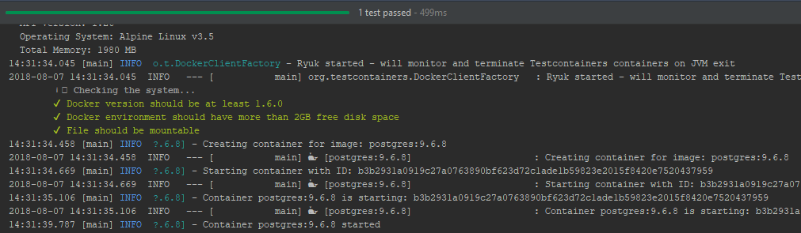

= How to use the JUnit5 in the Spring Framework 4
:source-highlighter: prettify
:icons: font
:toc: left
:experimental:
:numbered:
:homepage: http://antkorwin.com
Korovin Anatoliy <antkorwin@gmail.com>;  Home <http://antkorwin.com>
// START OF CONTENT

## Resolve a SpringExtension

If you have a project with the Spring Framework older than 5.0
or a project with the SpringBoot older than 2.0
then you cannot find SpringExtension class in sources of spring libs.

To fix this you need to add a Sam Brannen's dependency:

[source, xml]
----
<dependency>
	<groupId>com.github.sbrannen</groupId>
	<artifactId>spring-test-junit5</artifactId>
	<version>1.2.0</version>
	<scope>test</scope>
</dependency>
----

Also you need to add the jitpack in repositories block of your pom file:

[source, xml]
----
<repositories>
    <repository>
        <id>jitpack.io</id>
        <url>https://jitpack.io</url>
    </repository>
</repositories>
----

## Example

Let's make a new spring boot project with parent link to the 1.5.9:

[source, xml]
----
<?xml version="1.0" encoding="UTF-8"?>
<project xmlns="http://maven.apache.org/POM/4.0.0" xmlns:xsi="http://www.w3.org/2001/XMLSchema-instance"
  xsi:schemaLocation="http://maven.apache.org/POM/4.0.0 http://maven.apache.org/xsd/maven-4.0.0.xsd">
  <modelVersion>4.0.0</modelVersion>

  <groupId>com.antkorwin</groupId>
  <artifactId>junit5-utils-demo</artifactId>
  <version>0.0.1-SNAPSHOT</version>
  <packaging>jar</packaging>

  <name>junit5-utils-demo</name>
  <description>Demo project for Spring Boot</description>

  <parent>
  	<groupId>org.springframework.boot</groupId>
  	<artifactId>spring-boot-starter-parent</artifactId>
  	<version>1.5.9.RELEASE</version>   <1>
  	<relativePath/> <!-- lookup parent from repository -->
  </parent>

  <properties>
  	<project.build.sourceEncoding>UTF-8</project.build.sourceEncoding>
  	<project.reporting.outputEncoding>UTF-8</project.reporting.outputEncoding>
  	<java.version>1.8</java.version>
		<junit.vintage.version>5.1.1</junit.vintage.version>
		<junit-jupiter.version>5.2.0</junit-jupiter.version>
		<junit-platform.version>1.2.0</junit-platform.version>
  </properties>

  <repositories>
      <repository>
          <id>jitpack.io</id>
          <url>https://jitpack.io</url>   <2>
      </repository>
  </repositories>

  <dependencies>
  	<dependency>
  		<groupId>org.springframework.boot</groupId>
  		<artifactId>spring-boot-starter-data-jpa</artifactId>
  	</dependency>
        ...  <3>

    <!-- JUnit5 test utils and extensions -->
  	<dependency>
  	    <groupId>com.github.antkorwin</groupId>
  	    <artifactId>junit5-integration-test-utils</artifactId>   <4>
  	    <version>0.35</version>
  	    <scope>test</scope>
  	</dependency>
    <!-- JUnit5 test utils and extensions -->

  	<!-- The support for the JUnit5 for a spring boot older than 2.0 -->
  	<dependency>
  		<groupId>com.github.sbrannen</groupId>
  		<artifactId>spring-test-junit5</artifactId>   <5>
  		<version>1.2.0</version>
  		<scope>test</scope>
  	</dependency>
  	<!-- The support for the JUnit5 for a spring boot older than 2.0 -->

  </dependencies>

  <build>
  	<plugins>
  		<plugin>
  			<groupId>org.springframework.boot</groupId>
  			<artifactId>spring-boot-maven-plugin</artifactId>
  		</plugin>
  	</plugins>
  </build>

</project>
----
<1> spring boot older than 2.0 version
<2> jitpack repository
<3> all other dependencies that you need
<4> my custom junit5 extensions to work with a testcontainers and other useful things
<5> Sam Brannen's tools to support a junit5 in the SpringFramework4

Add an one simple entity:

[source, java]
----
@Entity
@Getter
@Setter
@Builder
@NoArgsConstructor
@AllArgsConstructor
public class Task {
    @Id
    @GeneratedValue
    @Type(type = "uuid-char")
    private UUID id;

    private String name;
}
----

And repository:

[source, java]
----
public interface TaskRepository extends JpaRepository<Task, UUID> {
}
----

Now we can write a JUnit5 integration test for this repository:

[source, java]
----
@PostgresIntegrationTests
class TaskRepositoryTest {

    @Autowired
    private TaskRepository taskRepository;

    @Test
    @ExpectedDataSet("dataset/expected.json")
    void name() throws Exception {
        // Arrange
        Task task = Task.builder()
                        .name("name")
                        .build();
        // Act
        taskRepository.save(task);
    }
}
----

In this test we use a PostgreSQL docker container with testcontainers library.

Look at the PostgresIntegrationTests annotation in more details.

[source, java]
----
@Retention(RetentionPolicy.RUNTIME)
@Target({ElementType.TYPE})
@EnableIntegrationTests
@EnableRiderTests
@EnablePostgresTestContainers
public @interface PostgresIntegrationTests {
}
----

This annotation comes from the `junit5-integration-test-utils` artifact,
I made it to create new integration tests with the PostgreSQL docker container
faster than make it manually.

And now, all what you need to create an integration test
with the PostgreSQL docker image is a using of `@PostgresIntegrationTests` annotation.

You can read about an using this meta-annotation in more details here: https://github.com/antkorwin/junit5-integration-test-utils

Deeper and deeper, with meta-annotations:

[source, java]
----
@Retention(RetentionPolicy.RUNTIME)
@Target(ElementType.TYPE)
@ContextConfiguration
@ExtendWith(PostgresTcExtension.class)
@ExtendWith(TraceSqlExtension.class)
@Tag("pg")
public @interface EnablePostgresTestContainers {
}
----

On this level, we can see how to use JUnit5 repeatable annotation `ExtendWith` to add multiple extensions by using a single meta-annotation

## The source code

This project available on github by this link:

image:../icons/git.png[github,64,64] link:https://github.com/antkorwin/junit5-and-spring4[github.com/antkorwin/junit5-and-spring4]

// END OF CONTENT
include::../metrica.adoc[]

++++

<noscript>Please enable JavaScript to view the <a href="https://disqus.com/?ref_noscript">comments powered by Disqus.</a></noscript>
++++
