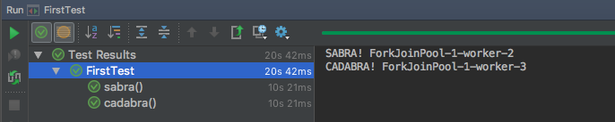
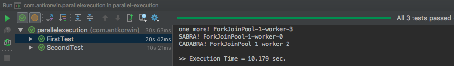
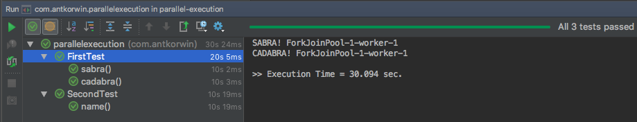

= JUnit5 Parallel Execution of tests
:source-highlighter: prettify
:icons: font
:toc: left
:experimental:
:numbered:
:homepage: http://antkorwin.com
Korovin Anatoliy <antkorwin@gmail.com>;  Home <http://antkorwin.com>
// START OF CONTENT

## Configuration & dependencies

Parallel execution of tests is an experimental feature in the JUnit5 which available from version 5.3.0-RC1.

Until the `JUnit 5.3.0` version is ready to production,
you can use snapshots of release candidates, for this we need to add the following dependencies:

[source, xml]
----
<dependency>
    <groupId>org.junit.jupiter</groupId>
    <artifactId>junit-jupiter-api</artifactId>
    <version>5.3.0-RC1</version>
</dependency>
<dependency>
    <groupId>org.junit.jupiter</groupId>
    <artifactId>junit-jupiter-engine</artifactId>
    <version>5.3.0-RC1</version>
</dependency>
<dependency>
    <groupId>org.junit.platform</groupId>
    <artifactId>junit-platform-engine</artifactId>
    <version>1.3.0-RC1</version>
</dependency>
<dependency>
    <groupId>org.junit.platform</groupId>
    <artifactId>junit-platform-launcher</artifactId>
    <version>1.3.0-RC1</version>
</dependency>
<dependency>
    <groupId>org.junit.vintage</groupId>
    <artifactId>junit-vintage-engine</artifactId>
    <version>5.3.0-RC1</version>
</dependency>
----

For working with snapshots you need to add the `oss.sonatype.org` in repositories and plugin-repositories blocks of your pom file:

[source, xml]
----
<repositories>
    <repository>
        <id>snapshots-repo</id>
        <url>https://oss.sonatype.org/content/repositories/snapshots</url>
        <releases>
            <enabled>false</enabled>
        </releases>
        <snapshots>
            <enabled>true</enabled>
        </snapshots>
    </repository>
</repositories>

<pluginRepositories>
    <pluginRepository>
        <id>snapshots-repo</id>
        <url>https://oss.sonatype.org/content/repositories/snapshots</url>
    </pluginRepository>
</pluginRepositories>
----

Also, you need to add a next configuration of the maven-surefire-plugin:

[source, xml]
----
<plugin>
    <groupId>org.apache.maven.plugins</groupId>
    <artifactId>maven-surefire-plugin</artifactId>
    <version>2.22.0</version>
    <configuration>
        <reportFormat>plain</reportFormat>
        <includes>
            <include>**/*Test*.java</include>
        </includes>
    </configuration>
    <dependencies>
        <dependency>
            <groupId>org.junit.platform</groupId>
            <artifactId>junit-platform-surefire-provider</artifactId>
            <version>1.3.0-RC1</version>
        </dependency>
        <dependency>
            <groupId>org.junit.jupiter</groupId>
            <artifactId>junit-jupiter-engine</artifactId>
            <version>5.3.0-RC1</version>
        </dependency>
    </dependencies>
</plugin>
----

And the last step in the set up is the properties file `junit-platform.properties`,
here we need to turn on parallelism and set up the properties of thread pool:

[source]
----
junit.jupiter.execution.parallel.enabled=true
junit.jupiter.execution.parallel.config.strategy=fixed
junit.jupiter.execution.parallel.config.fixed.parallelism=4
----

## Let's try to check parallel execution of tests

Let's start with a simple example of a one test class with two test-methods:

[source, java]
----
@Execution(ExecutionMode.CONCURRENT)
class FirstTest {

    @Test
    void sabra() throws InterruptedException {
        Thread.sleep(10_000);
        System.out.println("SABRA! " + Thread.currentThread().getName());
    }

    @Test
    void cadabra() throws InterruptedException {
        Thread.sleep(10_000);
        System.out.println("CADABRA! " + Thread.currentThread().getName());
    }
}
----

Run tests and see the following result:

if we look at the console output, we can see names of two different threads, it's good, parallel execution works.
But if we look at the test case timing in IDE,
we can see that a result time is a sum of times of the each test case(not a real elapsed time).
A little later I'll show you how to check it.

Now we consider how to write a simple assert on the parallel execution of tests.

We add an each thread name in the global list of thread names, and we need to write a `AfterAll` callback.
In this callback, we will check the size of list after all threads have completed.

[source, java]
----
@Execution(ExecutionMode.CONCURRENT)
class FirstTest {

    private static List<String> threadNames = Collections.synchronizedList(new ArrayList<>());

    @AfterAll
    static void afterAll() {

        Assumptions.assumeTrue(isParallelExecutionEnable());  <1>

        long count = threadNames.stream()
                                .distinct()
                                .count();

        assertThat(count).isEqualTo(2);
    }

    @Test
    void sabra() throws InterruptedException {
        Thread.sleep(10000);
        threadNames.add(Thread.currentThread().getName());
    }

    @Test
    void cadabra() throws InterruptedException {
        Thread.sleep(10000);
        threadNames.add(Thread.currentThread().getName());
    }
}
----
<1> we used this assumption to make assertions only if the current configuration provides a parallel execution.
You can find source code of assumption here: link:https://github.com/antkorwin/junit5-prallel-execution/blob/master/src/test/java/com/antkorwin/parallelexecution/FirstTest.java[FirstTest.java]

## Run multiple test classes

Parallel execution in JUnit5 runs all tests concurrently by default.
You can configure the behavior of execution within the test class by using the `@Execution` annotation.
Also you can use a `@ResourceLock` annotation to write a more complicated synchronization between tests.

Add a one more test class and return to the question about the elapsed time:

[source, java]
----
class SecondTest {

		@Test
		void name() throws InterruptedException {
				System.out.println("one more! "+Thread.currentThread().getName());
				Thread.sleep(10000);
		}
}
----

I wrote an extension for the JUnit5 to show the elapsed time after completing all tests in suite.

[source, java]
----
public class TestSuiteProfilerExtension implements BeforeAllCallback, AfterAllCallback {

    private ExtensionContext.Namespace NAMESPACE =
                ExtensionContext.Namespace.create("antkorwin", "parallel", "test");

    @Override
    public void beforeAll(ExtensionContext context) throws Exception {
        getStore(context).getOrComputeIfAbsent("startTime",
                                               k -> System.currentTimeMillis());  <1>

        TestDescriptor testDescriptor =
                (TestDescriptor) FieldUtils.readField(context.getRoot(),
                                                      "testDescriptor",   <3>
                                                      true);

        getStore(context).getOrComputeIfAbsent("testClassCount",   			<2>
                                               k -> testDescriptor.getChildren().size());
    }

    @Override
    public synchronized void afterAll(ExtensionContext context) throws Exception {

        int testClassCount = (int) getStore(context).get("testClassCount") - 1;  <4>

				if (testClassCount <= 0) {
						double duration = ((double) System.currentTimeMillis() -
															 getStartTime(context)) / 1000;

						System.out.println("\n>> Execution Time = " + duration + " sec.\n");
				}

        getStore(context).put("testClassCount", testClassCount);
    }

    private long getStartTime(ExtensionContext context) {
        return (long) getStore(context)
                .get("startTime");
    }

    private ExtensionContext.Store getStore(ExtensionContext context) {
        return context.getRoot().getStore(NAMESPACE);
    }

}
----
<1> on the first call of the `beforeAll` method, we store the current time in the extension context storage(if it absent)
<2> store the number of all test classes in the context
<3> this is not clean construction but for our testing purpose it's possible to use it to obtain a number of all test classes that will run.
<4> after execution of each test we can decrement a variable in the junit5 extension context storage

Let's look at the result:

For a comparison, this is the result of running tests without parallel execution:

As you can see with the use of parallel execution, we got the result three times faster.

This is a brilliant feature in `JUnit5`!

If you are still using junit4, think hard about migration to Junit5.

## The source code

This project available on github by this link:

image:../icons/git.png[github,64,64] link:https://github.com/antkorwin/junit5-prallel-execution[github.com/antkorwin/junit5-prallel-execution]

// END OF CONTENT
include::../metrica.adoc[]

++++

<noscript>Please enable JavaScript to view the <a href="https://disqus.com/?ref_noscript">comments powered by Disqus.</a></noscript>
++++
