= Как быстро составить смету проекта, так чтобы точно заработать на нем (8 эффективных правил)
:source-highlighter: prettify
:icons: font
:toc: left
:experimental:
:numbered:
:homepage: http://antkorwin.com
Korovin Anatoliy <antkorwin@gmail.com>;  Home <http://antkorwin.com>

Недавно решил систематизировать работу со сметами. Мне часто приходится обсуждать с заказчиками оценку стоимости работ того или иного проекта, и я не понаслышке знаю как сложно работать с плохой сметой, или когда ее вообще нет, а есть только обрывки сообщений в чате или почте о том, почему технический отдел рассчитал такую стоимость разработки проекта. 

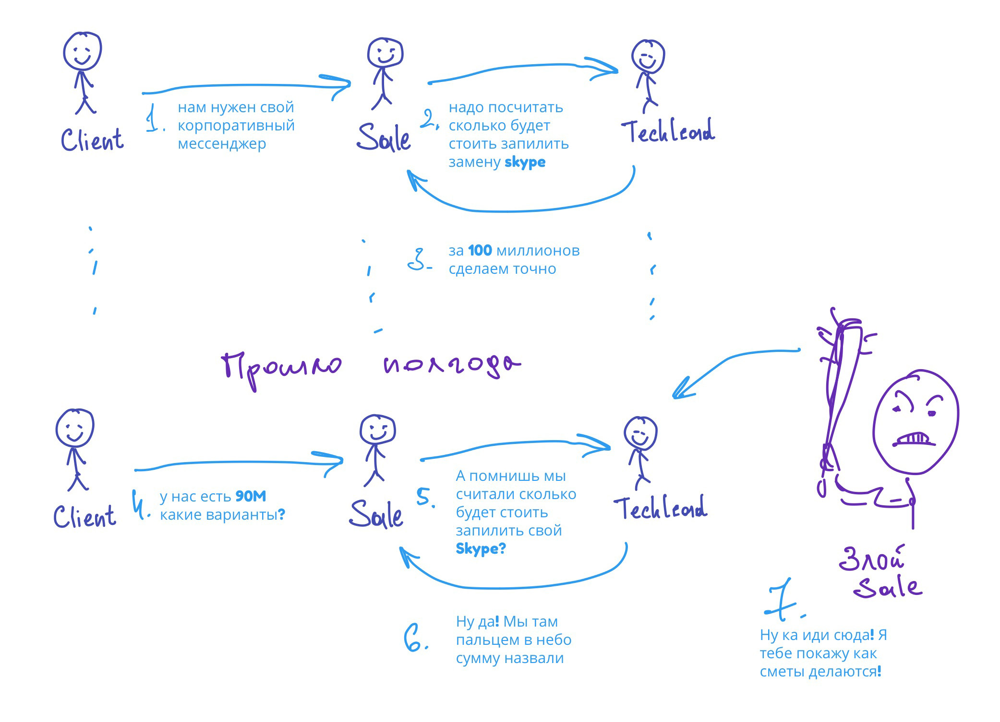 

К каким проблемам может привести отсутствие системной работы со сметами, и на какие грабли наступили мы, перед тем как систематизировали этот процесс - я напишу в следующей статье, так что подписывайтесь, если интересно почитать не только про успешный успех, но и про факапы.

А сейчас мы будем разбираться, как можно все исправить. 

== Первое правило: разделяем проект на задачи (декомпозиция)

Самое главное на этом шаге не лениться. Если перед нами стоит задача оценить разработку нового мессенджера, а мы декомпозировали ее всего на три задачи, то мы не сможем достаточно точно оценить срок их реализации.

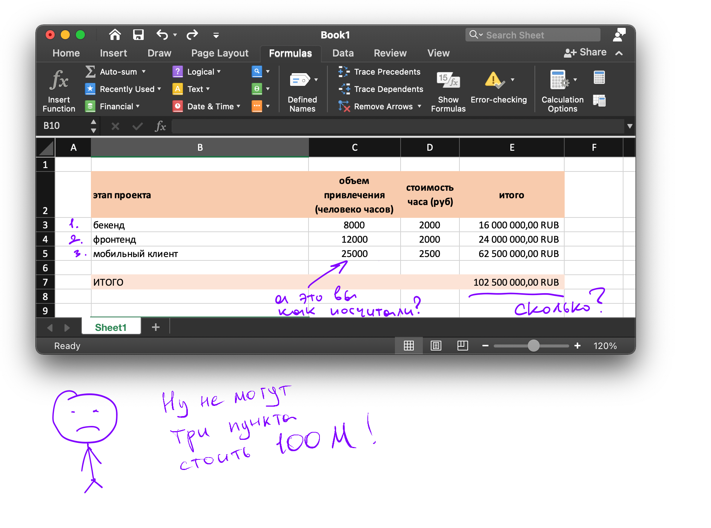

С таким же успехом можно было не разделять вообще эту задачу и сказать, что нам нужно 50 000 человеко-часов на ее реализацию, или даже 100 000, это не важно, потому что обе эти оценки "пальцем в небо". Оценивая задачу "написать свой skype", мы очень плохо понимаем что это такое, пока подробно не распишем, что нам нужно будет сделать:

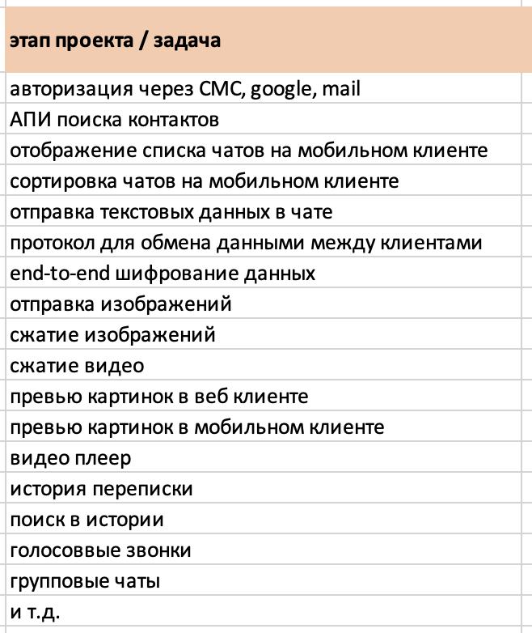

на этот список ушло две минуты, но он уже даст намного более развернутое представление того, что закладывалось в оценку 100М. 

Еще один важный момент в декомпозиции задач для сметы - старайтесь формулировать задачи так, чтобы понимать, какой именно специалист будет отвечать за ее реализацию. Так вы сможете указать специалиста и выбрать грейд необходимый для решения задачи:

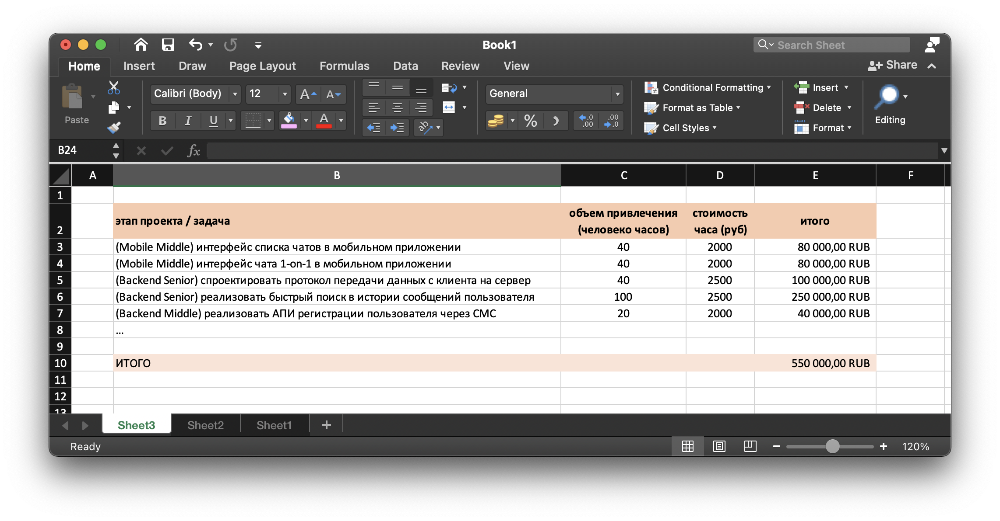

что это нам дает:

- наглядно видно набор компетенций, необходимый команде проекта
- теперь можно прикинуть, какие задачи можно делать параллельно, а какие нет
- последующая оценка трудозатрат становится более реалистичной, вы ведь будете каждый раз думать, какая квалификация сотрудника нужна для выполнения задачи 
- хорошая декомпозиция очень полезна в общении с заказчиком. Если им покажется, что ваша оценка выше их бюджета, то они могут сами посмотреть, что из списка задач можно убрать. Возможно, они и не собирались это делать, либо готовы пожертвовать этим функционалом.
- это работает в обе стороны, вы можете точно так же обсудить с заказчиком приоритеты, чтобы разделить проект на более понятные этапы и минимизировать риск не уложиться в срок

== Второе правило: Автоматизируем в таблице все что можно (дружи с Excel)

Как и обещал, рассказываю, как сделать смету быстро и не напряжно. Если вы будете каждый раз писать ставки ваших спецов руками, то довольно быстро это может надоесть. Еще хуже когда потом надо увеличить или уменьшить ставку какого-нибудь направления, одновременно во всех таблицах. Нужно максимально автоматизировать этот процесс. Выносим все существующие в вашей команде грейды в отдельную таблицу:

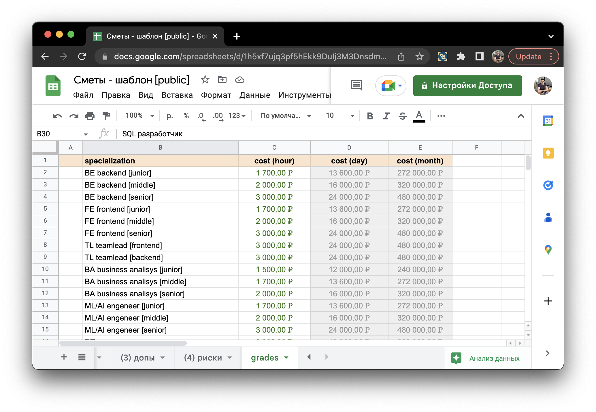

Указываем там стоимость часа и название. После чего подтягиваем их в таблицу с задачами, делаем селектор специалиста и автоматом пересчитываем ставку. Эксель крутая штука, если один раз не полениться и сделать удобный шаблон, то потом будет по кайфу делать крутые сметы.

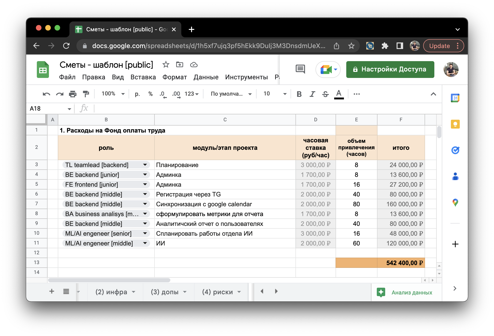

Через валидацию данных в excel можно использовать значения в другой таблице как справочник для drop down в нужном поле. Пользоваться этим довольно удобно, выбираем грейд специалиста и часовая ставка автоматом пересчитывается. Для этого, правда, пришлось использовать парочку формул.

image::grades.gif[]

== Третье правило: оценка трудозатрат не должна быть слишком оптимистичной (PERT estimates)

Оценка расходов на фонд оплыты труда (ФОТ) для айти проектов - это самая важная часть. Промахнуться тут крайне опасно, но и бездумно умножать все сроки на 2 или на 3.14 - это не выход, потому что опытный заказчик, глядя в вашу смету, может понять что обычно похожий функционал занимал меньше времени. Конечно, бывают ситуации, когда в проекте есть дополнительный фактор сложности. Это может быть легаси или крайне не типичный стек технологий, но если у вас нет разумного объяснения, почему вы завысили расходы конкретно в этом случае, то лучше не делать этого. Я предпочитаю даже такие факторы, как легаси и непонятные технологии прописывать в смету явно, в дополнительные расходы или риски, чуть ниже мы об этом еще поговорим. 

Для того, чтобы реалестично оценить estimate задачи, есть метод PERT оценки. В Целом, методология PERT позволяет построить граф из всех задач проекта, эмулировать его запуск, понять критический путь и кратчайший срок завершения проекта. Там же можно увидеть проблемные ребра графа, где больше всего зависимостей. 

Методология, конечно, интересная, но есть очевидные минусы:

- PERT граф сложно быстро нарисовать
- что еще хуже, его сложно понять, когда проект достаточно сложный
- в некоторых проектах такой анализ избыточен, если у вас не так много зависимостей
- редактировать и поддерживать такую схему в процессе реализации проекта тоже не просто
- диаграмма Ганта более наглядный и простой в реализации способ представления

Для нас с вами самое полезное, что есть в методе PERT - это оценка срока выполнения задачи, потому что она учитывает оптимистичное время выполнения задачи и пессимистичное. При этом очень просто считается и дает довольно похожий на правду результат.

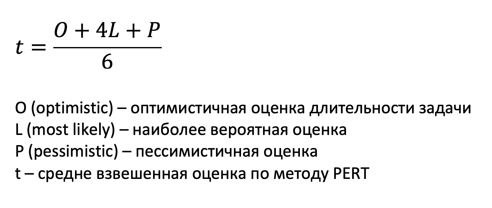

Этот метод можно использовать, чтобы перепроверить себя, частенько я так и делаю. Дать оптимистичную и пессимистичную оценку каждой задачи - довольно не сложно. Чтобы не тратить на это много времени, добавляем в excel формулу вычисления PERT оценки.

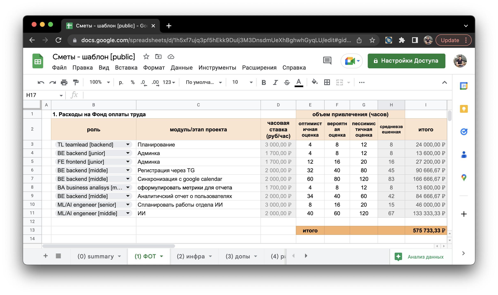

[WARNING]
====
Не забывайте о том, что реализация задачи - это не только кодинг, в нее войдут: планирование, совещания, code review, ретроспективы и т.д.
====

== Четвертое правило: заложить инфраструктурные расходы

Отдельно оцениваем расходы на инфраструктуру. В определенных проектах можно попробовать обойтись без этого, но все чаще прихожу к мысли что все, что мы не включили в смету, потом о себе напомнит, и вы этому не обрадуетесь.

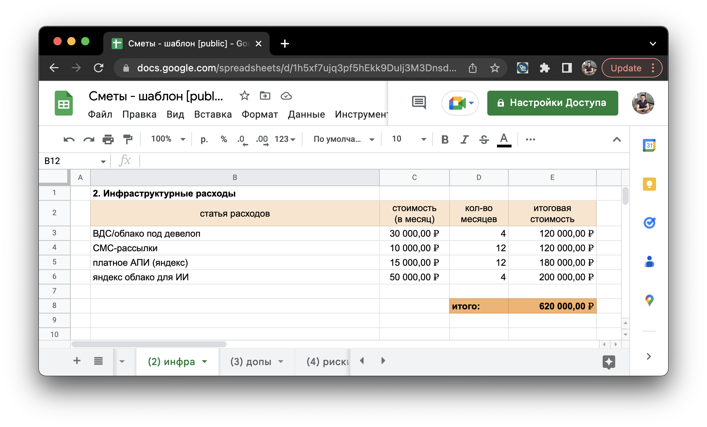

Для айти проектов, в инфраструктурные расходы может войти:
 
 - оплата хостингов/облаков для девелоперского окружения
 
 - если вы используете СМС-рассылки, то это тоже статья расходов
 
 - все чаще мы используем AI в проектах, и чтобы тренировать нейронные сети тоже можно использовать облачные решения, вместо своего десктопа. При этом месячный счет за такую тренировку очень часто превосходит стоимость всего облака под проект за год.
 
 - платные АПИ, например, если вы пользуетесь картографией от яндекса, то это платная история. Когда мы делали проект по автоматизации гос-такси, нужно было вычислять наиболее близкую к пассажиру машину, это делается через матрицу кратчайших расстояний. Стоимость этого сервиса лучше сразу заложить в смету и обозначить заказчику, потому что если он хочет чтобы  приложение знало все о пробках и работало не хуже яндекса, то куда разумнее использовать их алгоритм чем переизобретать велосипеды. Но если цена будет великовата, то заказчик сам может решить, что они готовы пожертвовать этим удобством.   

== Пятое правило: оценить все возможные дополнительные расходы

Давайте представим ситуацию, что вам нужно оценить разработку проекта, в котором используется технология, не знакомая никому в вашей команде. Обучение новому технологическому стеку - это хороший пример доп расходов. Можно оценить стоимость обучения одного человека, тогда вам будет не сложно понять сколько обойдется усиление команды, при масштабировании проекта.

Еще один подходящий кейс - это доработка чужого легаси проекта, такие проекты нужно делить на кусочки и оценивать то, что вы хорошо понимаете как делать. К доп расходам тут можно отнести аудит старой системы. Бывают заказчики, которые не понимают этого, они почему-то считают что вы будете учить своих специалистов за их счет. Тут ваша задача очень четко обозначить, что их проект - это не курс прикладной физики и термодинамики, а вашим специалистам ничего не даст то, что вы потратите уйму времени, чтобы разобраться во всем том безобразии что у них сейчас творится в проекте. Вы не сможете продать эти знания ни одному другому заказчику на планете, потому что каждое легаси уникально по-своему (прям как снежинка, только обычно оно не блестит).

Ниже пример расчета дополнительных расходов:

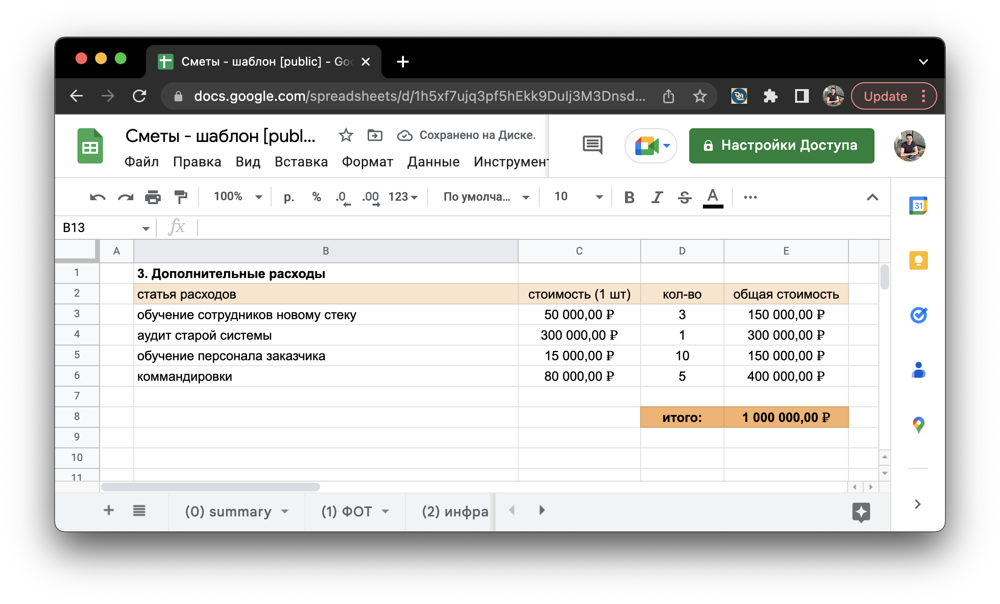

== Шестое правило: Сделать оценку возможных рисков

Вопрос оценки рисков намного шире, чем эта статья, есть разные походы и техники работы с рисками. В рамках сметы, нам важно написать как можно больше возможных рисков и дать им оценку. Оценивать нужно так, как будто бы это произошло и вам нужно как-то нивелироать последствия. Так что доставайте карандаш и бумагу и пишите все возможные проблемы, которые можно предвидеть, а еще лучше позовите команду и обсудите с ними, может кто-то еще подкинет идей.

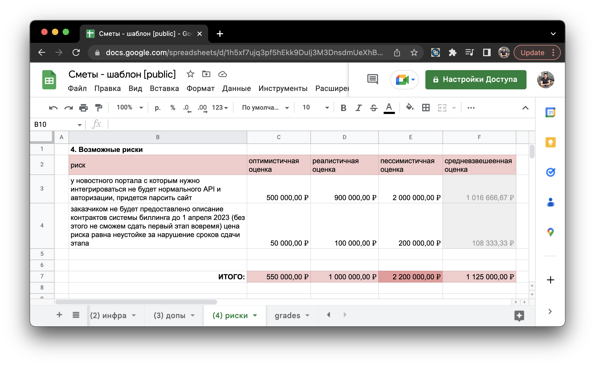

В процессе описания возможных рисков и их оценки в денежном эквиваленте, вы можете взглянуть на проект под другим углом. Еще интереснее это будет понять заказчику, потому что для нас это стоимость работы, а для них успех или провал бизнес-проекта. Вы покажете свою экспертность, если обозначите возможные риски и план их решения. Возможно, заказчик проигнорирует их, но это будет его ответственность.

== Седьмое правило: всегда делаем календарный план проекта

Зачем нужно понимать общий срок выполнения проекта, думаю, что можно не объяснять. А вот примерная диаграмма Ганта, может помочь сейлам в общении с заказчиком. 

Самый быстрый вариант сделать график, это опять же excel. Поймите меня правильно, я люблю другие продукты для планирования, и есть множество софта для этого: Asana, GanttPro, MS Projects, и т.д. Но чтобы сделать это быстро, в нашей таблице, нужно добавить всего одну колонку, срок начала работ:

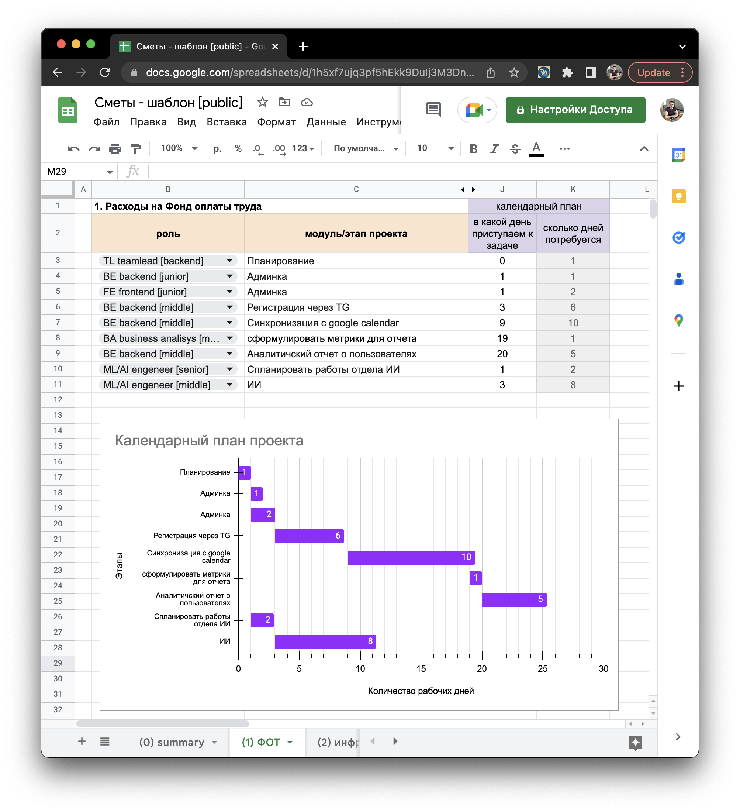

График позволяет: 

- быстро увидеть проблемные этапы

- пустить какие-то задачи в параллель, чтобы ускорить конечный срок

- просто показать сложные процессы

[TIP]
====
Поддерживать такой график на этапе реализации проекта будет не просто, редактирование данных в таком формате быстро не сделаешь, для этого лучше использовать более продвинутые решения. Но прелесть сметы в том, что мы один раз ее пишем и редко редактируем.
====

== Восьмое правило: Используй  с  умом

Скажу честно, я решил написать эту статью, чтобы проще было скинуть шаблон сметы новому сотруднику или подрядчику и ждать от него привычный для себя формат оценки трудозатрат на проект. Унификация таких процессов позволяет существенно экономить время. 

[NOTE]
====
 В любом случае, нужно держать в голове критерий разумности, если проект линейный и супер-типовой для вас, то не нужно выдумывать риски, которых не будет и отсутствующие доп расходы. В идеале, для типового проекта вы просто копируете смету с прошлого раза и вносите парочку корректировок. Так за минуту у вас готовая смета, в которой уже все прописано для заказчика, и вы не тратили на это много времени.
====

Так выглядит папка с типовыми сметами у меня:

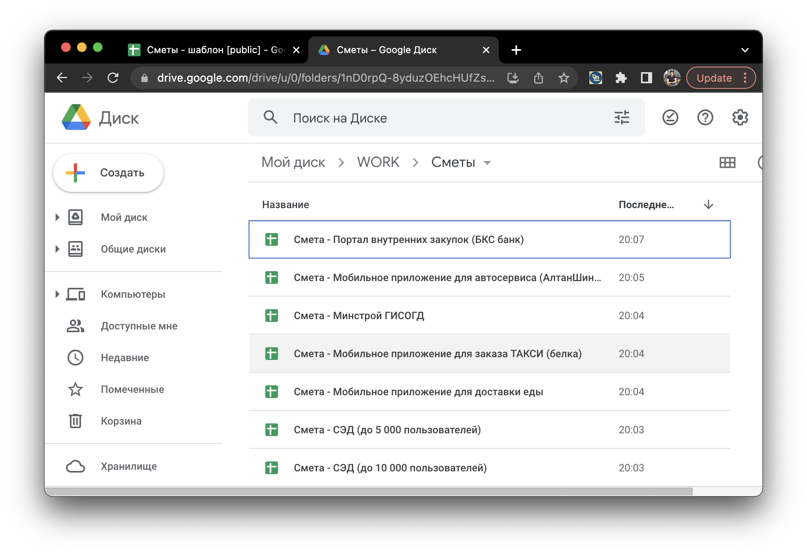

[TIP]
====
Шаблон сметы, который можно скопировать, вы можете найти в моем телеграм канале: https://t.me/antkorwin_blog[t.me/antkorwin_blog] Пользуйтесь на здоровье, буду рад, если напишите в комментариях, пригодился он вам или нет.
====

image:../icons/tg.png[github,64,64]  link:https://t.me/antkorwin_blog[ t.me/antkorwin_blog]

include::../metrica.adoc[]