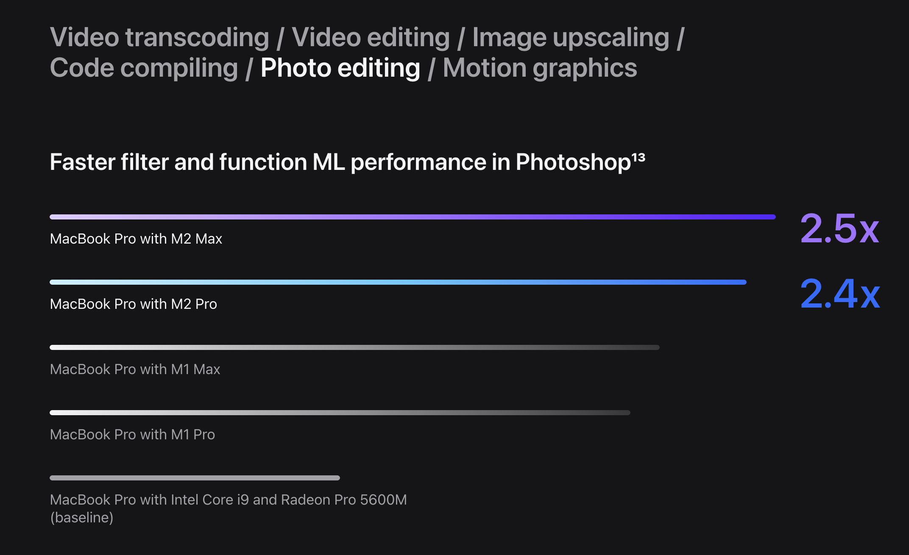

= Как написать Уникальное Торговое Предложение для вашего продукта
:source-highlighter: prettify
:icons: font
:toc: left
:experimental:
:numbered:
:homepage: http://antkorwin.com
Korovin Anatoliy <antkorwin@gmail.com>;  Home <http://antkorwin.com>

== Интро

Для начала нужно понять, что мы продаем. Возможно, у вас уже есть продукт, может быть вы даже его успешно продаете, но никогда не задавались вопросом формирования УТП. И не знаете зачем оно нужно. 

В первую очередь, хорошо сформированное УТП помогает построить маркетинг. УТП - это часть материалов, которые будут активно использоваться вашими sale-специалистами в работе с клиентами. Уникальное ценностное предложение поможет более ясно понимать главную ценность вашего продукта.   

== Что такое УТП, почему это важно?

Для начала минутка истории. Термин Уникальное Торговое Предложение (Unique Selling Proposition) был разработан американским копирайтером-рекламистом Россером Ривзом. 
 
УТП – это причина, **почему клиенту нужно купить именно у вас**, а не у кого-то еще. То, чем вы отличаетесь от остальных компаний. УТП формулируется, как утверждение, которое никто до вас не делал на рынке.

УТП - это понятное описание услуги без шаблонных и расплывчатых формулировок. Это **логическое обоснование приобретения вашего товара клиентом**, оно должно явно подчеркивать решение приобрести товар у вас, а не у конкурентов. 

Сейчас кажется, что предложить что-то уникальное - почти невозможно, но это не так. 

.Миф про уникальность
[TIP]
====
Во времена Россера Ривза, товары были действительно уникальными, а сейчас рынок перенасыщен и предложить что-то уникальное невозможно. Это не так, сам Ривз разделял истинное торговое предложение и ложное. Есть байка о том что он на спор смог доказать, что из двух одинаковых 50-центовых монет - одна лучше другой. В случае, когда у продукта нет уникальных характеристик, придумывается ложное УТП.
====

Ложное УТП - это не обман потребителя, **__это другой взгляд на то, что вы ему предлагаете__**, возможно никто до вас не позиционировал товар под таким углом, а если клиент готов заплатить, то вы все сделали правильно. 

== Пример сильного УТП - лаки страйк

Рынок был перенасыщен товарами и сто лет назад. Так, для того чтобы табачной компании American Tobacco выделиться из массы своих конкурентов в начале 20го века, нужно было формулировать ложное уникальное торговое предложение, не имея истинного УТП, все сигаретные гиганты предлагали рынку примерно одно и тоже.

Эта история стала частью сериала Безумцы(Mad men), очень советую к просмотру, ниже ссылка на этот эпизод:

video::Ktkn1H_QoV0[youtube, height=480, width=720]

Над рекламой American Tobaco работал Альберт Ласкер. Он убедил компанию сфокусироваться на качестве, которое было не уникальным для отрасли, но до Lucky Strike никто не преподносил его под таким углом.

В 1917 году большинство табачных компаний, стали прожаривать табак вместо сушки на солнце. Lucky Strike были одной из таких компаний. Сам факт такой подготовки табака не несет ничего интересного для покупателя, но American Tobacco Company стали первыми, кто использовал этот факт как своё торговое преимущество. Прожарка придавала табаку улучшенный вкус и понижала кислотность, что якобы облегчало воздействие сигарет на горло.

Слово “toasting” легло в основу одного из самых известных слоганов Lucky Strike — “It's Toasted”. В рекламных постерах изображали тосты, поджаренный сыр, запечённые яблоки и другую еду — так реклама убеждала покупателей в том что сигареты Lucky Strike вкуснее, чем у конкурентов.

image::lucky_strike.png[]

== Структура хорошего УТП 
//correct this

Потребитель склонен запомнить из рекламного объявления только нечто одно: либо один сильный довод, либо одну сильную мысль. В рекламном объявлении могут найти отражение пять, десять или даже пятнадцать аспектов, но потребитель, скорее всего, остановит свое внимание только на одном или попытается, как умеет, свести их все вместе в некую собственную идею.

УТП состоит из трех частей:

* Каждое рекламное объявление должно сделать потребителю какое-то предложение. Это должны быть не просто слова, не крикливое восхваление товара и не витринная реклама. Каждое объявление должно говорить каждому отдельному читателю: «Купи именно этот товар и получишь именно эту специфическую выгоду».

* Предложение должно быть таким, какого конкурент либо не может дать, либо просто не выдвигает. Оно должно быть уникальным. Однако это не всегда работает. Реклама известной зубной пасты в свое время утверждала: «Она выдавливается ровной лентой и аккуратно ложится на вашу щетку». Это было предложение, причем уникальное. Но оно не побуждало публику, вероятно, потому, что не сообщало ей ничего существенного.

* Предложение должно быть настолько сильным, чтобы привести в движение миллионы, то есть привлечь к потреблению вашего товара новых потребителей.

image::утп.jpg[]

== Как сформулировать хорошее УТП 

Следующие вопросы помогут в этом:

* *(product)* Какой продукт вы продаете? Простая, емкая и понятная формулировка. Представьте что у вас одна минута, чтобы объяснить человеку про ваш продукт.

* *(client)* Кто должен покупать ваш продукт?
Попробуйте составить портрет вашего покупателя. Подумайте что общего у тех кто уже покупал ваши услуги. 

* *(problem)* Какую проблему решает продукт?
Предложение должно быть простым и понятным целевой аудитории, особенно в эпоху информационной перегрузки, клипового мышления. Говорите, чтобы вас поняли представители ЦА.

* *(pain point)* как ваш продукт улучшит жизнь клиента или решит его проблему?

* *(reason)* Почему должны купить именно у вас, а не у конкурентов?
Уникальное предложение оперирует ценностями продукции для потребителя, а не стоимостью.

* *(specific)* какие конкретно преимущества получит ваш клиент?
Здесь УТП в чем-то схоже с оффером – оно должно быть четким, ясным и «по делу». Преподносите ясные выгоды, детализируйте, но не перегружайте информацией.

* *(brand)* В чем уникальность бренда?
Покажите свой товар так, чтобы клиент увидел выгодные отличия от конкурента. Здесь важно понятие цены и ценности. Первый вариант – манипуляция со стоимостью – приведет только к бесконечному снижению выручки. Всегда найдется на рынке тот, кто продает «ещё дешевле». Правильный подход начинается с позиционирования ценности продукта для клиента. Если УТП построен от ценности, то покупатель забывает, сколько стоит товар и желает им обладать за любую сумму.

* *(competitors)* Кто ваши конкуренты? Как правило, отсутствие конкурентовв говорит о том что вы плохо искали, либо что еще хуже, ваш продукт никому не нужен. Когда найдете, с кем конкурируете, будет проще понять или придумать, чем вы уникальны.

== Типичные ошибки

- **Высокомерие (Лучший, уникальный, идеальный … )**. Если вваше УТП изобилует такими прилагательными, то его не будут воспринимать всерьез. Даже если вы продаете iphone, то использовать в УТП конкретику выгоднее, чем баснословно утверждать что он лучший. Посмотрите их промо, там очень много конкретики: в два раза быстрее, на 60% больше, в 1.5 раза ярче.

- *Шаблоны (быстрая доставка, эксперты мирового уровня, качественный сервис, умная аналитика …)* Весь этот буллшит ни о чем не говорит, эти клише использовали до вас сотни раз. Наметанный на рекламу взгляд, отфильтрует их, при чтении текста, если в вашем УТП ничего не останется значит вы ничего и не предложили по делу.

- **Не знаем нашу аудиторию**. Например, вы делаете решение для B2G рынка (гос-сектора) и в качестве УТП предлагаете им заработать при помощи вашего решения. Проблема тут в том, что большинство госов не пойдет на это, из-за того что у них задачи даже нет такой, для них это новая галактика, где можно зарабатывать реальные деньги. Вы почти наверняка столкнетесь с тем, что ЛПР-ы осознанно будут открещиваться от таких проектов, потому что им еще и придумывать надо механизмы получения платежей и обосновать, во всех инстанциях, на каком основании они аккумулируют эти деньги. У вас больше шансов предложить им экономию бюджета, а не прямой заработок. И обратная ситуация, вы продаете для B2B-сегмента решение, УТП которого полностью построено вокруг социального эффекта для города. Зачем это бизнесу? Конечно, хорошо, если это крупная компания и у них в ценностях и миссии прописаны социальные активности, но, есть одно большое НО, если ваше УТП не дает бизнесу возможности больше заработать, то бюджет на ваше предлложение в лучшем случае будет выделен по остаточному принципу, а в худшем вы вообще ничего им не продадите. 

- *Не понимаете, какая задача у клиента* - Нужно осознавать, какие проблемы на повестке у вашего клиента. Вам нужно понять именно его задачу, а не ваше воображение о том как устроен мир. Если к вам пришли, чтобы сделать новостной портал, то нужно копнуть глубже, у заказчика скорее всего не было цели сделать портал, возможно они хотят сформировать лояльность к своей компании среди читателей или выстроить воронку продаж через него, но чтобы понять эти причины вам нужно задавать правильные вопросы вашим клиентам. Чтобы понять истинные цели клиентов, почитайте про cust dev, попрактикуйтесь в таких интервью внутри своей компании, вы узнаете много нового. 

- **«Мыканье» – УТП изобилует словами «мы можем», «мы лучшие», «мы делаем»**. В 90% случаев клиент не будет читать о ваших «мнимых» достоинствах. Его интересуют свои выгоды. Думайте о том как сделать клиента победителем, он должен стать ярким, сильным, успешным с вашей помощью. 

- *Модальный глагол «мочь»* – фраза «мы можем» звучит не слишком убедительно. Клиент всегда задается встречным вопросом: «а если не сможете?» Пишите прямо: мы доставим груз в течение 2 часов, а не так «мы можем доставить груз быстро».

- *Сложные формулировки* - Например: "Реализация полного цикла проработки, внедрения и последующей технической поддержки системы на месте расположения Заказчика. Выполнение работ точно в срок." Можно было сказать проще: "Мы находимся рядом с заказчиком и всегда соблюдаем сроки". Вы пишите не ТЗ к гос-контракту, в котором одна из задач запутать нежданных гостей в закупке. Не лейте воду в текст и избегайте канцеляризмов, у читателя нет задачи зависнуть на полчаса с вашим УТП и другими маркетинговыми материалами, ему нужно за минутут понять решает ли продукт его проблему и стоит ли с вами работать. 

- *Нет ответа на вопрос «что я получу от этого»* – УТП не говорит о выгодах клиента, а значит, теряет до 80% своей ценности для ЦА.

- *Making the world a better place* - тоже своего рода буллшит, если все ваше УТП построено вокруг того что вы делает мир лучше, спешу вас расстроить, таких как вы сотни и даже тысячи, открываем любой крупный стартап-акселератор и смотрим что каждый второй говорит об этом. Сейчас конечно ситуация меняется, люди умнеют, но это такое же клише, которого не должно быть в вашем УТП если только вы не greenpeace или Мать Тереза. Ниже фрагмент из сериала Sillicon valley, в котором наглядно показали насколько не уникальна эта идея в мире стартапов. Сериал, кстати говоря, очень хорош, там довольно много реализма. 

video::B8C5sjjhsso[youtube, height=480, width=720]

- *Не уникальное предложение* – оно останется незаметным на рынке, потому что так делают многие, так делали раньше вас и покупателю незачем менять свои привычки, чтобы воспользоваться услугами вашей компании.

- **Обман, акцент на то чего нет или мы в этом не уверены**. 
Обман ожиданий ЦА. Если не хотите «дурной славы», от которой отмыться куда сложнее, чем кажется на первый взгляд, то стройте коммуникации с клиентами на правдивости и ответственности

== Домашнее задание

- посмотреть сериал "sillicon valley", если вы запускаете новый продукт или стартап, то вам понравится. Конечно, некоторые вещи там доведены до абсурда, но очень многое совпадает с тем что ждет стартапы в долине (проверено на отзывах друзей, которые прошли через это)

- ну раз уж такое дело, то и Безумцев тоже стоит посмотреть. О том, чем жила рекламная отрасль в Америке двадцатых годов.

- ну а шаблон для первого шага подготовки маркетинговых материалов и формирования УТП вы можете найти в моем телеграм канале: https://t.me/antkorwin_blog[t.me/antkorwin_blog]
