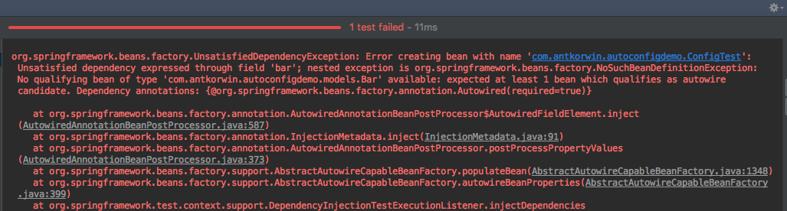
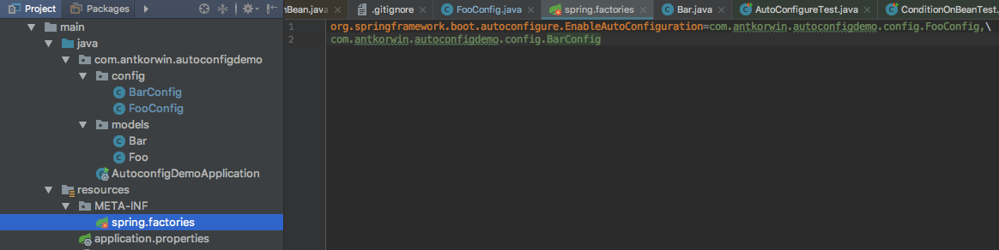
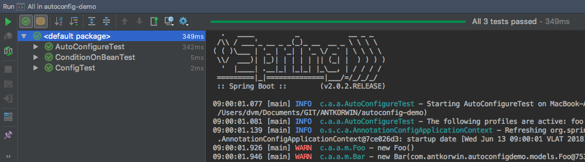

= Spring auto-configuration with conditional on bean
:source-highlighter: prettify
:icons: font
:toc:
:experimental:
:numbered:
:homepage: http://antkorwin.com
Korovin Anatoliy <antkorwin@gmail.com>;  Home <http://antkorwin.com>
// START OF CONTENT

## Preamble

The CTO of our company sent me an interesting case of a configuration, last night.
He not fears coding something unusual, this is a good habit for a chief.

He wanted to make a one bean depends on another,
and the first of them should created only if he set a certain property.
Of course, in this case the second bean should not be created.

## Let's try to code this.

We need to define a two objects:

[source, java]
----
@Slf4j
@Getter
public class Foo {

    private String value = "ops";

    public Foo() {
        log.warn("new Foo()");
    }
}

@Slf4j
@Getter
public class Bar {

    private Foo foo;
    private String value = "dev";

    public Bar(Foo foo) {
        this.foo = foo;
        this.value += foo.getValue();
        log.warn("new Bar({})", foo);
    }
}
----

Then we make a first configuration file:

[source, java]
----
@Configuration
public class FooConfig {

    @Bean
    public Foo foo() {
        return new Foo();
    }
}
----

And a second config, which depends on the first:

[source, java]
----
@Configuration
@ConditionalOnBean(name = "foo")
public class BarConfig {

    @Bean
    public Bar bar(Foo foo) {
        return new Bar(foo);
    }
}
----

Write a simple test for this configuration:

[source, java]
----
@SpringBootTest
@RunWith(SpringRunner.class)
public class ConfigTest {

    @Autowired
    private Foo foo;

    @Autowired
    private Bar bar;

    @Test
    public void simpleTest() {
        Assertions.assertThat(foo).isNotNull();
        Assertions.assertThat(bar).isNotNull();
    }
}
----

And what we got as a result - `No qualifying bean of type 'Bar'`

## Read the documentation

It's boring, but this is the simplest way to know how to do what you want.
Open a javadoc about the `ConditionalOnBean`:
link:https://docs.spring.io/spring-boot/docs/current/api/org/springframework/boot/autoconfigure/condition/ConditionalOnBean.html[https://docs.spring.io/ConditionalOnBean.html]

And what we see?

[quote, Phillip Webb]
`The condition can only match the bean definitions that have been processed by the
application context so far and, as such, it is *strongly recommended* to use this
condition on *auto-configuration classes only*. If a candidate bean may be created by
another auto-configuration, make sure that the one *using this condition runs after*.`

What does it mean for us:

- We need to make our configuration classes as auto-configuration

- The `BarConfig` must be processed after the `FooConfig`.

## How to make auto-configuration class

Under the hood, auto-configuration files are the simple `@Configuration` classes
that using conditional annotations such as `@Conditional`, `@ConditionalOnClass`, `@ConditionalOnMissingBean`, etc.

These annotations allow us to specify constraints and dependencies between the beans in the configuration.

IMPORTANT: In order for our configuration will be loaded by the Spring,
we need to add a path to configuration classes into the `spring.factories` property file.
This file must be located in the `META-INF` folder of the resources of your's project.

This properties is processing by `SpringFactoriesLoader` which loads and
instantiates factories of a given type from `META-INF/spring.factories`.

WARNING: Be careful, it is dangerous to use extra spaces or line breaks
in the contents of the file `spring.factories`.
You must use a key-value format:

`[interface | abstract class]` = `[comma-separated list of implementation or configuration class names]`

For example:

## How to change the order of processing a configurations

Now we have an ability to define a dependency between two configuration files.
We can do this by using one of the following annotations:

* `@AutoConfigureAfter`

* `@AutoConfigureBefore`

For our task, we need to mark the `BarConfig` with the annotation `AutoConfigureAfter`
and specify dependency on the `FooConfig` class:

[source, java]
----
@Configuration
@AutoConfigureAfter(FooConfig.class)
@ConditionalOnBean(name = "foo")
public class BarConfig {

    @Bean
    public Bar bar(Foo foo) {
        return new Bar(foo);
    }
}
----

For the testing a bean conditional we set a profile for the FooConfig:

[source, java]
----
@Profile("foo")
@Configuration
public class FooConfig {

    @Bean
    public Foo foo() {
        return new Foo();
    }
}
----

And modify test a bit:

[source, java]
----
@RunWith(SpringRunner.class)
@SpringBootTest
@ActiveProfiles("foo")
public class ConfigTest {

    @Autowired
    private Foo foo;

    @Autowired
    private Bar bar;

    @Autowired
    private ApplicationContext applicationContext;

    @Test
    public void contextLoads() {
        Assertions.assertThat(foo).isNotNull();
        Assertions.assertThat(bar).isNotNull();
    }
}
----

If you don't set active profile to `foo` in test
then you will not find both of the beans in the context:

[source, java]
----
@SpringBootTest
@RunWith(SpringRunner.class)
public class ConditionOnBeanTest {

    @Autowired
    private ApplicationContext applicationContext;

    @Test
    public void beanNotFoundTest() {
        Assertions.assertThat(applicationContext.containsBean("foo")).isFalse();
        Assertions.assertThat(applicationContext.containsBean("bar")).isFalse();
    }
}
----

All tests passed:

## Source code of this project on the github

image:../icons/git.png[github,64,64] link:https://github.com/antkorwin/autoconfig-demo[github.com/antkorwin/autoconfig-demo]

// END OF CONTENT
include::../metrica.adoc[]

++++

<noscript>Please enable JavaScript to view the <a href="https://disqus.com/?ref_noscript">comments powered by Disqus.</a></noscript>
++++
