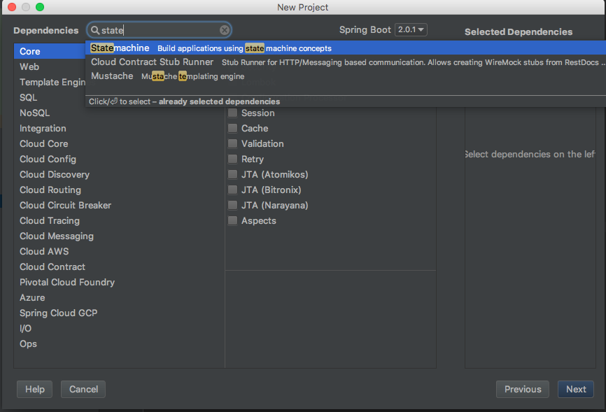
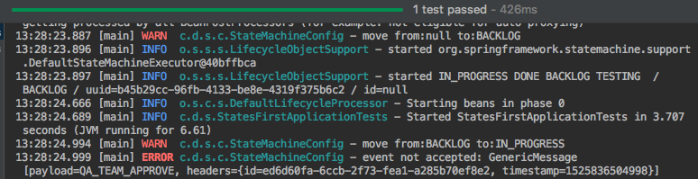
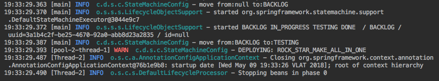
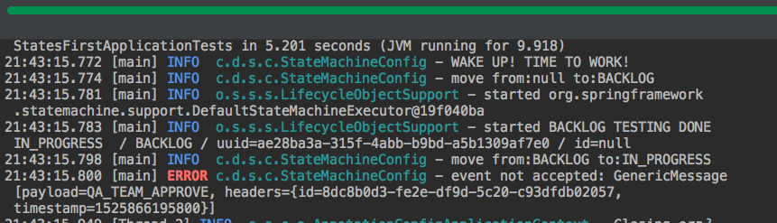
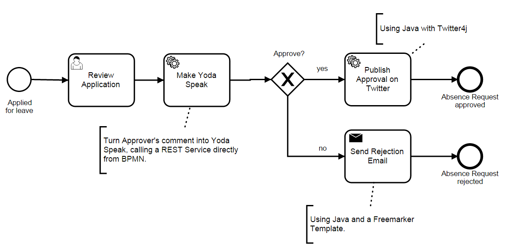

= Spring State Machine
:source-highlighter: prettify
:icons: font
:toc:
:experimental:
:numbered:
:homepage: http://antkorwin.com
Korovin Anatoliy <antkorwin@gmail.com>;  Home <http://antkorwin.com>
// START OF CONTENT

## Dependencies

Create a new Spring Boot project and add the `statemachine` in dependencies.

The one starter made all the magic

[source, xml]
----
<dependency>
	<groupId>org.springframework.statemachine</groupId>
	<artifactId>spring-statemachine-starter</artifactId>
</dependency>
----

## States & Events

For example, consider the business process that is known to most developers - software development lifecycle and Kanban methodology.
If you didn't hear about the Kanban before, then you should read about this methodology.
You can find a many articles about it on the Internet.

Let's see the following scheme:

[plantuml]
....
[*] --> BACKLOG : business team gave us a new tasks
BACKLOG --> INPROGRESS : developer started the feature
INPROGRESS --> TESTING : developer finished the feature
TESTING -->DONE : QA-team checked the use case and marked it as successful
TESTING --> INPROGRESS : QA-team found a bugs and rejected the use case
DONE --> [*]
....

We can extract the following states from this business-process: `BACKLOG`,
`IN_PROGRESS`, `TESTING`, `DONE`. This will be our set of states.

The transition from one state to another passes by a certain event.
Also we need extracting set of events from scheme:
`START_FEATURE`, `FINISH_FEATURE`, `QA_REJECTED_UC`, `ROCK_STAR_DOUBLE_TASK`, `DEPLOY`, `QA_CHECKED_UC`.

Spring state machine provides the ability to configure itself through enums.
You can describe the states and the events in enumeration:

[source, java]
----
public enum States {
    BACKLOG,
    IN_PROGRESS,
    TESTING,
    DONE
}

public enum  Events {
    START_FEATURE,
    FINISH_FEATURE,
    QA_REJECTED_UC,
    ROCK_STAR_DOUBLE_TASK,
    DEPLOY,
    QA_CHECKED_UC
}
----

## Configuration

We will consider an example of using a state machine through the use of standard spring DI.
We need to make a spring configuration for the state machine:

[source, java]
----
@Configuration
@EnableStateMachine
public class StateMachineConfig
        extends EnumStateMachineConfigurerAdapter <1>
                        <States, Events> {

    @Override
    public void configure(
            StateMachineConfigurationConfigurer
                    <States, Events> config) throws Exception {

        config.withConfiguration()  <2>
              .autoStartup(true);
    }

    @Override
    public void configure(
            StateMachineStateConfigurer<States, Events> states)
            throws Exception {

        states.withStates()		<3>
              .initial(States.BACKLOG)
              .state(States.IN_PROGRESS)
              .state(States.TESTING)
              .end(States.DONE);
    }

    @Override
    public void configure(
            StateMachineTransitionConfigurer<States, Events> transitions)
            throws Exception {

        transitions.withExternal()  <4>
                   .source(States.BACKLOG)
                   .target(States.IN_PROGRESS)
                   .event(Events.START_FEATURE)
                   .and()
                   .withExternal()
                   .source(States.IN_PROGRESS)
                   .target(States.TESTING)
                   .event(Events.FINISH_FEATURE)
                   .and()
                   .withExternal()
                   .source(States.TESTING)
                   .target(States.IN_PROGRESS)
                   .event(Events.QA_TEAM_REJECT)
                   .and()
                   .withExternal()
                   .source(States.TESTING)
                   .target(States.DONE)
                   .event(Events.QA_TEAM_APPROVE);
    }
----
<1> we working with a type-safe, all of our states and events are described by the enums,
so these types will be declared in the configuration.
<2> override a base method for configuring the state machine.
<3> description of states
<4> description of transitions

We set the autostart setting in the base configuration,
then the state machine will start immediately in the initialization state.

You need to specify the entry point to the state machine (the initial state) in the settings of states.
When the state machine is start, the transition to this point will be the first.

It is important to understand that the transition to the `BACKLOG` state from "nowhere" is also a transition,
a little later we will see it more clearly.

Also, we specify the exit point (end state) in the configuration of states.
Transition to this state will stop the state machine.

The configuration of the transitional looks pretty intuitive,
for each transition you need to specify the source state,
the target state, and the event that will triggered this transition.

## Try to use it

Test successful DI & initialization of state machine

[source, java]
----
@RunWith(SpringRunner.class)
@SpringBootTest
public class StatesFirstApplicationTests {

    @Autowired
    private StateMachine<States, Events> stateMachine;

    @Test
    public void initTest() {
        Assertions.assertThat(stateMachine.getState().getId())
                  .isEqualTo(States.BACKLOG);

        Assertions.assertThat(stateMachine).isNotNull();
    }
}
----

We test the main flow of the application, when execution is on a positive way ("green way"):

[source, java]
----
@Test
public void testGreenFlow() {
    // Arrange
    // Act
    stateMachine.sendEvent(Events.START_FEATURE);
    stateMachine.sendEvent(Events.FINISH_FEATURE);
    stateMachine.sendEvent(Events.QA_TEAM_APPROVE);
    // Asserts
    Assertions.assertThat(stateMachine.getState().getId())
              .isEqualTo(States.DONE); <1>
}
----
<1> The main criterion for the successful completion of all transitions
is the achievement by the state machine of state DONE.
In a real test, it would be worthwhile to check each transition,
not only the final state after a series of transitions,
but for our research purposes this will be enough.

## Intercept the events of the state machine

Add state machine listener in configuration:

[source, java]
----
@Override
public void configure(
				StateMachineConfigurationConfigurer
								<States, Events> config) throws Exception {

		config.withConfiguration()
					.listener(listener()) <1>
					.autoStartup(true);
}

private StateMachineListener<States, Events> listener() {
		return new StateMachineListenerAdapter<States, Events>(){
				@Override
				public void transition(Transition<States, Events> transition) { <2>
						log.warn("move from:{} to:{}",
										 ofNullableState(transition.getSource()),
										 ofNullableState(transition.getTarget()));
				}

				@Override
				public void eventNotAccepted(Message<Events> event) { <3>
						log.error("event not accepted: {}", event);
				}

				private Object ofNullableState(State s) {
						return Optional.ofNullable(s)
													 .map(State::getId)
													 .orElse(null);
				}
		};
}
----
<1> declaration of listener
<2> override a callback for intercept any transitions
<3> override a callback for attempt of unacceptable transitions

After that we can make "wrong way" test:

[source, java]
----
@Test
public void testWrongWay() {
    // Arrange
    // Act
    stateMachine.sendEvent(Events.START_FEATURE);
    stateMachine.sendEvent(Events.QA_TEAM_APPROVE);
    // Asserts
    Assertions.assertThat(stateMachine.getState().getId())
              .isEqualTo(States.IN_PROGRESS);
}
----

then we look at logout error:

This is a clear example of what I said before,
the starting transition from "nowhere" to `BACKLOG` is also a transition.
We should use the method `ofNullableState`
because the source state in this transition is `null`.

## More than one state machine? No problem!

change annotation `@EnableStateMachine` to `@EnableStateMachineFactory`,
this provide us the ability to create state machine from factory
and we can inject factory instead of concrete instance.

[source, java]
----
@Slf4j
@Configuration
@EnableStateMachineFactory
public class StateMachineConfig
        extends EnumStateMachineConfigurerAdapter
                        <States, Events> {

								...

}
----

and now we need to change the tests:

[source,java]
----
@RunWith(SpringRunner.class)
@SpringBootTest
public class StatesFirstApplicationTests {

    private StateMachine<States, Events> stateMachine;

    @Autowired
    private StateMachineFactory<States, Events> stateMachineFactory;

    @Before
    public void setUp() throws Exception {
        stateMachine = stateMachineFactory.getStateMachine();
    }

		...
}
----

## Actions - add some business logic

Let's make auto-deploy after the finished feature.

We can do this as follows:

[source,java]
----
@Override
public void configure(StateMachineStateConfigurer<States, Events> states)
				throws Exception {

		states.withStates()
              .initial(States.BACKLOG)
              .state(States.IN_PROGRESS)
              .state(States.TESTING, deployAction()) <1>
              .end(States.DONE);
}

private Action<States, Events> deployAction() {  <2>
		return context -> {
				log.warn("DEPLOYING: {}",context.getEvent());
		};
}
----
<1> add the deploy action in the configuration of states after enter in the `TESTING` state
<2> implementation of deploy action

This approach has a one problem.
If we slightly complicate our business process, then this action can be performed when it is unnecessary.
For example, if the developer finished a two features in one pull-request,
then he can transfer the second task to `TESTING` without run additional deployment.
We hope that he did it because he is super efficient, so we can call him a "Rock Star".

[plantuml]
....
[*] --> BACKLOG : time to work!

BACKLOG --> IN_PROGRESS : start feature

IN_PROGRESS --> TESTING : finish feature

TESTING --> DONE : QA approved

TESTING --> IN_PROGRESS : QA rejected task

BACKLOG --> TESTING : Rock Star
....

Add the "rock star" transition in the configuration:

[source, java]
----
transitions.withExternal()
           		...
           .and()
           .withExternal()
           .source(States.BACKLOG)
           .target(States.TESTING)
           .event(Events.ROCK_STAR_MAKE_ALL_IN_ONE);
----
Now if we move task from backlog to testing then will be run deploy.
But we don't want this behavior.

check this proposition in the test:

[source,java]
----
@Test
public void testRockStar() {
    // Arrange
    // Act
    stateMachine.sendEvent(Events.ROCK_STAR_MAKE_ALL_IN_ONE);
    // Asserts
    Assertions.assertThat(stateMachine.getState().getId())
              .isEqualTo(States.TESTING);
}
----

test results:

We can see that the `deployAction` is triggered by any transition to the state `TESTING`.

How can we solve this problem? We can move the action
from the configuration of states to the configuration of transitions:

[source, java]
----
states.withStates()
      .initial(States.BACKLOG, timeToWorkAction())
      .state(States.IN_PROGRESS) <1>
      .state(States.TESTING)
      .end(States.DONE);

  ...

transitions.withExternal()
           	...
           .source(States.IN_PROGRESS)
           .target(States.TESTING)
           .event(Events.FINISH_FEATURE)
           .action(deployAction())  <2>
           .and()
           	...
----
<1> remove deploying action from the configuration of states
<2> past the action on transition from IN_PROGRESS to FINISH_FEATURE

It provides us a more flexibility and allows to run actions by making a certain transitions.

## Guards - use conditions in flow.

Next we will add the ability to run deploying from `BACKLOG` and `IN_PROGRESS` states.
We will make `DEPLOY` as a separate event so that a developers can decide when to do it themselves.
But before going to `TESTING`, we will verify that the deployment event was called.
For this we will create a guard on transitions to `TESTING` state.

[plantuml]
....
[*] --> BACKLOG : time to work!
BACKLOG --> IN_PROGRESS : start feature
IN_PROGRESS --> TESTING : finish feature
TESTING --> DONE : QA approved
TESTING --> IN_PROGRESS : QA rejected task
BACKLOG --> TESTING : Rock Star
BACKLOG --> BACKLOG : deploy
IN_PROGRESS --> IN_PROGRESS : deploy
....

Add transitions for internal `DEPLOY` and guards for transitions to `TESTING`

[source, java]
----
transitions.withExternal()
           .source(States.BACKLOG)
           .target(States.IN_PROGRESS)
           .event(Events.START_FEATURE)
           .and()
           .withExternal()
           .source(States.IN_PROGRESS)
           .target(States.TESTING)
           .event(Events.FINISH_FEATURE)
           .guard(checkDeployGuard()) <1>
           .and()
           .withExternal()
           .source(States.TESTING)
           .target(States.IN_PROGRESS)
           .event(Events.QA_TEAM_REJECT)
           .and()
           .withExternal()
           .source(States.TESTING)
           .target(States.DONE)
           .event(Events.QA_TEAM_APPROVE)
           .and()
           .withExternal()
           .source(States.BACKLOG)
           .target(States.TESTING)
           .guard(checkDeployGuard()) <1>
           .event(Events.ROCK_STAR_MAKE_ALL_IN_ONE)
           .and()

           .withInternal()
           .source(States.BACKLOG)
           .event(Events.DEPLOY) <2>
           .action(deployAction())
           .and()
           .withInternal()
           .source(States.IN_PROGRESS)
           .event(Events.DEPLOY) <2>
           .action(deployAction());
----
<1> guards on transitions to `TESTING`
<2> internal `DEPLOY` events

Then we make guard implementation based on the state machine variables.
You can write in extend state a lot of useful things that will be shared in process.

[source, java]
----
private Guard<States, Events> checkDeployGuard() {
    return context -> {
        Boolean flag = (Boolean) context.getExtendedState()
                                        .getVariables()
                                        .get("deployed");
        return flag == null ? false : flag;
    };
}
----

After that, we can use this variable in the deployment action:

[source, java]
----
private Action<States, Events> deployAction() {
    return context -> {
        log.warn("DEPLOYING: {}", context.getEvent());
        context.getExtendedState()
               .getVariables()
               .put("deployed", true);
    };
}
----

Now we can make unit test for this case

[source, java]
----
@Test
public void testGuard() {
    // Arrange & act
    stateMachine.sendEvent(Events.START_FEATURE);
    stateMachine.sendEvent(Events.FINISH_FEATURE);
    stateMachine.sendEvent(Events.QA_TEAM_APPROVE); // not accepted!
    // Asserts
    Assertions.assertThat(stateMachine.getState().getId())
              .isEqualTo(States.IN_PROGRESS);
}
----

If we don't send the `DEPLOY` event then we get the following result:

## Persisting State machine

In this section, we will look at how to save and load the current state of the state machine in different storages.

The process of creating a state machine immediately in a certain state is not easy,
so that not to keep all the created state machines in memory all the time,
we need a tool to save and load the state of the state machine by identifier.

### Persisting state machine in-memory

To start we make a simple (in-memory) implementation.

WARNING: We used this kind of storage just for a demonstration.
For a real application you need to prefer more stable and complexity storage system.

We need to write an implementation of StateMachinePersist.

[source, java]
----
public class InMemoryPersist
        implements StateMachinePersist<States, Events, UUID> {

    private HashMap<UUID, StateMachineContext<States, Events>> storage
            = new HashMap<>(); <1>

    @Override
    public void write(StateMachineContext<States, Events> context,
                      UUID contextObj) throws Exception {

        storage.put(contextObj, context);
    }

    @Override
    public StateMachineContext<States, Events> read(UUID contextObj) throws Exception {
        return storage.get(contextObj);
    }
}
----
<1> We using the HashMap to save a state machines

WARNING: We need to store the context of the state machine,
not an instance of the state machine.
The `StateMachineContext` contains not only the current state,
there are also stored variables that we write to the context.
It provide ability to restore a completely identical state of the state machine.

Than we make a persist configuration:

[source, java]
----
@Bean
public StateMachinePersist<States, Events, UUID> inMemoryPersist() {
    return new InMemoryPersist();
}

@Bean
public StateMachinePersister<States, Events, UUID> persister(
        StateMachinePersist<States, Events, UUID> defaultPersist) {

    return new DefaultStateMachinePersister<>(defaultPersist);
}
----

Now we can use it:

[source, java]
----
@Autowired
private StateMachineFactory<States, Events> stateMachineFactory;

@Autowired
private StateMachinePersister<States, Events, UUID> persister;

@Test
public void testPersist() throws Exception {
	 // Arrange
	 StateMachine<States, Events> firstStateMachine =
					 stateMachineFactory.getStateMachine();

	 StateMachine<States, Events> secondStateMachine =
					 stateMachineFactory.getStateMachine();

	 firstStateMachine.sendEvent(Events.START_FEATURE);
	 firstStateMachine.sendEvent(Events.DEPLOY);

	 // precondition
	 Assertions.assertThat(secondStateMachine.getState().getId())
						 .isEqualTo(States.BACKLOG);

	 // Act
	 persister.persist(firstStateMachine, firstStateMachine.getUuid()); <1>
	 persister.restore(secondStateMachine, firstStateMachine.getUuid()); <2>

	 // Asserts
	 Assertions.assertThat(secondStateMachine.getState().getId())
						 .isEqualTo(States.IN_PROGRESS);
}
----
<1> Saving a context of the first state machine.
<2> Loading the context of the first state machine to the second state machine instance.

### Persisting state machine in MongoDb

Let's consider an example of a real repository for the state machines.

We need to add some dependencies for working with the MongoDb.
Also we will write integration tests with TestContainers framework.

[source, mvn]
----
<!-- MongoDB -->
<dependency>
	<groupId>org.springframework.boot</groupId>
	<artifactId>spring-boot-starter-data-mongodb</artifactId>
</dependency>
<dependency>
	<groupId>org.springframework.statemachine</groupId>
	<artifactId>spring-statemachine-data-mongodb</artifactId>
	<version>2.0.0.RELEASE</version>
</dependency>
<!-- MongoDB -->

<!-- TestContainers -->
<dependency>
	<groupId>org.testcontainers</groupId>
	<artifactId>testcontainers</artifactId>
	<version>1.4.3</version>
</dependency>
<!-- TestContainers -->
----

Then we make MongoDb persist

[source, java]
----
@Bean
public StateMachineRuntimePersister<States, Events, UUID> mongoPersist(
        MongoDbStateMachineRepository mongoRepository) {

    return new MongoDbPersistingStateMachineInterceptor<States,Events,UUID>(mongoRepository);
}
----

Now we can make integration test.

I have abstract class for testing mongodb application in spring framework.
The TestContainers library allows us to run the mongodb in docker and use it as a target database:

[source, java]
----
@SpringBootTest
@RunWith(SpringRunner.class)
public abstract class BaseMongoIT {

    private static final Integer MONGO_PORT = 27017;
    private static GenericContainer mongo =
            new GenericContainer("mongo:latest")
            .withExposedPorts(MONGO_PORT);

    static {
        mongo.start();
        System.setProperty("spring.data.mongodb.host", mongo.getContainerIpAddress());
        System.setProperty("spring.data.mongodb.port", mongo.getMappedPort(MONGO_PORT).toString());
    }

    @Autowired
    protected MongoTemplate mongoTemplate;
}
----

and test case:

[source, java]
----
public class MongoPersistTest extends BaseMongoIT {

    @Autowired
    private StateMachinePersister<States, Events, UUID> persister;
    @Autowired
    private StateMachineFactory<States, Events> stateMachineFactory;

	@Test
    public void testMongoPersist() throws Exception {
        // Arrange
        StateMachine<States, Events> firstStateMachine = stateMachineFactory.getStateMachine();
        StateMachine<States, Events> secondStateMachine = stateMachineFactory.getStateMachine();

        firstStateMachine.sendEvent(Events.START_FEATURE);
        firstStateMachine.sendEvent(Events.DEPLOY);

        // Act
        persister.persist(firstStateMachine, firstStateMachine.getUuid());
        persister.persist(secondStateMachine, secondStateMachine.getUuid());
        persister.restore(secondStateMachine, firstStateMachine.getUuid());

        // Asserts
        Assertions.assertThat(secondStateMachine.getState().getId())
                  .isEqualTo(States.IN_PROGRESS);

        boolean deployed = (boolean) secondStateMachine.getExtendedState()
                                                       .getVariables()
                                                       .get("deployed");

        Assertions.assertThat(deployed).isEqualTo(true);

        // Mongo specific asserts:
        Assertions.assertThat(mongoTemplate.getCollectionNames())
                  .isNotEmpty();

        List<Document> documents = mongoTemplate.findAll(Document.class,
                                                         "MongoDbRepositoryStateMachine");

        Assertions.assertThat(documents).hasSize(2);
        Assertions.assertThat(documents)
                  .flatExtracting(Document::values)
                  .contains(firstStateMachine.getUuid().toString(),
                            secondStateMachine.getUuid().toString())
                  .contains(firstStateMachine.getState().getId().toString(),
                            secondStateMachine.getState().getId().toString());
    }
}
----
In the specific asserts, we checked that the save was exactly in the MongoDB.

## Multiple configuration of state machines in one project

We sometimes need to use a several different state machines in single project.
These state machines can have their own sets of states and events.

In order to make a several state machines, you need to use a name on the declaration of the state machine factory.

[source, java]
----
@Configuration
@EnableStateMachineFactory(name = "secondStateMachineFactory")
public class SecondStateMachineConfig extends EnumStateMachineConfigurerAdapter<States, Events> {
		...
}
----

Now you can inject the state machine by using this name in the qualifier above the factory:

[source, java]
----
@Autowired
@Qualifier("secondStateMachineFactory")
private StateMachineFactory<States, Events> secondStateMachineFactory;
----

So, you can use a several state machines at the same time.

## Life seems boring without state machines

Let's look at the several alternative solutions without using the state machines.
And consider their pros and cons.

### First Alternative is - You can hardcode your business logic

It looks like a spaghetti code:

[source, java]
----
    class StateMachine {

        private States currentState;
        private HashMap<String, Object> variables;
        private boolean finished;

        public void processing(Events event) {

            if(!finished) {
                log.error("already finished state machine");
            }

            switch (currentState) {
                case BACKLOG:
                    if (event == Events.START_FEATURE) {
                        currentState = States.IN_PROGRESS;
                        // transition logic
                    } else if (event == Events.DEPLOY) {
                        variables.put("deployed", true);
                        // start deploy
                    } else {
                        log.error("not accepted event.");
                    }
                    break;

                case IN_PROGRESS:
                    if (event == Events.FINISH_FEATURE) {
                        if (variables.get("deployed").equals(true)) {
                            currentState = States.TESTING;
                            // run business logic
                        } else {
                            log.error("unreachable state");
                        }
                        // transition logic
                    } else if (event == Events.DEPLOY) {
                        variables.put("deployed", true);
                        // start deploy
                    } else {
                        log.error("not accepted event.");
                    }
                    break;

                case TESTING:
                    if(event == Events.QA_TEAM_APPROVE){
                        currentState = States.DONE;
                        finished = true;
                        log.info("successful done!");
                    } else if (event == Events.QA_TEAM_REJECT){
                        currentState = States.IN_PROGRESS;
                        log.info("reject");
                    } else {
                        log.error("not accepted event.");
                    }
                    break;

						...

            }
        }
----

Of course, you can work on the organization of this code,
you can replace the repeating logic and make a strategies for processing events, etc.
But in the first approximation it is very difficult to maintain this code.
It is difficult to track the logic of the transitions and their availability.

icon:plus[] Pros:

- Speed of implementation, you don't need to create an infrastructure for working with a business processes

icon:minus[] Cons:

- Very poor code maintenance in the future.

### The second alternative is - You can use any BPM engine

This is a good alternative, but a quite expensive.
I will shortly discuss the cost of using the BPM in a project.
First, you will need to deploy a full-fledged framework for a BPM processes in the project.
These frameworks are not lightweight, not all of them work natively in the java.
Secondly, you need to know a BPMN notation and be able to describing your business process by using this notation.

icon:plus[] You should use BPMN-engine:

- If you have very complex business processes.

- When you need a lot of opportunities that provided by the BPM notation,
such as: messages, subprocesses, signals, conditions on any transitions, etc.

- If you need a process versioning.

- When you need to visualize a processes by their code.

- When you need a tools to view and debug of all current processes and their states.

icon:minus[] You should not use BPMN-engine:

- If you have a very simple processes and a set of system states is obvious.

- If you have a little time to develop and(or) you don't have a specialists in this subject area.

- If you do not need to manage a versioning of the processes.

- There is no way to deploy a full-fledged BPM framework in production. (you do not have a required resources or a infrastructure for this or a specialists for support)

## Source code of this project on the github

image:../icons/git.png[github,64,64] link:https://github.com/antkorwin/statemachine[github.com/antkorwin/statemachine]

// END OF CONTENT
include::../metrica.adoc[]

++++

<noscript>Please enable JavaScript to view the <a href="https://disqus.com/?ref_noscript">comments powered by Disqus.</a></noscript>
++++
