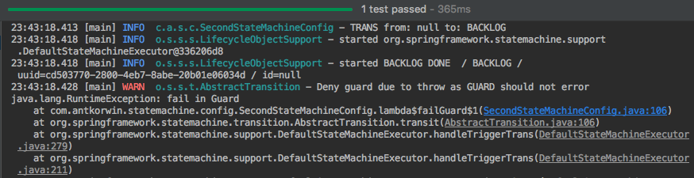

= Exception Handling in the Spring State Machine
:source-highlighter: prettify
:icons: font
:toc:
:experimental:
:numbered:
:homepage: http://antkorwin.com
Korovin Anatoliy <antkorwin@gmail.com>;  Home <http://antkorwin.com>
// START OF CONTENT

When you work with a state machine, you often take care of an errors, which may happen on the business logic layer.

## Error in the action

Let's consider what happens if an error occurs during the execution of the action:

[source, java]
----
@Override
public void configure(StateMachineTransitionConfigurer<States, Events> transitions) throws Exception {
		transitions.withExternal()
				.source(States.BACKLOG)
				.target(States.DONE)
				.action(failAction())
				.event(Events.ROCK_STAR_DOUBLE_TASK);
}

private Action<States, Events> failAction() {
		return context -> {
				throw new RuntimeException("fail in action");
		};
}
----

Then we make a test:

[source, java]
----
@Test
public void failInActionTest() {
    // Act
    stateMachine.sendEvent(ROCK_STAR_DOUBLE_TASK);
    // Asserts
    Assertions.assertThat(stateMachine.getState().getId())
              .isEqualTo(States.BACKLOG);
}
----

Result of the test:

We are trying to make a transition with failed action.
And we see this exception in log,
but it not thrown to the place of the call.
Because the spring state machine handle all of the runtime exceptions.

## Error in a guard check

Let's try to make exception in a guard.

Add a new transition:

[source, java]
----
transitions.withExternal()
           .source(States.BACKLOG)
           .target(States.DONE)
           .event(Events.START_FEATURE)
           .guard(failGuard());
----

and the failed guard:

[source, java]
----
private Guard<States, Events> failGuard() {
    return context -> {
        throw new RuntimeException("fail in Guard");
    };
}
----

Now we can write a test:

[source, java]
----
@Test
public void failInGuardTest() {
    // Act
    stateMachine.sendEvent(START_FEATURE);
    // Asserts
    Assertions.assertThat(stateMachine.getState().getId())
              .isEqualTo(States.BACKLOG);
}
----

After that we seeing in the log a same behavior:

The exception thrown, but we can't catch it on the place of the call.
The state machine didn't move to a target state, this is expected behavior.
The throw of an exception while checking a guard condition - is equals to returned false by guard.

## Indication of a state machine errors

The spring state machine have a not rich functionality for working with errors.
We can set an error in actions or guards, but we can't get type of the error later.
We can only check for an error, but not the type of exception.

Let's see example:

[source, java]
----
transitions.withExternal()
           .source(States.BACKLOG)
           .target(States.DONE)
           .action(actionWithInternalError())
           .event(Events.FINISH_FEATURE);
----

We set the error in this action, by creating a concrete type of an exception:

[source, java]
----
private Action<States, Events> actionWithInternalError() {
    return context -> {
        context.getStateMachine()
               .setStateMachineError(new RuntimeException("fail in Action"));
    };
}
----

Let's try to check it:

[source, java]
----
@Test
public void internalFailTest() {
    // Check precondition
    Assertions.assertThat(stateMachine.hasStateMachineError()).isFalse();
    // Act
    stateMachine.sendEvent(FINISH_FEATURE);
    // Asserts
    Assertions.assertThat(stateMachine.getState().getId())
              .isEqualTo(States.DONE);

    Assertions.assertThat(stateMachine.hasStateMachineError()).isTrue();
}
----

This test was successfully passed.

Before we sent the event in the state machine, it did not have errors.
And after this transition we got an error by using `hasStateMachineError` method.
However, the state machine successfully moved to the target state.

The interface of StateMachine is not provide any methods for a getting type of exception.
It is strange, but you can make workaround for this by using variables of a state machine.

## Source code of this project on the github

image:../icons/git.png[github,64,64] link:https://github.com/antkorwin/statemachine[github.com/antkorwin/statemachine]

// END OF CONTENT
include::../metrica.adoc[]

++++

<noscript>Please enable JavaScript to view the <a href="https://disqus.com/?ref_noscript">comments powered by Disqus.</a></noscript>
++++
