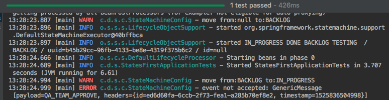
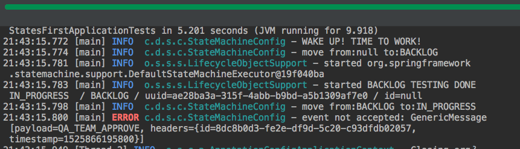
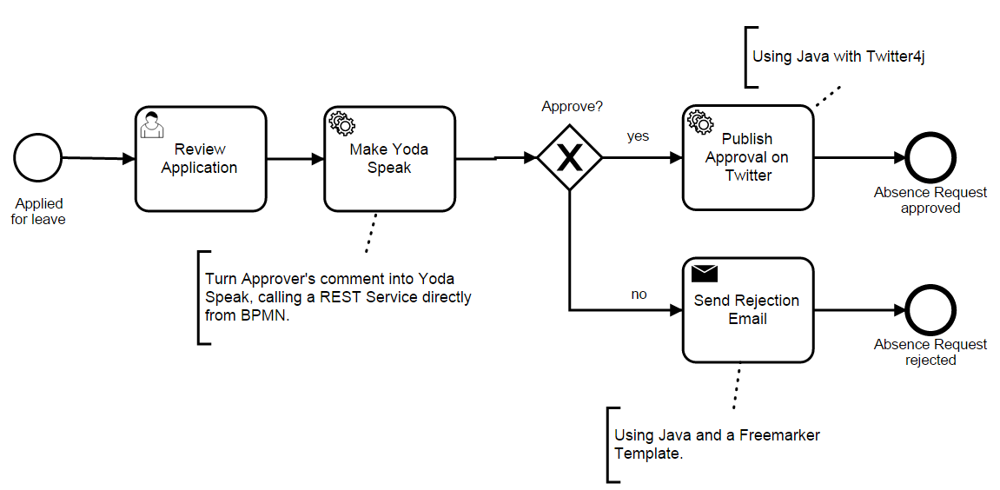

= Spring State Machine
:source-highlighter: prettify
:icons: font
:toc:
:experimental:
:numbered:
:homepage: http://antkorwin.com
Korovin Anatoliy <antkorwin@gmail.com>;  Home <http://antkorwin.com>
// START OF CONTENT

## Настройка проекта

Создаем новый SpringBoot проект и добалвяем в зависимостях statemachine

image:./spring-init.png[state machine]

Вся магия в одном стартере для стэйт-машины.

[source, xml]
----
<dependency>
	<groupId>org.springframework.statemachine</groupId>
	<artifactId>spring-statemachine-starter</artifactId>
</dependency>
----

## Состояния и события

Для примера возьмем бизнес-процесс, знакомый большинству разработчиков.
Если вдруг канбан прошел мимо вас, то стоит немного почитать про эту методологию разработки.

[plantuml]
....
[*] --> BACKLOG : заказчик придумал новую задачу
BACKLOG --> INPROGRESS : разработчики взяли задачу в работу
INPROGRESS --> TESTING : разработчики сделали задачу
TESTING -->DONE : команда тестирования проверила кейс и не нашла там багов
TESTING --> INPROGRESS : команда тестирования нашла ошибки и вернула таск в работу
DONE --> [*]
....

Из этого бизнес-процесса мы можем вычленить следующие состояния:
`BACKLOG`,`IN_PROGRESS`,`TESTING`,`DONE`. Собственно это и будет набором стэйтов.

Переход из одного состояния в другое происходит по определенному событию.
Spring State Machine позволяет конфигурировать стэйты и ивенты через java enum-ы.

[source, java]
----
public enum States {
    BACKLOG,
    IN_PROGRESS,
    TESTING,
    DONE
}

public enum  Events {
    START_FEATURE,
    FINISH_FEATURE,
    QA_REJECTED_UC,
    QA_CHECKED_UC
}
----

## Конфигурация для statemachine

Мы будем рассматривать пример использования statemachine
через стандартные механизмы Spring DI, для этого нам понадобится сделать
spring configuration описывающий настройки стэйт-машины.

[source, java]
----
@Configuration
@EnableStateMachine
public class StateMachineConfig
        extends EnumStateMachineConfigurerAdapter <1>
                        <States, Events> {

    @Override
    public void configure(
            StateMachineConfigurationConfigurer
                    <States, Events> config) throws Exception {

        config.withConfiguration()  <2>
              .autoStartup(true);
    }

    @Override
    public void configure(
            StateMachineStateConfigurer<States, Events> states)
            throws Exception {

        states.withStates()		<3>
              .initial(States.BACKLOG)
              .state(States.IN_PROGRESS)
              .state(States.TESTING)
              .end(States.DONE);
    }

    @Override
    public void configure(
            StateMachineTransitionConfigurer<States, Events> transitions)
            throws Exception {

        transitions.withExternal()  <4>
                   .source(States.BACKLOG)
                   .target(States.IN_PROGRESS)
                   .event(Events.START_FEATURE)
                   .and()
                   .withExternal()
                   .source(States.IN_PROGRESS)
                   .target(States.TESTING)
                   .event(Events.FINISH_FIATURE)
                   .and()
                   .withExternal()
                   .source(States.TESTING)
                   .target(States.IN_PROGRESS)
                   .event(Events.QA_TEAM_REJECT)
                   .and()
                   .withExternal()
                   .source(States.TESTING)
                   .target(States.DONE)
                   .event(Events.QA_TEAM_APPROVE);
    }
----
<1> мы работаем с типизированной стэйт-машиной,
и все наши состояния и события описаны в энумах,
 поэтому конфигурация тоже отражает эту типизацию
<2> оверайдим метод конфигурации базовых настрок стэйт-машины
<3> описываем состояния стэйт-машины
<4> описываем переходы

В базовой конфигурации мы задаем настройку автозапуска для стэйт-машины,
это позволит нам автоматиески переходить в стартовый стэйт, при создании стэйт-машины.

В настройках состояний нужно указать точку входа в стэйт-машину (initial state),
при запуске стэйт-машины переход в эту точку будет первым.
Тут важно понимать что переход в состояние BACKLOG из ниоткуда это тоже переход, далее мы увидим это более наглядно.

Так же в конфигурации состояний мы задает точку выхода (end state), перейдя в которую стэйт-машина будет остановлена.

Настройка переходов выглядит довольно интуитивно-понятной, для каждого перехода
нужно указать исходное состояние, целевое состояние и событие которое придете к такому переходу.

## Используем стэйт-машину

Первым делом, протестируем что контекст сконфигурирован корректно и
спринг инжектит нужную стэйт-машину:

[source, java]
----
@RunWith(SpringRunner.class)
@SpringBootTest
public class StatesFirstApplicationTests {

    @Autowired
    private StateMachine<States, Events> stateMachine;

    @Test
    public void initTest() {
        Assertions.assertThat(stateMachine.getState().getId())
                  .isEqualTo(States.BACKLOG);

        Assertions.assertThat(stateMachine).isNotNull();
    }
}
----

Напишем тест для основного флоу так называемый "green way":

[source, java]
----
@Test
public void testGreenFlow() {
    // Arrange & Act
    stateMachine.sendEvent(Events.START_FEATURE);
    stateMachine.sendEvent(Events.FINISH_FIATURE);
    stateMachine.sendEvent(Events.QA_TEAM_APPROVE);
    // Asserts
    Assertions.assertThat(stateMachine.getState().getId())
              .isEqualTo(States.DONE); <1>
}
----
<1> главный критерий успешного выполнения всех переходов - это достижение стэйт-машиной стэйта DONE,
в полноценном тесте стоило бы проверить каждый переход, а не только конечное состояние после серии переходов,
но для наших исследовательских целей этого будет достаточно.

## Перехватываем события стэйт-машины

Добавляем listener в конфигурацию:

[source, java]
----
@Override
public void configure(
				StateMachineConfigurationConfigurer
								<States, Events> config) throws Exception {

		config.withConfiguration()
					.listener(listener()) <1>
					.autoStartup(true);
}

private StateMachineListener<States, Events> listener() {
		return new StateMachineListenerAdapter<States, Events>(){
				@Override
				public void transition(Transition<States, Events> transition) { <2>
						log.warn("move from:{} to:{}",
										 ofNullableState(transition.getSource()),
										 ofNullableState(transition.getTarget()));
				}

				@Override
				public void eventNotAccepted(Message<Events> event) { <3>
						log.error("event not accepted: {}", event);
				}

				private Object ofNullableState(State s) {
						return Optional.ofNullable(s)
													 .map(State::getId)
													 .orElse(null);
				}
		};
}
----
<1> прописываем обработчик событий для стэйт машины
<2> переопределяем метод перехвата любого перехода
<3> переопределяем метод срабатывающий при попытке осуществить недопустимый переход

После этого можно написать тест с недопустимым переходом:

[source, java]
----
@Test
public void testWrongWay() {
    // Arrange
    // Act
    stateMachine.sendEvent(Events.START_FEATURE);
    stateMachine.sendEvent(Events.QA_TEAM_APPROVE);
    // Asserts
    Assertions.assertThat(stateMachine.getState().getId())
              .isEqualTo(States.IN_PROGRESS);
}
----

И в логах мы увидим что обработчик отработал как мы этого ожидали:

Тут видно еще один нюанс, о котором я рассказывал выше, первый переход в `BACKLOG`(initial стэйт)
тоже является переходом для стэйт машины и наш обработчик его отлавливает, но исходное состояние для него будет  `NULL`,
для этого в обработчике пришлось оборачивать стэйты получаемые из `transition` в  `ofNullableState`

## Создаем несколько экземпляров стэйт-машины

Для инстанцирования стэйт машин нужно заменить в конфигурации аннотацию `@EnableStateMachine` на `@EnableStateMachineFactory`.
Это позволит нам инжектить в код фабрику создающую стэйт-машины.

Исправим конфигурацию:
[source, java]
----
@Slf4j
@Configuration
@EnableStateMachineFactory
public class StateMachineConfig
        extends EnumStateMachineConfigurerAdapter
                        <States, Events> {

								...

}
----

Модифицируем тесты:

[source,java]
----
@RunWith(SpringRunner.class)
@SpringBootTest
public class StatesFirstApplicationTests {

    private StateMachine<States, Events> stateMachine;

    @Autowired
    private StateMachineFactory<States, Events> stateMachineFactory;

    @Before
    public void setUp() throws Exception {
        stateMachine = stateMachineFactory.getStateMachine();
    }

		...
}
----

## Добавим бизнес логику на переход из стэйта в стэйт

Давайте добавим немного автоматизации, например
сделаем автодеплой перед запуском стэйта `TESTING`.

Мы можем сделать это следующим образом:

[source,java]
----
@Override
public void configure(
				StateMachineStateConfigurer<States, Events> states)
				throws Exception {

		states.withStates()
					.initial(States.BACKLOG)
					.state(States.IN_PROGRESS)
					.state(States.TESTING, deployAction()) <1>
					.end(States.DONE);
}

private Action<States, Events> deployAction() {  <2>
		return context -> {
				log.warn("DEPLOYING: {}",context.getEvent());
		};
}
----
<1> запускаем действие deployAction после входа в стейт `TESTING`
<2> реализация действия deployAction

Этот подход имеет одну проблему.

Если мы немного усложним наш бизнес процесс, то это действие может выполняться когда нам этого не нужно.
Например, разработчик может реализовать две фичи в одном пул-реквесте, тогда нам нужно
переместить вторую задачу в `TESTING` в обход состояния `IN_PROGRESS`.
Будем надеяться, что разработчик так сделал от того что он слишком эффективен
и успевает реализовать два таска в одном, еще и в два раза быстрее чем изначально планировал.
Обычно таких супер эффективных программистов мы называем Рок Звездами =)

[plantuml]
....
[*] --> BACKLOG : time to work!
BACKLOG --> IN_PROGRESS : start feature
IN_PROGRESS --> TESTING : finish feature
TESTING --> DONE : QA approved
TESTING --> IN_PROGRESS : QA rejected task
BACKLOG --> TESTING : Rock Star
....

Добавим событие и переход:

[source, java]
----
transitions.withExternal()
           		...
           .and()
           .withExternal()
           .source(States.BACKLOG)
           .target(States.TESTING)
           .event(Events.ROCK_STAR_MAKE_ALL_IN_ONE);
----

проверим что все работает так как мы планировали:

[source,java]
----
@Test
public void testRockStar() {
    // Arrange
    // Act
    stateMachine.sendEvent(Events.ROCK_STAR_MAKE_ALL_IN_ONE);
    // Asserts
    Assertions.assertThat(stateMachine.getState().getId())
              .isEqualTo(States.TESTING);
}
----

результат теста:

image::deploying_test_result.png[rock star test result]

Теперь когда мы перемещаем таск из `BACKLOG` в `TESTING` запускается процесс деплоя.
Но это не то поведение которое нам нужно. Для решения этой проблемы мы можем переместить
вызов действия из конфигурации стейтов в конфигурацию переходов:

[source, java]
----
states.withStates()
      .initial(States.BACKLOG, timeToWorkAction())
      .state(States.IN_PROGRESS) <1>
      .state(States.TESTING)
      .end(States.DONE);

  ...

transitions.withExternal()
           	...
           .source(States.IN_PROGRESS)
           .target(States.TESTING)
           .event(Events.FINISH_FEATURE)
           .action(deployAction())  <2>
           .and()
           	...
----
<1> убираем вызов действия из стэйтов
<2> добавляем вызов действия на переход из IN_PROGRESS в FINISH_FEATURE

## Guards - добавляем условия на переходы

Теперь мы добавим возможность запустить деплой из стейта `BACKLOG`
и из стейта `IN_PROGRESS`. Сделаем событие `DEPLOY` так чтобы разработчики
сами могли решить когда он им нужен. Однако перед входом в стейт `TESTING` мы
будем проверять был ли выполнен деплой, и если нет то переход в стейт `TESTING`
будет неосуществим. Эту проверку мы сделаем при помощи guard'а на переходе в стейт `TESTING`.

[plantuml]
....
[*] --> BACKLOG : time to work!
BACKLOG --> IN_PROGRESS : start feature
IN_PROGRESS --> TESTING : finish feature
TESTING --> DONE : QA approved
TESTING --> IN_PROGRESS : QA rejected task
BACKLOG --> TESTING : Rock Star
BACKLOG --> BACKLOG : deploy
IN_PROGRESS --> IN_PROGRESS : deploy
....

Добавим внутренние переходы для событий `DEPLOY` из стейтов `BACKLOG` и `IN_PROGRESS`.
Так же добавим guard для перехода в стейт `TESTING`:

[source, java]
----
transitions.withExternal()
           .source(States.BACKLOG)
           .target(States.IN_PROGRESS)
           .event(Events.START_FEATURE)
           .and()
           .withExternal()
           .source(States.IN_PROGRESS)
           .target(States.TESTING)
           .event(Events.FINISH_FEATURE)
           .guard(checkDeployGuard()) <1>
           .and()
           .withExternal()
           .source(States.TESTING)
           .target(States.IN_PROGRESS)
           .event(Events.QA_TEAM_REJECT)
           .and()
           .withExternal()
           .source(States.TESTING)
           .target(States.DONE)
           .event(Events.QA_TEAM_APPROVE)
           .and()
           .withExternal()
           .source(States.BACKLOG)
           .target(States.TESTING)
           .guard(checkDeployGuard()) <1>
           .event(Events.ROCK_STAR_MAKE_ALL_IN_ONE)
           .and()

           .withInternal()
           .source(States.BACKLOG)
           .event(Events.DEPLOY) <2>
           .action(deployAction())
           .and()
           .withInternal()
           .source(States.IN_PROGRESS)
           .event(Events.DEPLOY) <2>
           .action(deployAction());
----
<1> проверяем условие доступности перехода в `TESTING`
<2> внутренне событие (не меняющее стейт) `DEPLOY`

Теперь сделаем реализацию guard'а с использованием переменных из контекста стейт-машины.
Вы можете писать в ExtendedState переменные, которые будут расшарены между всем процессом
исполнения стейт-машины. Количество этих переменных не ограничено, мы просто задаем имя переменной (строкой) и ее значение (Object).

[source, java]
----
private Guard<States, Events> checkDeployGuard() {
    return context -> {
        Boolean flag = (Boolean) context.getExtendedState()
                                        .getVariables()
                                        .get("deployed");
        return flag == null ? false : flag;
    };
}
----

Теперь нужно не забыть установить значение этой переменной в действии деплоя:

[source, java]
----
private Action<States, Events> deployAction() {
    return context -> {
        log.warn("DEPLOYING: {}", context.getEvent());
        context.getExtendedState()
               .getVariables()
               .put("deployed", true);
    };
}
----

Сделаем юнит-тест для этого кейса:

[source, java]
----
@Test
public void testGuard() {
    // Arrange & act
    stateMachine.sendEvent(Events.START_FEATURE);
    stateMachine.sendEvent(Events.FINISH_FEATURE);
    stateMachine.sendEvent(Events.QA_TEAM_APPROVE); // not accepted!
    // Asserts
    Assertions.assertThat(stateMachine.getState().getId())
              .isEqualTo(States.IN_PROGRESS);
}
----

Если мы не вызываем событие `DEPLOY` то мы получим следующий результат:

## Сохранение/восстановления состояния стейт-машины

Для сохранения/восстановления состояний стейт-машины нужно реализовать интерфейс `StateMachinePersist`.

Для начала напишем простую реализацию in-memory persist:

[source, java]
----
public class InMemoryPersist
        implements StateMachinePersist<States, Events, UUID> {

    private HashMap<UUID, StateMachineContext<States, Events>> storage
            = new HashMap<>(); <1>

    @Override
    public void write(StateMachineContext<States, Events> context,
                      UUID contextObj) throws Exception {

        storage.put(contextObj, context);
    }

    @Override
    public StateMachineContext<States, Events> read(UUID contextObj) throws Exception {
        return storage.get(contextObj);
    }
}
----
<1> в качестве хранилища будем использовать HashMap

Обратите внимание что сохраняется не экземпляр `StateMachine` а контекст (`StateMachineContext`)

Теперь нам нужно сделать конфигурацию для нашего способа персистинга и добавить реализацию `StateMachinePersister`
работающую через наш способ хранения контекста стейт-машины.

[source, java]
----
@Bean
public StateMachinePersist<States, Events, UUID> inMemoryPersist() {
    return new InMemoryPersist();
}

@Bean
public StateMachinePersister<States, Events, UUID> persister(
        StateMachinePersist<States, Events, UUID> defaultPersist) {

    return new DefaultStateMachinePersister<>(defaultPersist);
}
----

Теперь можно воспользоваться полученным механизмом:

[source, java]
----
@Autowired
private StateMachineFactory<States, Events> stateMachineFactory;

@Autowired
private StateMachinePersister<States, Events, UUID> persister;

@Test
public void testPersist() throws Exception {
	 // Arrange
	 StateMachine<States, Events> firstStateMachine =
					 stateMachineFactory.getStateMachine();

	 StateMachine<States, Events> secondStateMachine =
					 stateMachineFactory.getStateMachine();

	 firstStateMachine.sendEvent(Events.START_FEATURE);
	 firstStateMachine.sendEvent(Events.DEPLOY);

	 // precondition
	 Assertions.assertThat(secondStateMachine.getState().getId())
						 .isEqualTo(States.BACKLOG);

	 // Act
	 persister.persist(firstStateMachine, firstStateMachine.getUuid()); <1>
	 persister.restore(secondStateMachine, firstStateMachine.getUuid()); <2>

	 // Asserts
	 Assertions.assertThat(secondStateMachine.getState().getId())
						 .isEqualTo(States.IN_PROGRESS);
}
----
<1> сохраняем контекст первой стейт-машины
<2> загружаем во сторую стейт-машину состояние первой

## Сохраняем стейт-машины в MongoDb

Для работы с MongoDb нам понадобится добавить парочку новых зависимостей.
Так же мы будем использовать TestContainers для написания интеграционных тестов.

[source, mvn]
----
<!-- MongoDB -->
<dependency>
	<groupId>org.springframework.boot</groupId>
	<artifactId>spring-boot-starter-data-mongodb</artifactId>
</dependency>
<dependency>
	<groupId>org.springframework.statemachine</groupId>
	<artifactId>spring-statemachine-data-mongodb</artifactId>
	<version>2.0.0.RELEASE</version>
</dependency>
<!-- MongoDB -->

<!-- TestContainers -->
<dependency>
	<groupId>org.testcontainers</groupId>
	<artifactId>testcontainers</artifactId>
	<version>1.4.3</version>
</dependency>
<!-- TestContainers -->
----

Теперь мы можем добавить персист для MongoDb:

[source, java]
----
@Bean
public StateMachineRuntimePersister<States, Events, UUID> mongoPersist(
        MongoDbStateMachineRepository mongoRepository) {

    return new MongoDbPersistingStateMachineInterceptor<States,Events,UUID>(mongoRepository);
}
----

Теперь можно написать интеграционный тест.

Для запуска mongodb в тесте я буду пользоваться библиотекой TestContainers,
для всех интеграционных тестов mongodb я использую следующий базовый класс:

[source, java]
----
@SpringBootTest
@RunWith(SpringRunner.class)
public abstract class BaseMongoIT {

    private static final Integer MONGO_PORT = 27017;
    private static GenericContainer mongo =
            new GenericContainer("mongo:latest")
            .withExposedPorts(MONGO_PORT);

    static {
        mongo.start();
        System.setProperty("spring.data.mongodb.host", mongo.getContainerIpAddress());
        System.setProperty("spring.data.mongodb.port", mongo.getMappedPort(MONGO_PORT).toString());
    }

    @Autowired
    protected MongoTemplate mongoTemplate;
}
----

в итоге тестовый кейс будет выглядеть так:

[source, java]
----
public class MongoPersistTest extends BaseMongoIT {

    @Autowired
    private StateMachinePersister<States, Events, UUID> persister;
    @Autowired
    private StateMachineFactory<States, Events> stateMachineFactory;

	@Test
    public void testMongoPersist() throws Exception {
        // Arrange
        StateMachine<States, Events> firstStateMachine = stateMachineFactory.getStateMachine();
        StateMachine<States, Events> secondStateMachine = stateMachineFactory.getStateMachine();

        firstStateMachine.sendEvent(Events.START_FEATURE);
        firstStateMachine.sendEvent(Events.DEPLOY);

        // Act
        persister.persist(firstStateMachine, firstStateMachine.getUuid());
        persister.persist(secondStateMachine, secondStateMachine.getUuid());
        persister.restore(secondStateMachine, firstStateMachine.getUuid());

        // Asserts
        Assertions.assertThat(secondStateMachine.getState().getId())
                  .isEqualTo(States.IN_PROGRESS);

        boolean deployed = (boolean) secondStateMachine.getExtendedState()
                                                       .getVariables()
                                                       .get("deployed");

        Assertions.assertThat(deployed).isEqualTo(true);

        // Mongo specific asserts:
        Assertions.assertThat(mongoTemplate.getCollectionNames())
                  .isNotEmpty();

        List<Document> documents = mongoTemplate.findAll(Document.class,
                                                         "MongoDbRepositoryStateMachine");

        Assertions.assertThat(documents).hasSize(2);
        Assertions.assertThat(documents)
                  .flatExtracting(Document::values)
                  .contains(firstStateMachine.getUuid().toString(),
                            secondStateMachine.getUuid().toString())
                  .contains(firstStateMachine.getState().getId().toString(),
                            secondStateMachine.getState().getId().toString());
    }
}
----

## Зачем и когда нужны стейт-машины

Если взять наш пример выше, то без стейт-машины его можно было бы реализовать другими способами.

Давайте рассмотрим возможные альтернативы использованию стейт-машин.

### Первая альтернатива - захардкодить

следующим спагети-кодом, конечно можно подумать над организацией этого метода,
но в конечном итоге мысль использовать стейт-машину будет самым простым вариантом
наведения порядка и даст простоту поддержки и модификации этого кода:

[source, java]
----
@Slf4j
    class StateMachine {

        private States currentState;
        private HashMap<String, Object> variables;
        private boolean finished;

        public void processing(Events event) {

            if(!finished) {
                log.error("already finished state machine");
            }

            switch (currentState) {
                case BACKLOG:
                    if (event == Events.START_FEATURE) {
                        currentState = States.IN_PROGRESS;
                        // transition logic
                    } else if (event == Events.DEPLOY) {
                        variables.put("deployed", true);
                        // start deploy
                    } else {
                        log.error("not accepted event.");
                    }
                    break;

                case IN_PROGRESS:
                    if (event == Events.FINISH_FEATURE) {
                        if (variables.get("deployed").equals(true)) {
                            currentState = States.TESTING;
                            // run business logic
                        } else {
                            log.error("unreachable state");
                        }
                        // transition logic
                    } else if (event == Events.DEPLOY) {
                        variables.put("deployed", true);
                        // start deploy
                    } else {
                        log.error("not accepted event.");
                    }
                    break;

                case TESTING:
                    if(event == Events.QA_TEAM_APPROVE){
                        currentState = States.DONE;
                        finished = true;
                        log.info("successful done!");
                    } else if (event == Events.QA_TEAM_REJECT){
                        currentState = States.IN_PROGRESS;
                        log.info("reject");
                    } else {
                        log.error("not accepted event.");
                    }
                    break;

						...

            }
        }
----

### Вторая альтерантива - BPM фреймворк

Для чего стоит реализовать подобный бизнес-кейс на каком-нибудь BPMN движке мы рассмотрим
в другой статье, тут я лишь коротко раскрою этот вопрос. Во первых, вам нужно будет
поднимать в проекте полноценный фреймворк для BPMN процесов, со своей специфичной БД.
Эти фреймворки не легковесные, далеко не все из них нативно работают в java.
Во вторых нужно уметь пользоваться нотацией BPMN и описать процесс.

icon:plus[] Когда стоит использовать BPM:

- если у вас сложные бизнес процессы

- когда нужно много возможностей: сообщения, подпроцессы, сигналы, условные переходы и т.п.

- если нужно версионирование процессов

- когда есть необходимость графически визуализировать используемые процессы

- когда нужен механизм для просмотра и отладки всех текущих процессов и их состояний

icon:minus[] Когда не стоит использовать:

- у вас очень простые процессы и набор состояний системы очевиден

- мало времени на разработку системы или нет специалистов в предметной области

- нет необходимости версионировать процессы

- нет возможности разворачивать в продакшене полноценный BPM фреймворк

// END OF CONTENT
include::../metrica.adoc[]

++++

<noscript>Please enable JavaScript to view the <a href="https://disqus.com/?ref_noscript">comments powered by Disqus.</a></noscript>
++++
