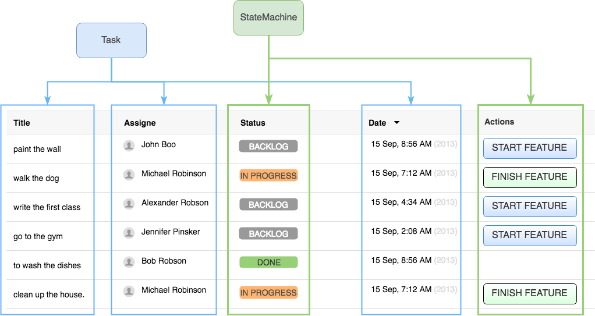

= Transactions and consistency between the state machine and other systems.
:source-highlighter: prettify
:icons: font
:toc:
:experimental:
:numbered:
:homepage: http://antkorwin.com
Korovin Anatoliy <antkorwin@gmail.com>;  Home <http://antkorwin.com>
// START OF CONTENT

## Problem of consistency between state machines and other systems.

Often, we have a business domain model that separate from the state machine.
In our projects state machines used just for an organization of a business workflow.
We store all domain-specific data in other objects.
Usually, we store this objects in its own database and operate with it by using transactions.

In this chapter we will consider how to safety work with a state machine.
And how to guarantee a consistency between the state machine and other systems.

Consider an example of a task management system:

[plantuml]
....
[*] --> BACKLOG
BACKLOG --> IN_PROGRESS : START_FEATURE
IN_PROGRESS --> DONE : FINISH_FEATURE
DONE --> [*]
....

The Task-entity have a list of attributes, which we can read/write in any time.

The part attributes of a task, we can get from a `Task` JPA entity.
However we need to retrieve a second part from the State Machine.

Also, we need to maintain a consistency of the state machine and Task-entity in a database:

- When we **create a new task**,
we need to make a new state machine instance for this task,
then persist it to the state machine storage.

- After a some *event applies* on the state machine,
we need to save a new `StateMachineContext` in the state machine storage and
also we need to refresh a state of the `Task` entity in the database.

- Often, when we use an interface with a list of tasks,
then we need to know **available actions(events)** for each task.

- Usually, when we use a list of task,
we need to know *current state* for each task in the list.

## Creating a state machine and assisted entity in the database.

When we create a new task, we need to create a new instance of the state machine,
then persist it, also we need to create a new Task entity to store additional data in the database.

[source, java]
----
protected Task executeImpl(CreateTaskActionArgument argument) {

    Task task = taskService.create(argument.getTaskTitle(), argument.getTaskEstimate());

    StateMachine<States, Events> machine =
            evaluateWithRollback(() -> xStateMachineService.create(task.getId()),
                                 () -> taskService.delete(task.getId()));

    return evaluateWithRollback(() -> taskService.updateState(task.getId(),
                                                              machine.getState().getId()),
                                () -> {
                                    taskService.delete(task.getId());
                                    xStateMachineService.delete(task.getId());
                                });
}
----

You can see here two blocks for a manual processing of rollback, they are needed because:

- If we get any exception while create a Task entity then we not try to create a state machine.

- If any exception throws while you create a state machine, you need to remove an already created task entity.

- If you catch an exception when you try to update a status of the task in database(synchronize with a state machine), then you need to rollback all which you already create (remove state machine and task in database).

## How to guarantee a consistency of transactions within using of a state machine

The first case is when we want to update the entity in the database and move the state machine to a next state.

## Source code of this project on the github

image:../icons/git.png[github,64,64] link:https://github.com/antkorwin/statemachine-utils-xservice-example[github.com/antkorwin/statemachine-utils-xservice-example]

// END OF CONTENT
include::../metrica.adoc[]

++++

<noscript>Please enable JavaScript to view the <a href="https://disqus.com/?ref_noscript">comments powered by Disqus.</a></noscript>
++++
